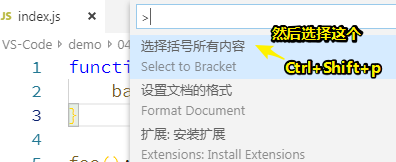
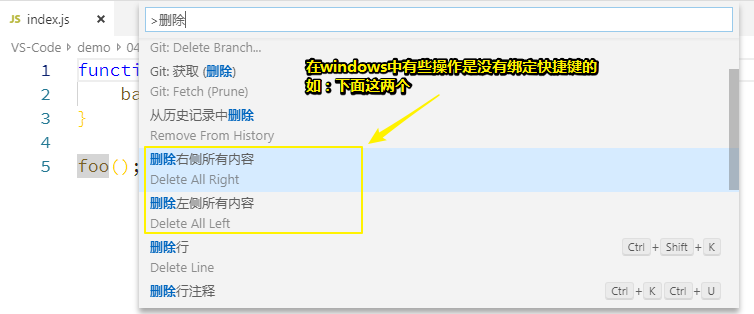
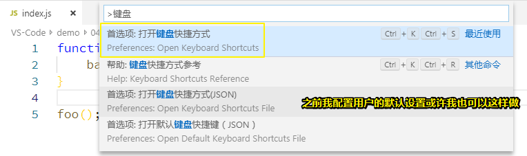
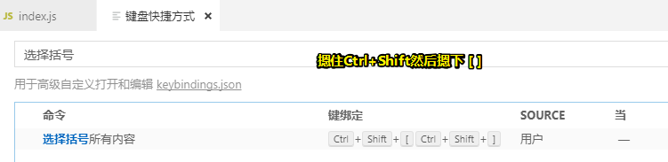
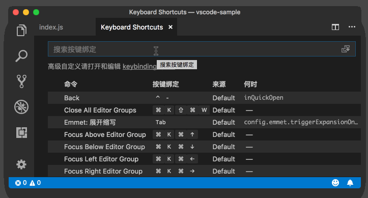
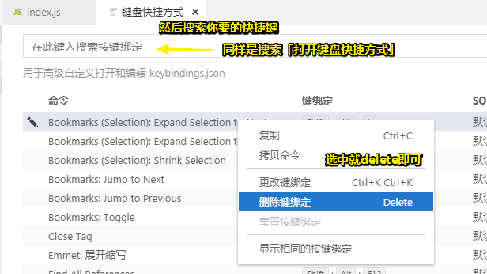
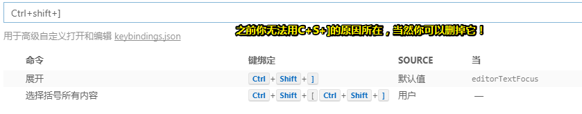

# 如何做到双手不离键盘？

## ★如何提高编码效率？

要想提高编码效率，你首先要掌握**基本的文本操作快捷键**。Vim 编辑器就因为其**高效且独特的文本操作方式**而知名。

### ◇Vim vs VS Code

2016 年的时候，我同时在开发维护 VS Code 中的编辑器以及 Vim 插件，经常在这两套完全不同的快捷键之间切换。我的切实感受是，熟记 VS Code 的这套快捷键后，**很多核心操作的效率是可以和 Vim 匹敌的**，而且很多 VS Code 不支持的 Vim 快捷键也可以通过**插件**的方式来实现。

## ★双手不离键盘

关于快捷键插件的开发，我在后面会讲，今天先来谈一谈核心的键盘操作：**光标的移动、文本的选择、文本的删除，以及如何为编辑器命令绑定快捷键**。

### ◇光标移动

#### 测试代码

```js
function foo() {
  bar();
}
 
foo();
```

借助一段非常简单的 5 行 JavaScript 代码来讲解这些操作

#### 取决于单位粒度的姿势

1. 常用姿势：方向键，以**一个字符为粒度**来移动，如果你想要移到行末或者是行首，且没有鼠标的情况下，显然这种姿势是相对低效的！毕竟需要按个左或右方向键个几秒，甚至十几秒

2. 以**单词**为粒度： `Ctrl+→`、`Ctrl+←`

3. 以**行**为粒度： `Home`、`End`，我的键盘有个 `Num Lock`的键，如果键盘没有锁定，那么我是 `Shift+Home`和 `Shift+End`

4. 以**代码块**为粒度： `Ctrl + Shift + \`，为什么需要它？因为很多编程语言都使用花括号将代码块包裹起来，比如 if、for 语句等，你很可能会希望通过一个快捷键，就能实现在代码块的始末快速跳转

   > 如我想加个return

5. 以**整个文档**为粒度：`Ctrl + Home/End 键`，如果你没有按下`NumLock`的话，那么你就得加个 `Shift`键才行，即 `Ctrl + Shift + Home/End 键`

> 没有想到，我当前用于记笔记的Typora也是如此操作哈！

###  ◇文本选择

掌握了上面的快捷键之后，你还可以非常轻松地掌握文本选择的操作。因为对于基于单词、行和整个文档的光标操作，**你只需要多按一个 Shift 键，就可以在移动光标的同时选中其中的文本。**

> 针对我这台笔记本，我需要把NumLock给摁了才能做
>
> 在这里常用的姿势，无非只有两种：
>
> 1. 针对单词的： `Ctrl+Shift+左/右方向键`
> 2. 针对整个文档的： `Ctrl+Shift+Home/End`
>
> 话说，还有个选择整行文本呢？这个该怎么做到？也是 `Shift+Home/End`，再次强调我这台电脑需要把NumLock给摁了

对了，还有一个对于代码块的文本选择，不过VS Code 默认没有绑定快捷键。那么，是不是就没办法了呢？

当然不是。你可以先使**用命令面板**找到命令 “选择括号所有内容” 并运行。后面我还会讲述如何为一些未绑定快捷键的命令绑定自己熟悉的快捷键，请稍安勿躁。



### ◇删除操作

> 删除单行文本的姿势： `Ctrl+Shift+K`

了解了光标移动和文本选择，再来看删除操作，就变得相对简单了。

比如你想把当前行中光标之前的文本全部删除，就可以先选中这段文本（Windows/Linux: `Home + Shift`，macOS: `Cmd + Left + Shift` )，然后再按删除键。不过对于频繁使用的删除操作，你肯定希望单次操作就可以完成任务，而不是重复地选择文本然后删除，那么你需要记住下面几个命令。

在此之前先来看看，分几种情况的删除：

1. 删除右侧所有内容
2. 删除左侧所有内容
3. 删除单词内的字符： `Ctrl+Delete`（删除单词中的右侧字符）、`Ctrl+backspace`（删除单词中的左侧字符）

所以在windows眼中的操作有：



> 其实，前期关于对这些快捷键的操作，忘记就通过命令行查找呗！只要输入个删除就会有很多删除情况出现了！


### ◇自定义快捷键

前面我们提到，VS Code 内置了很多的命令，但是并没有为每个命令都提供一个快捷键，毕竟快捷键的组合总是有限的。不过 VS Code 提供了快捷键的修改和自定义功能，这样你就可以根据自己的使用习惯，给自己常用的命令指定顺手的快捷键。

首先你可以打开命令面板（你还记得它的快捷键不？），搜索 “打开键盘快捷方式” 然后执行，这时你将看到相对应的界面。



然后通过搜索找到你希望修改快捷键的命令，双击，接下来你只要按下你期望的快捷键，最后**按下回车键**就可以了。

那么我要改哪个呢？

比如，你可以搜索 “选择括号内所有内容”，双击，按下 "Cmd + Shift + ]"，然后按下回车，这个快捷键就绑定上了。



> 如果快捷键有冲突它会提示的

有了这个快捷键，你就不需要打开命令面板找到这个命令再执行了。看到这里你可能会问，“如果我按下某个快捷键所绑定的命令不是我想要的，但是我又不知道这个命令的名字怎么办？”

VS Code 的快捷键修改界面已经考虑到了这一点，你可以在搜索框内搜索你使用的快捷键，然后就可以看到这个快捷键当前对应的命令是哪个。



比如，在上面的示例里，你通过搜索 “cmd+backspace” 这组快捷键，发现它对应的命令是 “删除左侧所有内容”，但你不希望使用这个命令，那你就可以通过右键选择删除该快捷键的绑定。



所以你可以这样：



## ★小结

今天这篇文章主要讲解了光标的移动、文本的选择和删除所对应的快捷键，并且研究了如何修改和自定义快捷键。你不妨**试着刻意地把这些快捷键运用到日常的编码中去，刚开始肯定会慢一些，不过你的肌肉肯定能迅速记住它们。**

如果你早就熟悉了这些快捷键，那么不妨试试对快捷键进行修改，我相信 **VS Code 内置的快捷键绑定不总是完美的**，希望你能找到你自己的最佳实践。

## ★总结

- 四个基本操作：光标移动、文本选择、删除操作、自定义快捷键以及删除默认快捷键
- 删除某个单词，可以定位到该单词的开头，然后 `C+del`，而不是像之前那样先 `C+d`选择这个单词，然后删除


## ★Q&A

### ①非原生应用与原生应用？

我看到了这么一段话：

> 虽然 VS Code 是基于 Web 技术开发的**非原生应用**，但是它支持针对单词、行、代码块、整个文档等多种光标移动方式。

也就是说要实现这些多种的光标移动方式，基本条件是你这个app得是个原生应用咯！不过VS Code却不需要！可见VS Code是很强大的！

**➹：**[带你解析:原生APP与web APP的区别 - 开源中国](https://www.oschina.net/question/585173_2141646)

**➹：**[React Native有什么优势？能跟原生比么？ - 知乎](https://www.zhihu.com/question/36722811)

### ②HHBK是什么？

> 关于键盘选择

**➹：**[为什么知乎上这么多人推荐 HHKB，却不反复强调说该键盘不适合一部分程序员？ - 知乎](https://www.zhihu.com/question/33690121)

**➹：**[60%机械键盘适合程序员吗，Filco minila air ？ - 知乎](https://www.zhihu.com/question/28996173)

**➹：**[87键位的键盘和104键位的键盘主要有什么区别？ - 知乎](https://www.zhihu.com/question/38460767)

**➹：**[机械键盘用 61 键的人多？还是用 87 键的人多？ - V2EX](https://www.v2ex.com/t/446657)

###  ③其它问题？

1. 感觉一套vim走天下——必须的

2. 我把删除的快捷键改为：delete+r删除右边的，delete+l删除左边的,cmd+delete删除一行——改成 h 和 l 是不是更有意思

3. vscode有没有快捷键能实现在类似于`<div></div>`这种元素开闭标签之间的快速跳转呢？atom上是`ctrl+m`，vscode上我一直没找到

   > 这是个很好的 feature request
   >
   > 难道是功能请求？
   >
   > **➹：**[GitHub 的 Pull Request 是指什么意思？ - 知乎](https://www.zhihu.com/question/21682976)
   >
   > **➹：**[[Feature Request] 中文模式下输入英文的问题 · Issue #350 · ibus/ibus](https://github.com/ibus/ibus/issues/350)

4. 方向键还是不够快捷, 如何使用ihjk代替方向键

   > 要使用 hjkl 来代替方向键，那就得区分开编辑模式和鼠标移动，Vim 插件是一种做法，我自己会跟ctrl 键组合使用，这样就区分开了。

5. 要用到方向键啊……我这种一百年手都不会伸到那个位置的人，无法理解了

   > VSCode 的默认快捷键里很多使用了方向键，你可以绑定成别的

6. 这节的字符操作vim来得更快更方便些，操作幅度也小

7. 老师，windows，ctrl+Delete，只能删除单词右边，碰到空格，就默认不删除了

   > 这个删除操作并不删除空格，空格会被当成一个单词

8. 老师，请问下，会Vim还需要再学习这套快捷键不？

   > 可以不用

9. 老师，怎么在编辑器中将tab键显示成小箭头，我这里tab键和空格一样都显示成了虚点，这个该怎么改

   > 这个说明你插入的 tab 其实还是空格，修改配置 editor.insertSpaces

10. windows下options 对应什么快捷键？—— `Alt`

11. windows 中调到行首行尾的默认快捷键是home和end这两个键，这和mac也太不一致了吧？如果键盘没有这两个键呢。。

    >  一般来说，没有 Home 键的键盘会提供 fn 来支持。Home/End 是 Windows 上非常惯用的方式。