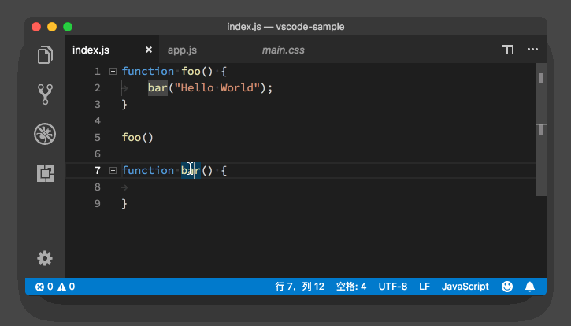
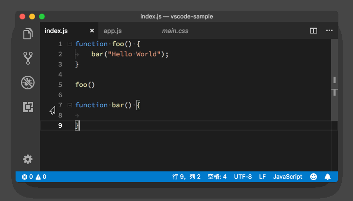
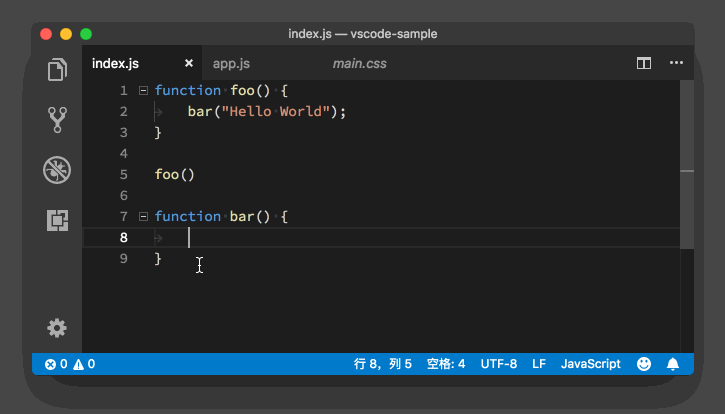
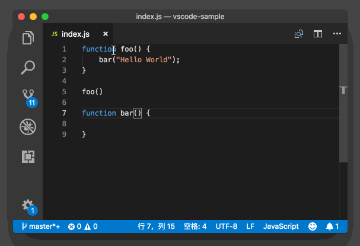
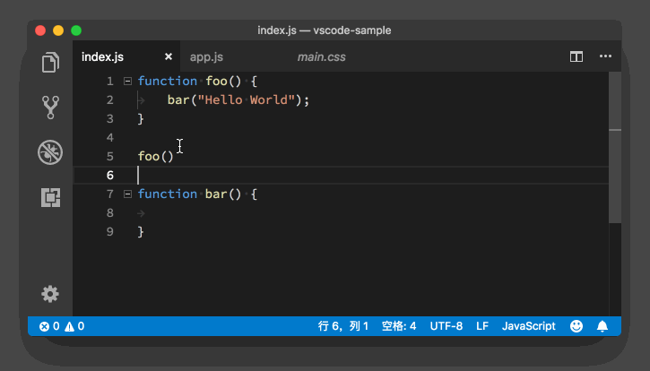
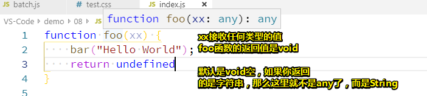
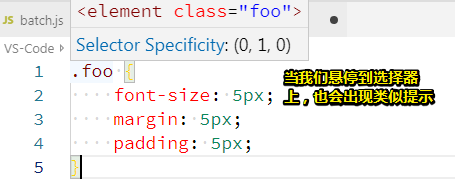
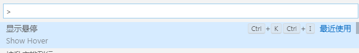

# 玩转鼠标操作

## ★前言

之前我一直说 VS Code 非常注重编码中的键盘体验。换句话来说就是，VS Code 非常关心你能不能够使用键盘完成绝大部分操作，从而无需将手从键盘上移动到别的输入设备上。但是这并不意味着 VS Code 只关心键盘的使用体验，毕竟大部分用户都是非常熟悉和喜欢使用鼠标的，更不要说 Mac 上让人无法割舍的触控板体验了。

那今天我们就一起来聊一聊，如何在 VS Code 中通过鼠标或者触控设备来完成代码阅读和编辑操作。在今天的内容中，我们使用鼠标来代表各种类似鼠标的触控设备。

## ★文本选择

首先我们来看一下如何使用鼠标快速地选择文本。最简单的方式，也是我们每个人最熟悉的方式，就是按住鼠标左键，然后拖动鼠标，直到选中所有我们想要选择的文字为止，再松开鼠标即可。

我们在前面的章节学习过，如何通过键盘快捷键快速选中单词行和全文，这在很大程度上提高了我们的编码效率。那是不是说鼠标用户要完成类似的操作，就只能 “一点、二拖、三松手” 呢？当然不是，VS Code 其实给鼠标也配备了类似的快捷键。

我们继续使用一段 JavaScript 代码来举例，如下：

```js
function foo() {
 bar("Hello World");
}
 
foo()
 
function bar() {
 
}
```

这段代码还是很简单的，你可以把他复制到你的编辑器中和我一起练习。

**在 VS Code 中，你单击鼠标左键就可以把光标移动到相应的位置。而双击鼠标左键，则会将当前光标下的单词选中。连续三次按下鼠标左键，则会选中当前这一行代码。最后是连续四次按下鼠标左键，则会选中整个文档。**



> 通过鼠标左键完成选中操作

到这里你可能会问，**如果我想要使用鼠标，选中其中的多行代码该怎么办？**VS Code 也考虑到了这个情况，在编辑器的最左边，显示的是每一行的行号。如果你单击行号，就能够直接选中这一行。如果你在某个行号上按下鼠标，然后上下移动，则能够选中多行代码。



> 拖动行号栏，选中指定代码行

## ★文本编辑

在 VS Code 中，我们除了能够使用鼠标来选择文本以外，还能够使用鼠标对文本进行一定程度的修改，我们把它称为**拖放功能（drag and drop）**。

### ◇剪切+粘贴

比如在今天的示例代码中，我们选中 `bar` 这个函数，然后将鼠标移到这段选中的代码之上，按下鼠标左键不松开。这时你可以看到，鼠标指针已经从一条竖线，变成了一个箭头。这时候我们移动鼠标的话，就可以把这段文本拖拽到我们想要的位置。

在移动的过程当中，我们能够在编辑器中看到一个由虚线构成的光标，当我们松开鼠标左键的时候，这段文本就会被移动到这个虚拟的光标所在的位置。



> 通过鼠标左键移动代码位置

在上面的动图里，我们把 `bar`这个函数，从文档的末尾移动到了第四行。这个功能就相当于使用键盘进行的 “剪切 + 粘贴”。

那么能不能使用鼠标进行 “复制 + 粘贴” 呢？别担心，VS Code 肯定也会考虑到这个情况的，所以答案是：必须能。

### ◇复制+粘贴

如果我们在拖拽这段文本的同时，按下 Option 键（Windows 上是 Ctrl 键），鼠标指针上会多一个加号，这时候我们再移动鼠标或虚拟光标至我们想要的位置，然后当我们松开鼠标左键的时候，这段文本将会被复制粘贴到虚拟光标所在的位置，也就是我们既定的目标位置。

你看，在移动鼠标的过程中，多按了个 Option 键（Windows 上是 Ctrl 键），操作结果就由原来的 “剪切 + 粘贴” 变为 “复制 + 粘贴” 了。


> 鼠标左键拖拽 +Option 键，复制粘贴代码块

## ★多光标

在前面第 6 篇文章中，我们已经学习了如何使用鼠标添加多光标。不得不承认，在鼠标的帮助下，多光标的创建显得格外便捷。我们只需按下 Option 键，然后在需要创建新光标的地方，按下鼠标左键即可。简言之，就是按住 Option 键，然后哪里需要点哪里。

不过，VS Code 中还有一个更加便捷的鼠标创建多光标的方式。当然，这首先要求你的鼠标拥有中键。你只需按下鼠标中键，然后对着一段文档拖出一个框，在这个框中的代码就都被选中了，而且每一行被选中的代码，都拥有一个独立的光标。



> 利用鼠标中键添加多光标

在第 6 篇文章中，我们已经尝试了用多种方法去创建光标然后修改代码，现在我们又为鼠标用户多提供了一种更为便捷的操作方式。尝试掌握它们吧，我相信这些便捷操作肯定能为你的高效编程之路尽一份力的。

## ★悬停提示窗口

相信你在 VS Code 的编辑器里使用鼠标的过程中，早就发现了，当你的鼠标移动到某些文本上之后，稍待片刻就能看到一个悬停提示窗口。这个窗口里会显示跟鼠标下文本相关的信息。

比如，在我们的示例代码中，当我们把鼠标移动到第五行 `foo` 上后，悬停提示窗口里展示了 `foo`的类型信息，它告诉我们 `foo`是一个函数，不需要任何的参数，返回值是 `void`。


> 了解函数的类型信息

如果我们把鼠标移动到 `foo` 上面时，按下 Cmd 键（Windows 上是 Ctrl），则能够在悬停提示窗口里直接看到 `foo`的实现。



> 按下 Cmd 键，辅助以鼠标，查看函数实现

我们能看到这样的信息，是因为这个功能也被包含在了 VS Code 的语言接口之中。VS Code 会告诉语言服务，当前鼠标所在位置的信息，语言服务会根据当前的项目情况和代码提供有用的信息。

在 JavaScript 或者 Java 这样的编程语言中，当我们把鼠标移动到某个变量上时，我们能够看到这个变量的定义信息。而在 CSS 中，当我们把鼠标移动到一个 CSS 规则上时，我们能看到的则是一段能够让这个 CSS 规则生效的 HTML 的样例代码。


> 了解 CSS 对应的 HTML 代码样例

当然，除了语言服务，任何 VS Code 上的插件都能够控制悬浮窗口里的内容。

## ★代码跳转和链接

除了能够使用鼠标进行代码选择、编辑、预览之外，我们还可以借助鼠标来完成跳转操作。不知道你还记得我们之前讲的文件、代码跳转相关的快捷键吗？如果不记得，一定要回去再复习哦。如果记得，今天在这里我再教你如何使用鼠标来完成跳转操作。

我们还是把鼠标移动到示例代码的第五行 `foo` 上，然后按下 Cmd 键，这时候 `foo`下面出现了一个下划线。然后当我们按下鼠标左键，就跳转到了 `foo`函数的定义处。


> 通过 Cmd 键和鼠标左键，跳转到函数定义处

当我们在编写 Markdown 这样的非编程语言的文档时，也可以通过 Cmd + 鼠标左键（Windows 上是 Ctrl + 鼠标左键）来打开超级链接。


> 通过 Cmd 键和鼠标左键，打开超级链接

## ★小结

以上就是 VS Code 编辑器中常用的鼠标操作，相对比较简单，当然这并不是全部。之后的章节中，在介绍 VS Code 的其他 UI 组件时，我也还会介绍相应的鼠标快捷操作。

这一节的内容你还是需要多加练习，然后希望它们能成为你的肌肉记忆。这样，不管你使用任何编辑器，在有鼠标操作的时候，你都可以试试上面的小技巧是否生效。

最后，欢迎在评论区给我留言，你可以分享对于鼠标操作，你自己珍藏的小技能。当然，有疑问同样可以写到留言区，我会第一时间给你反馈。


## ★总结

- 点两下鼠标就会选中单词，连续三下就是选中当前行，而连续4下就会选中整个文档了！

- 按住鼠标左键，上下拖动行号，可以选中多行代码

- 可以通过鼠标左键移动代码位置，前提是先选中代码，特征（箭头和虚线光标），而该功能相当于是「剪切+粘贴」

- 像要用鼠标模拟「复制+粘贴」功能的话，很简单，直接对上面这点加个 `Ctrl`键即可，特征是箭头左上角有 `+`，然后同样是虚线光标！

- 之前我们想要多光标操作，且需要用到鼠标的话，我们是用alt+鼠标左键的，如今我们可以使用鼠标中键做到！不过鼠标中键贼鸡儿难摁！

- 想要了解函数的类型信息，直接悬停到某个函数名上即可，就像这样：

  

  如果过你想看到函数的实现，那么就不单只是悬停，还得摁住Ctrl键才行

  其它语言的，如CSS，同样也会有提示（如CSS 对应的 HTML 代码样例以及权重）

  

  

- 想要查看某个函数的实现，为此需要通过鼠标实现代码跳转的话，我们可以通过 `Ctrl`+鼠标左键来跳转，而且我们很多时候针对markdown文档、pdf文档时，都是通过同样的手段打开超级链接的

  如果你想要回到原来的函数的调用位置，那么你可以通过 `A+左方向键`回来

  总之如果不用鼠标的话，那就 `F12`到实现，`A+左方向键`回来

  **➹：**[vscode 跳转到函数之后怎么跳转回之前的位置 - V2EX](https://www.v2ex.com/t/385490)


## ★Q&A

### ①其它问题？

1. 可不可以找个机会给我们讲一下，如果在多个机器上同步自己的 vs code 设置呢？ 谢谢

   > 你可以试试插件 Settings Sync ，后面我也会介绍

2. Mac，Linux 上一直有个问题，就是鼠标的 prev/next 键是没用的。Windows 上没问题，可以使用。JetBrains 家的都可以。

3. 想看看老师平时的最佳实践

4. 希望可以讲解一下如何通过vs code进行远程服务器开发

5. 有没有办法在不使用鼠标的情况下激活某些鼠标功能？例如显示悬浮窗。

   >  你可以在命令面包里搜搜 Hover 看看

   就像这样：

   

   快捷键是 `C+k+i`

### ②话说鼠标有哪些键呢？

我的鼠标就只有左、中、右这3个常用的键了！

在放大缩小网页的时候，可以通过 Ctrl键和鼠标滚轮来搞事情

**➹：**[鼠标有哪些快捷操作方式？ - 知乎](https://zhuanlan.zhihu.com/p/41562978)

