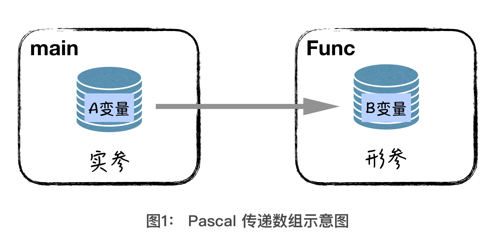
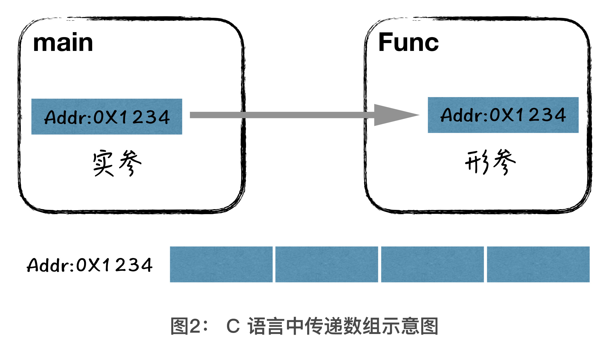
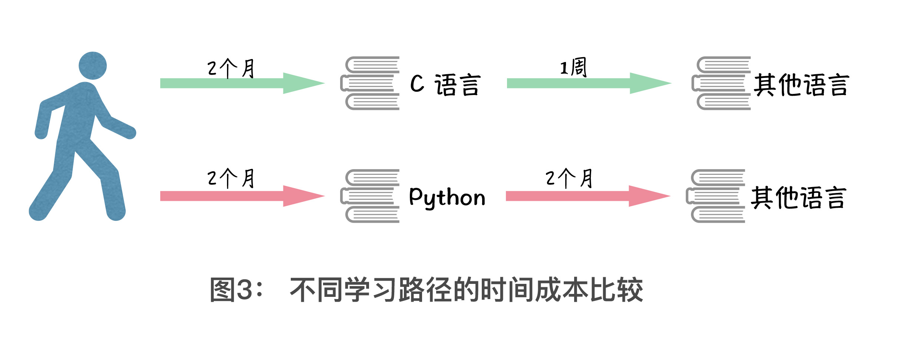

# 01-学习编程，我到底该选择哪门语言？

## 1、大概说一下有哪些编程语言？

- 最能反映系统本质的 C 语言
- 叫人难以捉摸的 C++
- 天生就格式优美的 Python
- 上古级的 Pascal
- 神奇的函数式编程语言 JavaScript
- 微软系的王牌语言 C#
- 被誉为世界上最好语言的 PHP
- 使用人数最多的 Java
- 能够方便操作系统的 Shell 
- 脚本语言还有我自己开发的一门娱乐级编程语言 Hython

> 这些语言为啥就叫编程语言呢？难道就因为这些语言可以与计算机沟通？

## 3、为啥有些人会那么多门编程语言？

如这门课的胡光老师，胡老师解释到：

> 原因很简单，工作中是一个边学习边工作的过程，不同编程语言擅长做的事情不一样，让专业的语言干专业的事情，这是一个程序开发人员最基本的认知，所以我能学会多种编程语言也是情理之中

话说，难道就没有一门编程语言可以全干的吗？

## 3、学习了这么多编程语言，难道不会造成混淆么？

其实，编程语言设计者，更多的还是为了让人们使用自己的编程语言进行开发，所以语言设计本身都会有前辈语言的主流特征，这也就是为什么，只要你学习了一门主流语言后，会大大降低你学习第二门语言的成本。

> 假如我是编程语言的设计者，我搞了千奇百怪的语法，结果没人用，难道我是在自娱自乐吗？这也忒孤独了吧！

## 4、为啥胡老师他还要自己开发一门娱乐级编程语言？

简单点儿回答就是：**自娱自乐**。正式点儿的回答就是：经历了开发编程语言这个过程，会对很多语言的特性**理解得更深刻**，知其然，知其所以然。所以当你自己能发开出一门编程语言的时候，站在开发者的角度再去学习其他编程语言，简直就属于“**降维打击**”般的学习。

## 5、第一门语言的选择，真得是门技术活吗？难道不是想学哪个就哪个吗？

> 学习不同的语言会有不同的体验，如会遇到惊喜也会踩到很多坑

老师的第一门语言：Pascal

- 一门上古级的编程语言，语法风格类似现在的 Python 和 C 的混搭风
- 目前没多少人使用 -> 原因是因为其**特立独行**的语法规则

怎样个特立独行法？

Pascal 程序需要你在最开始把**所有**需要的变量都定义一个遍，然后再描述程序的过程逻辑

举个栗子，以下是一段 Pascal 的“**判断素数**”的程序：

> 这段代码你看不懂没关系，只是让你对 Pascal 有个直观的感受

``` pascal
program JudgePrime;                // 程序名称
var x, i : integer; f : boolean;   // 变量仅能在此定义
begin
    readln(x);
    f := true;
    if x < 2 then 
    begin 
        write('F'); 
        exit; 
    end;
    for i:=2 to trunc(sqrt(x)) do
        if x mod i=0 then f:=false;
    if f then write('T') else write('F');
end.
```

整体程序结构解释一下：

- 第一行是程序的名字
- 第二行就是定义变量部分，并且变量只能在这里定义
- 从 `begin` 到 `end.` 中间就是我们所谓的程序逻辑部分

> 一种Python代码的既视感

老师的第二门语言：C

因为要参加ACM竞赛，老师在转 C 语言之前，他还有点儿担心这个过程会比较坎坷，谁知道，老师他就用了几天的时间，就搞定了他编程时候所需要的几乎全部语法。

你要知道，老师他学习 Pascal 的时候，可是花了四个月啊！

> 嗯？这是有天赋吗？

从这以后，老师才意识到这句话的真正含义：

> 语言从来不是编程的障碍，思维才是。

所谓“**思维**”大多数的时候，反映出来的是“**编程技巧**”，更形式化一点，我们叫它 **“编程范式” 和 “算法数据结构”**，这部分的东西，老师他后面还会着重讲解，并且会教我们一些提升编程技巧方法。

> 我之前看小野老师讲前端的公开课就是在说一些编程技巧，如模块怎么做比较好，代码该怎么抽离啊！等等，原来这就是「思维」呀！

> 啥叫更形式化点？ -> 是更具体点吗？还是说我们写代码是有个形式的？只有遵循这个形式，代码才能跑起来，才能正常运行起来？

由于 pascal 这门语言有太多条条框框了，于是，老师写起C来，就像有一只鸟刚挣脱了鸟笼，然后在蓝天翱翔的感觉，对，这是自由的感觉……

如这样一段判断素数的 C 语言程序：

``` c
#include <stdio.h>

int main() {
    int x;                   // 定义变量x
    scanf("%d", &x);
    int f = 0;               // 定义变量 f
    for (int i = 2; i * i <= x; i++) { // 定义循环变量i     
        if (x % i) continue;
        f = 1;
        break;
    }
    if (f) printf("F\n");
    else printf("T");
    return 0;
}
```

对边之前的 pascal 程序代码，你会发现它们的差别在于「**变量定义**」。C 语言中**我想在哪里定义，就在哪里定义**！

话说，C 语言除了可以**随处定义变量**这个特性，它与 Pascal 语言还有什么不同的特性呢？

普通变量向函数中传值，就是**将原变量中的值拷贝给函数参数的过程**，这个过程，我们称作“**实参给形参赋值**”。原变量就是实参，函数参数就是形参。在这个过程中，**本质上还是两个变量**，两片独立的存储位置，也就意味着，我们对形参的改动，不会影响实参。这一点上，C 语言和 Pascal 是完全一致的，下面就要说到不太一样的地方了。



请观察图 1，在 Pascal 中，如果你将一个数组作为参数传递给一个函数，**函数内部还是会复制一份这个数组**，也就是说，在 Pascal 中数组的传递过程和普通变量的传递过程没有任何区别。



你再观察图 2，图 2 展示的是 C 语言中数组作为参数传递的方式，你在图中会看到一个 “`0x1234`” 的信息，我们称之为**地址**，就类似于你家的**门牌号**。当我们传递一个数组时，其实在传递的是**数组的首地址**，也就是说，无论实参还是形参，实际上**指向同一片存储区**！

总结来说，对于数组，Pascal 函数内外，是两个互不相同，互不影响的存储区。C 语言则是函数内外是同一片存储区，任何一个修改，都意味着外部的数组也被修改了。

> JS同C一样

如果你只接触过这两门语言，那么这两种语言特性肯定会让你感到困扰，有时候我们会用一门语言的语言特性，去理解另一门语言的特性，如果这门语言是特立独行的，那么显然对于我们学习另一门语言来说是很不划算的，毕竟，假如用C和Pascal语言做同样一件事，思路都是一样的，但是因为语言特性的缘故而导致出bug了，就很难受了……

所以，**初学编程选择什么语言作为自己的第一门语言是多么重要**。如果你选择一个比较“**偏**”的语言，形成了它独特的语言特性，可能会对你**学习其他语言造成不小的困扰**。而 C 语言，由于它的**共通性**，很少会出现这样的问题。

老师的第三门语言：Python

欣赏过了从 Pascal 过渡到 C 语言的神清气爽，那你知道如果你学完 C，再学 Python，这是什么感觉么？简直就跟吃了一大口芥末一样，提神！

如，用Python姿势来判断素数：

``` python
#!/usr/bin/env python
# coding=utf-8
x = int(input())
i = 2
while i * i <= x:
    if x % i == 0:
        print("F")
        break
    i = i + 1
else:
    print("T")
```

对比之前的两段代码， Python 的这份代码，是不是看着就简洁、清爽？

> 整体上看，选择一门编程语言作为入门语言，C似乎就很合适了（给人一种很「中」的感觉）。我的入门语言是JavaScript，我觉得这也挺不错的……理由是，简单，直接在浏览器里边敲段代码就可以运行了，如果我选择C，需要下载编译器等等，总之很麻烦……

## 6、老师，是如何走上编程之路的？

年轻的小胡问：「老师，编程学好了，能做游戏么？」

小胡的老师曰：「恩」（带着不可置否的语气）

至此，小胡就踏上了学习编程的道路……

## 7、Python 为什么被评价为天生就格式优美呢？

那是因为，在 Python 中，如果你不按照缩进组织程序的层次关系，你的程序根本没有办法正常运行。

> 难道这就是所谓的天生吗？

不同的人编写代码可能有不同的风格，就像 C 语言，10 个人可能就有 10 种风格，但 Python 的代码风格就像**人的指纹**，它是天生的，不管多少人用 Python 编写代码，可能也只有**一种风格**。所以无论你是否写过程序，在写 Python 的时候，都将写得很漂亮，很舒服。

## 8、最适合学习编程的操作系统是 Linux？

最适合学习编程的操作系统是 Linux，Linux 中有一个核心设计思想，叫做“**一切皆文件**”，理解了文件，就理解了整个 Linux 操作系统，这里说的文件，可不是你所认为的常规的 windows 文件。Linux 世界中的文件，就像是我们这个世界中的原子一样，**是一种本质**。

> 不理解文件哈！

而 Python 中也有一个类似的核心设计思想，就是“**一切皆对象**”，理解了什么是对象，你就理解了 Python。而这么抽象的概念，我不认为我现在可以**用两三句话就给你讲明白**，不过还是那个道理“**语言从来不是编程的障碍**”，关于对象这个概念，在你日后对编程的知识逐渐丰富起来以后，自然就会明白了。

➹：[[译] 在 UNIX 中，一切皆文件 - 掘金](https://juejin.im/post/5b652d346fb9a04fc03129e6)

➹：[Linux 下 “一切皆文件” 思想的本质和好处在哪里？与 Windows 下的文件管理思想有啥差别？ - 知乎](https://www.zhihu.com/question/25696682)

## 9、编程入门，舍我其谁：C 语言？

虽然Python界面精炼，但我还是想要告诉你：



上图中的时间，只是一个参考，可能你比较有天赋，会比图中所标记时间用时短，可绝大多数的人，只会多于图上的时间，不会更少的。你会看到图上有两条学习路径，绿色的学习路径用时两个月多一点，红色的学习路径用时四个月。其实这张图，我就是想跟你说明，在我们学习过程中的一个重要的概念：**学习路径**。一个**合理的**学习路径，可以帮助你大大**缩短整体的学习时长**，毕竟你的时间才是最大的成本。

其实正如你所看到的，你用相同的时间掌握了 C 语言后，会对你学习其他语言有很大的帮助。反观，如果你一上来掌握的就是拥有很多奇怪语法特性的语言，不仅要花很长时间学，在日后的学习中，你会发现这些语法特性在其他语言甚至都找不到。**基于这类知识锻炼出来的编程思维，是不具备延展性的**。所以，在选择第一门语言的时候，一定要**选择简洁、高效、不拘泥于语法特性的语言**。就像学习武功一样，摒弃掉花拳绣腿，去稳扎稳打的进行练习，才是快速成长的诀窍。

> Java就很不简洁了，入门选它，实在是极大的打击了我们的编程积极性……Pascal就很拘泥于语法特性了，即固守这种很片门的语法特性……

请记住：

> 学习编程不等于学习语言，前者包含后者，也就是说想学好编程，不仅是学好语言，还有很多比语言更难的东西等着你呢。

既然要给你讲编程，我决定选择一门既可以带你**潜入底层系统一窥究竟**，又可以**顺畅简洁表达逻辑**，还**没有特别多奇奇怪怪的语法特性**的语言。我希望借助这门语言，让你在学习编程的过程中，能够**专注于编程思维训练本身**，帮助你一步一个脚印地学习编程，**培养编程思维**。这门语言，就是我们前文说到的 **C** 语言。

我有朋友是这样形容 C 语言的，我觉得很贴切，拿过来用一下，他说：**学编程就像是学乾坤大挪移，而 C 就是语言中的九阳神功**。

> 为啥学C？一句话完事儿 -> C就是语言中的九阳神功，有了九阳神功，学编程事半功倍

## 10、推荐的书籍？

特征：小册子、薄、内容详实准确、多本书籍之间有递进的关系

第一本：《啊哈 C 语言》

这本由电子工业出版社出版的《啊哈 C 语言！》被叫做“厕所 C 语言教科书”。这不是在说这本书很差，恰恰相反，这是一本**浅显易懂**的 C 语言入门书籍，即使是利用蹲马桶的时间看上一会儿，你也是看得懂的。并且和书籍配套的还有《啊哈 C 语言！》**特别版编译器**，会使得你在学习 C 语言基础知识的时候，更加轻松，自在。

第二本：《C 专家编程》

这本由人民邮电出版社出版的《C 专家编程》，会是你入门 C 语言以后的第二本必备书籍。这本书，会从 C 语言的**发展历史**讲解 C 语言中一些语法特性，以及相关**语言特性当初被设计的目的，以及现有的缺陷**，会给你一个**更深层次的解释**。并且，作者给你展现的，不仅仅是教你 C 语言语法，更多的是在给你讲 **C 语言是怎么被设计出来的**。这会使得你对于你今后所写的每一行代码，都会理解得比旁人深刻。

第三本：《C 缺陷与陷阱》

这本也是由人民邮电出版社出版，可以说是《C 专家编程》的延续，针对性会更强，直接指出 C 语言中各种各样的问题，并且加以分析。正所谓人无完人，那么**由人所设计出来的语言，当然也没有完美的**。你作为外行的时候， C 语言的美足够好好体会和欣赏，可想成为内行，你就必须要知道你所使用的工具，有什么**缺点和短板**，这样才能真正的在日后应用中，游刃有余。

## 11、小结？

记住一件事情，不同的学习路径，会有不同的**时间成本**。C 语言只是我们入门编程的一个载体，也是最有效、最深刻的一个载体。从 C 语言入手，会使得你的总**时间成本最低**。**永远记住，扎扎实实，稳扎稳打，才是真正的捷径**。

## 12、在你的学习过程中，有没有哪块知识，是你身边的行业前辈们告诉你很重要的，你一开始忽视了，然后过了好久，才发现，前辈说的对的？

我表哥在我上大一的时候，就告诉我「一定要学好C」,当时我并没有听哈！现在想来，这确实是对的！

## 13、编程环境说明？

## 14、老师，在市面上专门买了市面上最畅销的 15 本 C 语言的书籍，那这15本C语言编程书籍都有哪些？

1. 《C 语言核心技术》-->简称牛书
2. 《C 语言入门经典-第5版》很经典，但不推荐新手看
3. 《C 语言从入门到项目实战》这本书的项目讲得很好
4. 《C Prime Plus 第6版》
5. 《零基础入门学习 C 语言》
6. 《『笨方法』学 C 语言》
7. 《第一行代码 C 语言》计蒜客联合出品的
8. 《啊哈 C 语言！》
9. 《C 陷阱与缺陷》
10. 《C 专家编程》
11. 《C 程序设计 第五版》
12. 《C 语言从入门到精通》
13. 《算法：C 语言实现》
14. 《零基础：学 C 语言》
15. 《C和指针》

## 15、C语言for循环里面不能定义变量？

C语言for循环里面不能定义变量，这个已经是上个世纪的事情了，自从C99标准以后，C语言的循环中是可以定义变量的。

## 16、《啊哈 C 语言》编辑器下载？

到 <https://www.ahacpp.com/> 下载，书中的下载链接已失效，指向的是菠菜网站

## 17、c prime plus为何不推荐呢？

是这样的，不是不推荐，而是不满足我的推荐标准。你们可以自己买，当成工具书看。我推荐的标准是：**薄，内容有效，达到相同效果，花费的时间更少**。(｡ì _ í｡)

> 按照老师的标准，我也推荐一本：The C Beginner’s Handbook

## 18、函数式编程语言最佳代表是JavaScript吗？

如果说最具代表性的，个人认为还是：**Lisp语言**。可很多其他语言也支持函数式编程范式，例如：你所说的js，还有Python以及C++11以后的lambda表达式等等。都是为了支持函数式编程。


