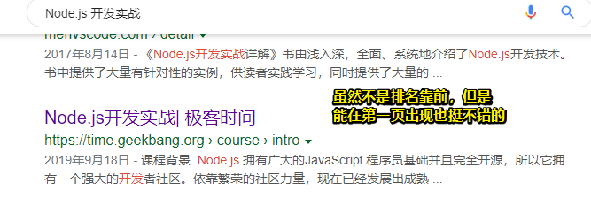

# 课程简介

## ★课程介绍

- 腾讯视频是从 2015 年开始使用 Node.js 对整站进行改造的，杨浩与同事一起从零开始一步一步把整个 Node.js 的开发运维步骤打通，搭建了一个运行于后台服务和浏览器前端之间的 **Node.js 中间层用作 SSR**（Server Side Rendering），以**提高搜索引擎抓取的效果**以及**首屏展现的速度**。

-  Node.js  只能用作中间层吗？——不，整站都可以用它来做！

-  Node.js 为什么值得学习？——  JSer 是真得多、完全开源、社区繁荣、有成熟的技术体系以及庞大的生态等等，就目前而言，它被广泛的用在 Web 服务（关于这个领域，业界对 Node.js 的接受程度最高）、开发工作流、客户端应用等诸多领域

-  Node.js 通常被用来干嘛？——常被用来做一个 BFF 层，即 Backend For Frontend（服务于前端的后端），通俗地来讲就是一个专门用于为前端业务提供数据的后端程序，而这类程序的特点是不需要太强的服务器运算能力，但对程序的灵活性有较高的要求，恰巧的是，这两个特点都正好和 Node.js 的优势相吻合。

- 使用 Node.js 的难点在哪里？——有很多非浏览器端的知识，如RPC调用、进程管理等等；推广使用  Node.js 的过程中会受到产品、后台、运维，甚至是你的老板等等不同角色的质疑，总之使用 Node.js 开展业务会碰上各种各样的阻力！

- 我们需要做什么才能搞定这些难点？

  - 补充必要的后台开发知识和运维知识
  - 需要对  Node.js 这项技术的优缺点，它能给业务带来的价值，都有非常深入的理解

  至此，你才能说服他人，配合你完成从前端到后台的一整套项目开发

## ★内容综述

主要讲解每一章的主要内容

- 第一章：课程背景介绍
  1. 介绍 Node.js 的背景以及现状
  2. 实现一个具体的 Node.js 项目，在实现这个项目的过程中，会演示这个项目从立项到开发，然后再到调优，维护，这里边所会遇到所有的问题以及它们的解决办法
  3. 总之做个简单的介绍
- 第二章：技术预研篇
  1. 项目立项之前，一般就会做技术预研
     1. 解释什么是技术预研
     2. 在技术预研的过程中，用尽可能有趣的实战例子，带你熟悉 Node.js 的基础用法
- 第三章：项目开发篇
  1. 项目立项之后，就是开发
     1. 会一步一步地把这个项目做出来。详细地了解下 Node.js 在项目开发中可能遇到的问题，并且把它们一一解决掉！
- 第四章：性能调优篇
  1. 项目开发完成后，我们需要对整个项目的性能进行一次排查，以及优化，而这样才能到上线的标准，这样才尽可能地利用后服务器资源，减少公司成本的支出！
- 第五章：框架和工程化篇
  1. 框架和工程化，是项目发展之后，经常会遇到的一个问题。我们用一个新技术实现一个项目之后，就要考虑把相关的代码给抽出来，形成一个通用的技术框架，而这样才能在更多的业务里边应用起来！让更多的项目享受这个新技术所带来的红利！ 

下一节课了解什么是 Node.js ！

## ★ Node.js 是什么？

 官网是这样描述的：

- Node.js 是一个基于 **Chrome V8 引擎**的 JavaScript 运行环境。
-  Node.js 使用了一个**事件驱动**、**非阻塞式 I/O** 的模型，使其轻量又高效。

如果照本宣科，显然，剩下的视频也就不用再继续看下去了！

理解这两句话，其实关键点就是加粗的描述

然而，**其实暂时咩有必要知道这些**！

通过这两句话引出了一些问题：

**①在 Node.js 里运行 JavaScript 跟在 Chrome 里运行 JavaScript 有什么不同？**

- 跟 Chrome 浏览器用的是同样的 JavaScript 引擎和模型。
- 在 Node.js 里写 JS 和在 Chrome 里写 JS ，几乎没有不一样！

**②既然是「几乎」，那就是存在有不一样的地儿哈！那不一样在哪里呢？**

- Node.js 没有浏览器 API ，即 document ，window 等。
- 加了许多 Node.js API 。
-  对于开发者来说，Node.js :
  -  你在 Chrome 里写 JavaScript 是在控制浏览器。
  - 而 Node.js 让你用类似的方式，控制整个计算机

**③人生的真谛要用自己一辈子去理解。（以前不懂道理，长大了就开始懂了）**

-  Node.js 的真谛，也需要你在 Node.js 的学习过程中慢慢理解。如：

  「Node.js 是一个基于 Chrome V8 引擎的 JavaScript 运行环境。」

  「Node.js 使用了一个事件驱动、非阻塞式 I/O 的模型。」

下一节会说，现阶段 ，Node.js 主要会被用来做什么项目！

## ★ Node.js 可以用来做什么？

- Web 服务 —— 腾讯视频

  - 搜索引擎优化+首屏速度优化。而「搜索引擎优化 + 首屏速度优化」 = 服务端渲染
  -  服务端渲染 + 前后端同构 = Node.js

- 构建工作流

  - Gulp
  - Webpack——打包，减少http请求

  为啥说「使用 Node.js 做 JS 构建工具，是最保险的选择？」

  因为「 构建工具不会永远不出问题」、「 构建工具不会永远满足需求」，而  Node.js  相较于其它用Java、Ruby等语言弄得构建工具，显然学习成本更低，而且更容易维护和扩展！

- 开发工具 - Visual Studio Code。

- 游戏 - wayward。所谓沙盒游戏，拥有贼高的自由度，即创造性是该类型游戏的核心玩法，**利用游戏中提供的物件**制造出玩家自己独创的东西。

- 可扩展性——大型应用需要给使用者自定义模块的能力（创造性的体现）

  -  使用 Node.js 做复杂本地应用
    -  可以利用 JS 的灵活性提供外部扩展
    -  JS 庞大的开发者基数让他们的灵活性得到利用

- 客户端应用 - twitch.tv（最早的游戏直播平台）

  -  在已有网站的情况下需要新开发客户端应用
  -  用 Node.js 客户端技术（electron）实现，最大限度复用现有工程

  使用 electron，你会发现，把网页变成客户端是多么简单的事儿！

## ★课程实战项目介绍

-  Node.js 版极客时间网站
  -  列表页（有很多视频罗列那个页面，即首页那个内容展示）
    - 打通前后台
    - 服务端渲染
  - 详情页（跳转到某个视频的详情介绍）
    - 网页路由
    - 异步加载（「课程介绍」和「课程目录」切换）
  - 播放页
    - API 服务器（如点赞、评论、视频资源请求等）

## ★总结

- 大致了解了 Node.js 是什么，以及能被用来干啥！
- 大致了解了这个专栏会讲什么，如SSR，其实我还是不太懂SSR，只知道实现了SSR，那么就做到了SEO优化了，可以让某块网页内容被搜索引擎抓取到

## ★Q&A

### ①预研为何物？

预研是对预算研发或预备研发的简称。预研不等于开发，开发是立项的项目并且有严格的流程，预研是开发的必要准备

**➹：**[做新产品分析和预研以及竞品分析，通常有哪些方法？ - 知乎](https://www.zhihu.com/question/19560320)

### ②谷歌搜索「银河补习班」？并没有搜索到腾讯视频的资源

如果可以很好的被搜索引擎收录

那么这就是SEO优化（搜索引擎优化）的结果

简单点说，首先是搜索引擎会收录你网页里的内容，所以内容自然是要尽可能丰富。其次当搜索引擎抓取完你的网页之后，接下来就会抓取你这个网页中出现的超链接对应的网页。这两点决定了搜索引擎爬取你网站页面的质量和数量，也决定了你网站在搜索引擎里的权重。

### ③为何大家都不屑于用node.js做游戏服务器？

> 我主要用node.js做游戏服务器的。从操作系统角度，比如8核心cpu，我开启4个进程做逻辑服务器，2个进程当网关承载客户端连接，2个进程做其他的服务，比如排行榜，每日登录等业务， 用pomelo之类的框架。 这样也是可以充分利用多核心的，为何大家都不屑于node.js做游戏服务器呢？

**充分利用多核心只是解决计算性能问题**。生产环境中还会涉及服务器稳定性，代码可维护性，开发人员的习惯等等。相信等到这些问题得到充分考虑，node.js游戏服务器实际应用也是可能的。最后一章我会尽可能讨论一下这方面。

### ④什么叫前后端同构？

同构是指同开发一个可以跑在不同的平台上的程序。例如开发一段 js 代码可以同时被基于 node.js 开发的 web server 和浏览器使用。

**➹：**[聊一聊前端「同构」 - 前端 - 掘金](https://juejin.im/entry/5b1631085188257d492adc9e)

**➹：**[同构并非想象中完美 - cocoo前端笔记](https://www.css3.io/isomorphic-Is-not-perfect-as-you-think.html)

**➹：**[★前端同构渲染的思考与实践 - 掘金](https://juejin.im/post/5c821dc45188257e1f2915b1)

### ⑤除了SSR的实战，课程是否会有node+数据库(mongo/mysql)的全栈实战？

> 目前是没有关于数据库方面的安排的，如果后面发现时间有余量，可能会考虑加上

### ⑥实战项目简单说就是实现ssr？

> 可以这么理解。不过所有http get服务都可以理解为就是ssr。只是有些渲染html有些渲染json。

  