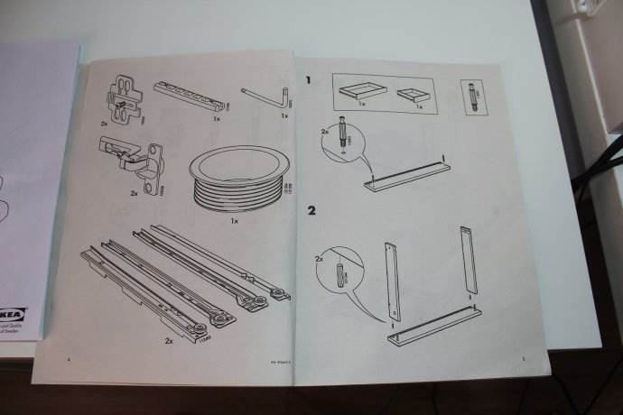
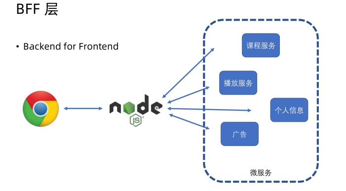

# 技术预研篇

## ★什么是技术预研？

### ◇啥是技术预研？

买过电脑椅的朋友都知道，邮寄过来的不是一张组装好的电脑椅，而是打包好的一个个零件，我们需要根据说明书，如类似这样的说明书：

才能把一个个零件组装成一张电脑椅！

而这些零件都经过厂家仔细测量的，保证这些零件最终能组装成一张电脑椅！不然，真得要说声「操」了，然后把零件都给砸了，毕竟完全体会不到组装成功之后的成就感以及快乐感！

回到我们的程序开发，也是一样的

 你在程序开发之前，如果能把所有要用到的技术 全部都测试一遍、调试过一遍，没问题了之后，然后你再开始真正的程序开发，那么你的程序开发过程就会变得更加的顺利！

而这就是技术预研的作用了

所以我们在做这个项目之前要：

1. 分析要做的需求，找出里面所涉及到的技术难点。
2. 针对每个技术难点进行攻克和测试（即**设计demo**进行攻克）

这样一来，我们在做这个项目的过程中就会变得更加顺利！

> 我之前持有的观点「先做项目，在做项目的过程中遇到不会的技术，再去学」
>
> 而现在则是「该项目会涉及到啥技术，先攻克这些技术，然后才开始去做项目，而不是啥也不懂，卡卡的去做项目」

### ◇BFF 层

这是一个怎样的项目？——课程所提供的这个项目

用现在比较流行的话来讲，它属于一个BFF层，即「 Backend for Frontend」

通俗来讲，它是属于浏览器跟后台服务中间的一个**中间渲染层**

这个中间渲染层负责组装后台返回的各个微服务里边所返回的数据，并且组装成前端所需要的数据，然后再返回到浏览器！

而这样一个事情就是一个「为前端所服务的后台服务」，即所谓的「BFF」哈！

而做这样一个BFF层，它的主要职责就是两个：

- 一个是对用户侧要提供一个 HTTP 服务
-  第二个是要和后端进行一个 RPC 通信，使用后端的 RPC 服务

所以，这一章我们要进行的两个技术预研：

1.  Node.js 是怎么对用户侧提供 HTTP 服务的
2.  Node.js 要怎么去使用后端 RPC 服务

当然，在做这两件事情之前，我们还是需要先了解 Node.js 是怎么跑起来的，它的底层机制是怎样子的！

所以下一节课就先来看看是怎样一个环境搭建！

## ★ Node.js 开发环境安装

## ★总结

- BFF层，拿到各个微服务所返回的数据，而这个过程需要进行 RPC 通信，然后把拿到的数据组装成前端所需要的数据，然后再响应回给浏览器，而这个过程需要进行 HTTP 请求和响应！我之前没有想过有BFF层这么一个东西存在，我以为就是浏览器和 Node.js 在搞事情，没想到 Node.js 是和其它 东西搞完事情之后，才把浏览器想要的东东给响应回去！

## ★Q&A

### ①啥是 RPC 服务？

简单理解一下：

> RPC（Remote Procedure Call Protocol）是指远程过程调用，也就是说两台服务器A，B，一个应用部署在A服务器上，想要调用B服务器上应用提供的函数/方法，由于不在一个内存空间，不能直接调用，需要通过网络来表达调用的语义和传达调用的数据。

不在一台机器上的两个程序之间的调用协议吗？

**➹：**[谁能用通俗的语言解释一下什么是 RPC 框架？ - 知乎](https://www.zhihu.com/question/25536695)

**➹：**[WEB开发中，使用JSON-RPC好，还是RESTful API好？ - 知乎](https://www.zhihu.com/question/28570307)

