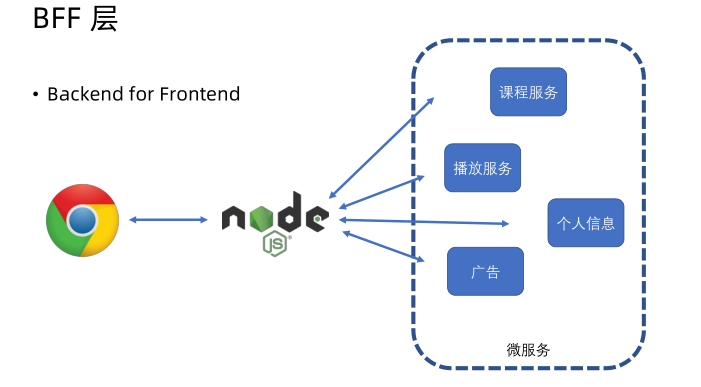
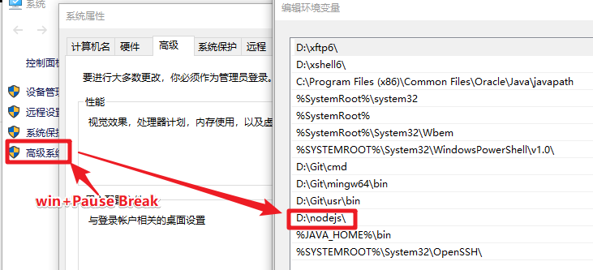
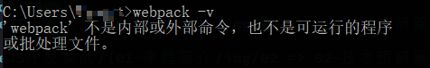
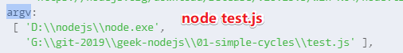

# 技术预研篇

## ★什么是技术预研？

### ◇啥是技术预研？

买过电脑椅的朋友都知道，邮寄过来的不是一张组装好的电脑椅，而是打包好的一个个零件，我们需要根据说明书，如类似这样的说明书：


才能把一个个零件组装成一张电脑椅！

而这些零件都经过厂家仔细测量的，保证这些零件最终能组装成一张电脑椅！不然，真得要说声「操」了，然后把零件都给砸了，毕竟完全体会不到组装成功之后的成就感以及快乐感！

回到我们的程序开发，也是一样的

 你在程序开发之前，如果能把所有要用到的技术 全部都测试一遍、调试过一遍，没问题了之后，然后你再开始真正的程序开发，那么你的程序开发过程就会变得更加的顺利！

而这就是技术预研的作用了

所以我们在做这个项目之前要：

1. 分析要做的需求，找出里面所涉及到的技术难点。
2. 针对每个技术难点进行攻克和测试（即**设计demo**进行攻克）

这样一来，我们在做这个项目的过程中就会变得更加顺利！

> 我之前持有的观点「先做项目，在做项目的过程中遇到不会的技术，再去学」
>
> 而现在则是「该项目会涉及到啥技术，先攻克这些技术，然后才开始去做项目，而不是啥也不懂，卡卡的去做项目」

### ◇BFF 层

这是一个怎样的项目？——课程所提供的这个项目

用现在比较流行的话来讲，它属于一个BFF层，即「 Backend for Frontend」

通俗来讲，它是属于浏览器跟后台服务中间的一个**中间渲染层**

这个中间渲染层负责组装后台返回的各个微服务里边所返回的数据，并且组装成前端所需要的数据，然后再返回到浏览器！

而这样一个事情就是一个「为前端所服务的后台服务」，即所谓的「BFF」哈！



而做这样一个BFF层，它的主要职责就是两个：

- 一个是对用户侧要提供一个 HTTP 服务
-  第二个是要和后端进行一个 RPC 通信，使用后端的 RPC 服务

所以，这一章我们要进行的两个技术预研：

1.  Node.js 是怎么对用户侧提供 HTTP 服务的
2.  Node.js 要怎么去使用后端 RPC 服务

当然，在做这两件事情之前，我们还是需要先了解 Node.js 是怎么跑起来的，它的底层机制是怎样子的！

所以下一节课就先来看看是怎样一个环境搭建！

## ★ Node.js 开发环境安装

要安装的工具：

- Chrome（前端必备的一个东西）

- VS Code（在这门课里边，没有什么特别的扩展需要去安装）

- Node.js

  - LTS（稳定，比较不容易出问题的这么一个版本）
  - Current（不怎么稳定，但有最新功能的这么一个版本）

  不容版本的API文档是不一样的，在这个课里边用的是Current版！

确认 Node.js 是否安装成功：

```bash
node -v
npm -v
```

有版本号出现，那就是安装成功啦！

如果在window环境下出现，找不到 node 这个命令，那么这一般就是环境变量没有配置的锅！

> 终端在找 Node.js 执行文件的时候，它会根据电脑里边的环境变量来寻找，而这个环境变量记载着所有可能在终端运行的程序的安装地址！



> 注意这在系统变量的Path里边配置，当然你在用户变量配置里也行

如果你去掉了它了，那么就会报类似这样的错误：



*注：每次修改环境变量，都得重启一下终端，不然就没有预期的效果出现*

目前，我们完成了 Node.js 的开发环境搭建，下一节开始第一个实战「石头剪刀布游戏」

---

## ★第一个 Node.js 程序：石头剪刀布游戏

### ◇会学到什么

从做这个小游戏的过程里边，我们会学到：

1.  Node.js 它的运行方式是怎样子的
2.  Node.js 的一些全局变量是怎样使用的，以及有哪些全局变量

### ◇怎么让代码跑起来

随便搞了个 JS 文件，然后使用 node 命令执行它，在这里边 node 命令会读取这个 JS 文件里边的内容然后运行里边的 Node.js 代码！

### ◇有哪些全局变量

 Node.js 的全局变量跟Chrome的是有一些差别的，但大部分其实也是类似的哈！如：

```js
console.log(Date)
console.log(Math)
console.log(setTimeout)
console.log(setInterval)
```

然而在时间函数里边有一个例外：

```js
console.log(requestAnimationFrame)   //ReferenceError: requestAnimationFrame is not defined
```

这个函数的意思其实是，浏览器渲染的下一帧，由于代码并不是跑在浏览器环境里边的，所以这个函数显然是不存在的哈！

为了弥补失去的这个函数， Node.js 又另外提供 了一个函数：

```js
console.log(setImmediate)
```

Node.js 特有的环境变量：

```
console.log(__filename) //拿到当前所运行的脚本所在的位置
console.log(__dirname) //当前所运行的脚本的目录位置
//G:\git-2019\geek-nodejs\01-simple-cycles\test.js
//G:\git-2019\geek-nodejs\01-simple-cycles
```

*注：拿到的是绝对路径哈！即从盘符开始哈！而不是相对于项目根目录的相对路径*

何时用？——这两个变量在我们进行文件操作的时候，非常有用哈！

还有一个是进程对象：`process`

这个进程对象的内容非常多，记载了我们运行的这个 Node.js 程序，它的进程的一些信息，如

1. nodejs版本号 `version: 'v10.15.3'`

2. 运行环境的操作系统 `platform: 'win32'`

3. 关键的还有kill、exit这两个函数，用于管理杀进程的一些操作

4. hrtime：用于统计时间，时间精度可到微秒级（bigint）。

5. cpuUsage、memoryUsage：打印CPU占用率和内存占用率，在性能分析时会经常用到

6. env：是一个对象，用于打印node目前所运行的环境的环境变量，如 `PATH`等，而环境变量这东西，可以让你快速的在启动 Node.js 的时候做一些配置，然后让你的程序能够根据环境变量做一些分治，比如说你可以加一个叫debug的环境变量，然后 Node.js 就可以以debug模式来运行

7. argv：在启用 Node进程的时候，敲击的命令是怎样子的。何时用？——做一些命令行程序时会用到：

   

   接下来的石头剪刀布游戏会用到它

以上就是有关 Node.js 全局变量的一些情况了！

### ◇石头剪刀布游戏

效果：输入 `node test.js  rock`，电脑随机输入一个石头剪刀布，然后输出一个谁赢的结果

思路：`argv`（获取用户输入）、`Math.random`（模拟电脑输入）、`if……else……`（判断结果）

测试：`node index.js rock`，测试了几局，可见结果有来有回，即有赢有输有平局哈！

经过这个有趣的石头剪刀布游戏的开发，我对 Node.js 的运行方式以及一些全局变量有了一定的认识！

下一节就开始讨论 Node.js 的模块规范！

## ★总结

- BFF层，拿到各个微服务所返回的数据，而这个过程需要进行 RPC 通信，然后把拿到的数据组装成前端所需要的数据，然后再响应回给浏览器，而这个过程需要进行 HTTP 请求和响应！我之前没有想过有BFF层这么一个东西存在，我以为就是浏览器和 Node.js 在搞事情，没想到 Node.js 是和其它 东西搞完事情之后，才把浏览器想要的东东给响应回去！
- 实际写代码的时候请用let，而不是var，因为这会好一些，如咩有变量提升，会和其它语言更接近些（如，代码块是有意义的）
- 老师在讲石头剪刀布这个游戏前，对 Node.js 进行了简单的介绍，如怎么运行 Node.js 代码、有哪些全局变量等，而这也算是对这个小游戏的技术预研了！不然，我是不太懂  `process`和它的 `argv`是干嘛用的！

## ★Q&A

### ①啥是 RPC 服务？

简单理解一下：

> RPC（Remote Procedure Call Protocol）是指远程过程调用，也就是说两台服务器A，B，一个应用部署在A服务器上，想要调用B服务器上应用提供的函数/方法，由于不在一个内存空间，不能直接调用，需要通过网络来表达调用的语义和传达调用的数据。

不在一台机器上的两个程序之间的调用协议吗？

**➹：**[谁能用通俗的语言解释一下什么是 RPC 框架？ - 知乎](https://www.zhihu.com/question/25536695)

**➹：**[WEB开发中，使用JSON-RPC好，还是RESTful API好？ - 知乎](https://www.zhihu.com/question/28570307)

### ② Node.js 版本？

不要使用奇数版就对了，因为奇数版常更新哈！

**➹：**[Node.js 的 LTS 版本意味着什么？ - 知乎](https://www.zhihu.com/question/35512237?from=profile_question_card)

### ③requestAnimationFrame？

为啥有它？

css3已经能够实现非常多的动画特效，但是仍然存在css3无法完成的动画任务（比如页面滚动），而通常的解决方案都是使用js中的setInterval来设置定时器来实现动画特效，然而计时器并不可靠，毕竟 JS 是单线程的，只要call stack 里边还有代码，那么设置的定时就很有可能不会按预期的时间执行callback，而这样一来，就会导致动画效果没有达到自己预期的那种效果

动画是由浏览器按照一定的频率一帧一帧的绘制的，由css实现的动画的优势就是浏览器知道动画的开始及每一帧的循环间隔，能够在恰当的时间刷新UI，给用户一种流畅的体验，而setInterval或setTimeout实现的JavaScript动画就没有这么可靠了，因为浏览器压根就无法保证每一帧渲染的时间间隔，一般情况下，每秒平均刷新次数能够达到60帧，就能够给人流畅的体验，即每过 1000/60 毫秒渲染新一帧即可

为此，requestAnimationFrame应运而生，其作用就是让浏览器流畅的执行动画效果。可以将其理解为**专门用来实现动画效果的api**，通过这个api,可以告诉浏览器某个JavaScript代码要执行动画，浏览器收到通知后，则会运行这些代码的时候进行优化，实现流畅的效果，而不再需要开发人员烦心刷新频率的问题了。

```html
<div id="myDiv" style="background-color: lightblue;width: 0;height: 20px;line-height: 20px;">0%</div>
<button id="btn">run</button>
<script>
var timer;
btn.onclick = function(){
    myDiv.style.width = '0';
    cancelAnimationFrame(timer);
    timer = requestAnimationFrame(function fn(){
        if(parseInt(myDiv.style.width) < 500){
            myDiv.style.width = parseInt(myDiv.style.width) + 5 + 'px';
            myDiv.innerHTML =     parseInt(myDiv.style.width)/5 + '%';
            timer = requestAnimationFrame(fn);
        }else{
            cancelAnimationFrame(timer);
        }    
    });
}
</script>
```

**➹：**[你需要知道的requestAnimationFrame - 掘金](https://juejin.im/post/5a82f0626fb9a06358657c9c)

**➹：**[CSS3动画那么强，requestAnimationFrame还有毛线用？ « 张鑫旭-鑫空间-鑫生活](https://www.zhangxinxu.com/wordpress/2013/09/css3-animation-requestanimationframe-tween-%E5%8A%A8%E7%94%BB%E7%AE%97%E6%B3%95/?_t_t_t=0.3547051663712042)

**➹：**[被誉为神器的requestAnimationFrame_JavaScript, setTimeout, setInterval, requestAnimationFrame 教程_w3cplus](https://www.w3cplus.com/javascript/requestAnimationFrame.html)

**➹：**[深入理解定时器系列第二篇——被誉为神器的requestAnimationFrame - 小火柴的蓝色理想 - 博客园](https://www.cnblogs.com/xiaohuochai/p/5777186.html)

### ④ 在 VS Code里边，有关 Node.js 代码的提示？

我在 VS Code 里边写 Node.js 代码，发现这个API `setImmediate`没有提示

出于开发效率的问题，那就需要一个代码提示工具，但我没有找到 相关的 VS Code 插件

解决办法：

在 你的 Node.js 项目里边安装个包即可：

```bash
yarn add @types/node
```

千万不要使用 `typings`，因为我在终端里边敲下 `typings install dt~node --global --save`这行命令就报了这样的错误 `Unable to connect to……`

**➹：**[nodejs笔记之vscode nodejs智能提示功能 - 蓝叶菱的专栏 - CSDN博客](https://blog.csdn.net/wlanye/article/details/85261058)

**➹：**[VSCode 求 Node.js 插件 - V2EX](https://www.v2ex.com/t/426633)

**➹：**[Unable to connect to "https://api.typings.org/entries/dt/node/versions/latest · Issue #450 · typings/typings](https://github.com/typings/typings/issues/450)

### ⑤局部变量？

>  关于局部变量的问题，JS里有一个需要关注的地方就是var关键字声明的变量会有一个变量提升的机制，把变量的可用范围提升到整个所在函数里。（在node.js里，一个JS模块也可以视为一个函数，后面会讲到）所以它会跨越if else范围可用
>
> 用es6标准里的let和const关键字声明变量的话，就不会有上面说到的现象，会和其他语言更接近些  

 Node.js 里边的一个模块指的是一个文件吗？我可以把一个文件视作为一个函数？

### ⑥process的变量可以设置么？

> 不太建议修改process对象。如果实在是想要有全局变量，依靠node.js的模块机制，定义一个config模块就够了。模块机制后面会讲到

在 Node.js 里边，我在一个 JS 文件里，用var声明了一个变量 `x`（不是在函数里边声明的），那么这个  `x`是全局变量吗？

按照目前的理解，这应该不是吧，因为这不是在浏览器环境啊！

```js
var x = 5
console.log(global.x) //undefined
```

回顾老师的答案，是定义一个 `config.js`文件么？然后利用 Node.js 的模块机制，那些模块需要用到全局变量，就到 `config`模块里边找对么？

