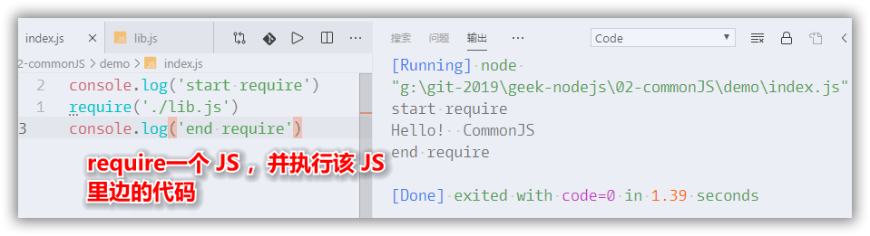
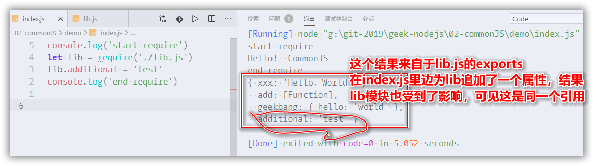
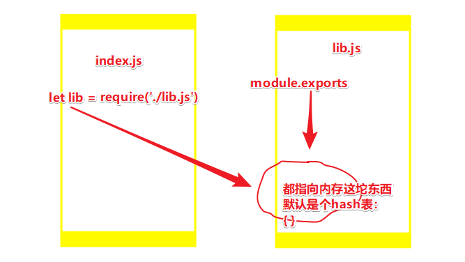
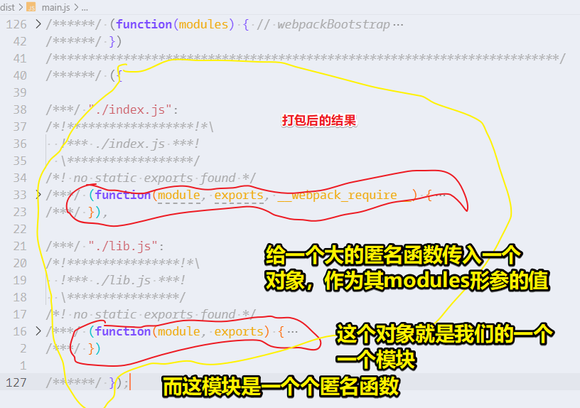
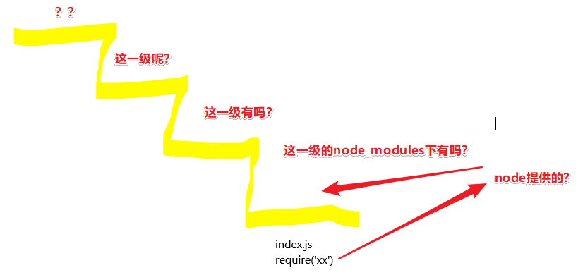
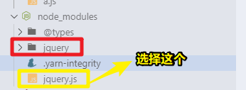
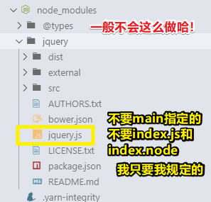

# 模块

## ★CommonJS 规范

### ◇为什么要了解它？

关于 Node.js 的模块规范，也就是CommonJS规范

模块规范是做一个大型  Node.js 应用程序的基础，所以这是非常关键的！

### ◇前端如何加载 JS ？

#### 用script标签

在讲解它之前，先来回顾前端是如何加载 JS 的。

在浏览器里边我们都是用`script`标签去加载 JS 的

如果script标签里边有个src属性，那么浏览器就会从远端下载个 JS 脚本下来，并且执行它！

反之，咩有这个src属性，那么浏览器就会直接把script里边的代码给执行一遍哈！

而这就是我们以前唯一的一种加载 JS 的方法！

#### script标签的不足

那么用script标签去加载 JS 会有一个什么样的问题呢？

**①当脚本变得很多的时候，我们需要手动去管理这个 JS 的加载顺序。**

举个栗子来说，当你的业务代码使用了jQuery这个JS，那么你就需要把jQuery放在第一个script标签上去加载！然后再去运行的你业务脚本，如果就引入一两个库，这样做其实是没啥问题的，但是如果变得越来越多之后呢？如你不只是引入jQuery，还引入Underscore 等其它奇奇怪怪的函数库 ，而这样一来你需要管理的脚本数量就变得非常多了，而这也意味着有很大管理成本

**②不同脚本之间，如果产生逻辑调用，那么这是需要一个全局变量作为桥梁去做通信的！**

就拿刚才那个jQuery例子来说，jQuery的所有函数都是挂在一个全局变量 `$`上的，我们每一次调用jQuery都是访问 `$`变量，然后去找它里边的函数，然后去调用。简而言之，就是说每一个脚本的逻辑输出，都得输出到一个全局变量上才能被其它脚本所调用！如果你的脚本变得非常多，那么你要用的全局变量也就越来越多了！而全局变量多了，那么你的程序就很难管理了！因为你很难确定哪一天自己的全局变量就会被人所覆盖，说白了，某个全局变量被覆盖了，那么你的 Node.js 程序也就GG了。

**③当一个 JS 的运行环境它咩有HTML，那该咋办呢？**

而这个例子就是 Node.js ，我们运行 Node.js 其实咩有经过任何的HTML文件的，而这就意味着我们是没有地方去写一个script标签了啊！

所以 Node.js 是需要重新去搞一个模块管理的机制，来管理我们 JS 的加载

而这个机制就是 CommonJS 模块规范啦！  

 CommonJS 其实并不是一个模块规范的名字，它是一个非常庞大的东西，只是现在只有模块规范是留着的，因为它被 Node.js 所采用，并且推广，再加上它非常经典，后续也影响到了浏览器端 JS 的编写方式！

现在前端里边有很多构建工具，比如说webpack，它就是兼容 CommonJS 这种模块规范，可以让你用 CommonJS 规范来写前端代码！

接下来实战一下 CommonJS 规范，以及使用 CommonJS 规范改编、优化之前的小游戏！

### ◇代码 vs  CommonJS 

①创建一个入口 JS ，如 `index.js`

②由于我们是在讲一个模块规范，因此还得再创建一个被依赖的 JS ，如 `lib.js`，说白了就是其它模块要用到这个 `lib.js`，而这样才能测试 CommonJS 到底是个什么东东

③ CommonJS 规范是怎样的呢？

有几个关键的变量：

- `require`：如果你在一个 JS 里边，想要加载另外一个 JS ，那就需要用到require函数来require它！

```js
//index.js
require('./lib.js')
```

当你运行index.js的时候，就会加载lib.js，并且运行它！

验证是否如我们所想的这样：



require这个依赖默认是有一个输出的，在上边的代码里边，我们只在lib.js添加了这样的代码：

```js
console.log('Hello!  CommonJS')
```

所以它的输出默认就是一个空对象 `{}`

那么如何指定被引用的这个 JS 的输出呢？即我不想要一个朴素的 `{}`

一个 JS 文件就是一个模块，lib这个模块里边，就有一个叫 `exports`变量，需要注意的是，它不是一个全局变量，而是一个不需要声明的关键字变量！（语法就这样，反正node会自己解析）总之，每个模块默认会注入一个 `exports`变量

接着在`exports`变量旗下，挂一个 属性：

```js
//libg.js
exports.xxx = 'Hello，World！'
```

以上就是我们定义一个模块的输出方式

> 说白了，这可以理解为一个模块就是一个函数，而exports的值就是该函数的返回值哈！

当然除了，挂字符串类型的数据以外，还可以挂其它的，如函数、对象等：

``` JS
exports.add = function (a, b) {
  return a + b
}
exports.geekbang = {
  hello: 'world'
}
```

可见，exports是可以挂任何东西的！

总之，exports的值就是一个正常的对象字面量

接下来，分析一下，`require('./lib.js')`的返回值，和 `lib.js` 里边的 `exports` 值是不是同一个引用？

测试这个问题，也很简单：

``` JS
// lib.js
console.log('Hello!  CommonJS')
exports.xxx = 'Hello，World！'
exports.add = function (a, b) {
  return a + b
}
exports.geekbang = {
  hello: 'world'
}

setTimeout(() => {
  console.log(exports)
}, 2000)
```



我们希望exports的值不是一个对象引用，而是一个字符串、函数等，那么这该如何实现呢？

这也很简单呀！

如果你这直接这样：`exports = 'hi'`

那么require的返回值还是一个对象，但如果你这样 `module.exports = 'hi'`,那么它的返回就是字符串 `hi`了

为啥会这样呢？

你可以理解为每个模块文件的第一行都有以下这行代码，只是这是node帮我们追加的罢了：

 ``` JS
 var exports = module.exports
 ```

 也就是说require的返回值是 `module.exports` 的引用，而不是 `exports`的值。这个东西你画一下内存图就很好理解了

 

当你 `exports = 'hi'` 的时候，`module.exports`的引用没啥变化，只是你 `exports`从此就成为了一个非常非常普通的变量，仅此而已！

因此，如果你想要require的返回值，不是默认的那个对象，那你就使用 `module.exports = xxx` 而不是 `exports = xxx`。如：

``` JS
//lib.js
module.exports = function minus(a, b) {
  return a - b
}

setTimeout(() => {
  console.log(exports)
}, 4000)
```

在这里需要注意的是，`lib.js`模块的`exports`的值是不会受到 `index.js` 模块的干扰的！你可以画个内存图理解一下。简单来说就是`exports`的值跟 `module.exports`的值，根本就不是同一个引用哈！那么这是何时改变的呢？

在我们写上`module.exports = (a,b) => a-b` 这一行代码的这一时刻！

另一种姿势解释 `module.exports` 和 `exports` 的区别：

之前说到，现在前端写 JS 的姿势也可以用 CommonJS 规范来写，即你用 CommonJS 规范写的 JS 代码，可以在浏览器上跑！

那么这是如何做到的呢？——引入webpack这个工具就可以做到！

那么webpack是怎么做到的呢？

把你用 CommonJS 规范写的代码，全都给分析一遍，然后打包成一个可以在浏览器跑的大的 JS ，然后，我们可以从这个打包结果来看出 CommonJS 的整个运行方式是怎样子的！

可以使用`yarn`全局安装webpack和webpack-cli，也可以本地安装

安装好之后，执行以下命令：

``` BASH
webpack --devtool none --mode development --target node index.js
```

*注：这是全局安装的webpack，如果是局部安装的，你就在该命令的开头加上npx，或者把该命令放到package.json的scripts字段里边去，然后运行脚本*

运行结果（这个 `main.js` 文件可以直接用 `node`运行 ）：

```js
/******/ (function(modules) { // webpackBootstrap
/******/ 	// The module cache
/******/ 	var installedModules = {};
/******/
/******/ 	// The require function
/******/ 	function __webpack_require__(moduleId) {
/******/
/******/ 		// Check if module is in cache
/******/ 		if(installedModules[moduleId]) {
/******/ 			return installedModules[moduleId].exports;
/******/ 		}
/******/ 		// Create a new module (and put it into the cache)
/******/ 		var module = installedModules[moduleId] = {
/******/ 			i: moduleId,
/******/ 			l: false,
/******/ 			exports: {}
/******/ 		};
/******/
/******/ 		// Execute the module function
/******/ 		modules[moduleId].call(module.exports, module, module.exports, __webpack_require__);
/******/
/******/ 		// Flag the module as loaded
/******/ 		module.l = true;
/******/
/******/ 		// Return the exports of the module
/******/ 		return module.exports;
/******/ 	}
/******/
/******/
/******/ 	// expose the modules object (__webpack_modules__)
/******/ 	__webpack_require__.m = modules;
/******/
/******/ 	// expose the module cache
/******/ 	__webpack_require__.c = installedModules;
/******/
/******/ 	// define getter function for harmony exports
/******/ 	__webpack_require__.d = function(exports, name, getter) {
/******/ 		if(!__webpack_require__.o(exports, name)) {
/******/ 			Object.defineProperty(exports, name, { enumerable: true, get: getter });
/******/ 		}
/******/ 	};
/******/
/******/ 	// define __esModule on exports
/******/ 	__webpack_require__.r = function(exports) {
/******/ 		if(typeof Symbol !== 'undefined' && Symbol.toStringTag) {
/******/ 			Object.defineProperty(exports, Symbol.toStringTag, { value: 'Module' });
/******/ 		}
/******/ 		Object.defineProperty(exports, '__esModule', { value: true });
/******/ 	};
/******/
/******/ 	// create a fake namespace object
/******/ 	// mode & 1: value is a module id, require it
/******/ 	// mode & 2: merge all properties of value into the ns
/******/ 	// mode & 4: return value when already ns object
/******/ 	// mode & 8|1: behave like require
/******/ 	__webpack_require__.t = function(value, mode) {
/******/ 		if(mode & 1) value = __webpack_require__(value);
/******/ 		if(mode & 8) return value;
/******/ 		if((mode & 4) && typeof value === 'object' && value && value.__esModule) return value;
/******/ 		var ns = Object.create(null);
/******/ 		__webpack_require__.r(ns);
/******/ 		Object.defineProperty(ns, 'default', { enumerable: true, value: value });
/******/ 		if(mode & 2 && typeof value != 'string') for(var key in value) __webpack_require__.d(ns, key, function(key) { return value[key]; }.bind(null, key));
/******/ 		return ns;
/******/ 	};
/******/
/******/ 	// getDefaultExport function for compatibility with non-harmony modules
/******/ 	__webpack_require__.n = function(module) {
/******/ 		var getter = module && module.__esModule ?
/******/ 			function getDefault() { return module['default']; } :
/******/ 			function getModuleExports() { return module; };
/******/ 		__webpack_require__.d(getter, 'a', getter);
/******/ 		return getter;
/******/ 	};
/******/
/******/ 	// Object.prototype.hasOwnProperty.call
/******/ 	__webpack_require__.o = function(object, property) { return Object.prototype.hasOwnProperty.call(object, property); };
/******/
/******/ 	// __webpack_public_path__
/******/ 	__webpack_require__.p = "";
/******/
/******/
/******/ 	// Load entry module and return exports
/******/ 	return __webpack_require__(__webpack_require__.s = "./index.js");
/******/ })
/************************************************************************/
/******/ ({

/***/ "./index.js":
/*!******************!*\
  !*** ./index.js ***!
  \******************/
/*! no static exports found */
/***/ (function(module, exports, __webpack_require__) {

console.log('start require')
let lib = __webpack_require__(/*! ./lib */ "./lib.js")
console.log('end require')

lib.additional = 'test'
console.log(lib)


/***/ }),

/***/ "./lib.js":
/*!****************!*\
  !*** ./lib.js ***!
  \****************/
/*! no static exports found */
/***/ (function(module, exports) {

console.log('我是lib.js模块')

exports.x = '我是x变量的字符串值'

module.exports = function add(a, b) {
  return a + b
}

setTimeout(() => {
  console.log(exports)
})

/***/ })

/******/ });
```

折叠代码分析该打包结果的大致结构：



从中可以简单看出 `__webpack_require__`的返回值是 `module.exports`，而不是 `exports`；模块id即模块的路径 `"./lib.js"`（这最后应该拼装成绝对路径哈！）

进一步分析大的匿名函数 `webpackBootstrap` ：

忽视该匿名函数里边所声明的变量，找到它的`return`，发现这TM是在调用一个 叫`__webpack_require__`的函数

一个知识盲点：

```js
let xxx = function(m) {
	console.log(m)
}
let p = {}
xxx(p.x=5) //居然log了一个5，我想这是赋值表达式返回5的结果哈！
```

总之，这种写法是在个xxx传参的过程中，顺便把一个对象的某个属性赋上了值！

因此，`__webpack_require__(moduleId)`的 `moduleId`的实参是 `"./index.js"`

那么下边这行代码的意图就很明显了：

```js
modules[moduleId].call(module.exports, module, module.exports, __webpack_require__);
```

`modules`是传给大匿名函数的那个包含有两个匿名模块的实参对象！

接着就开始执行 `index.js` 这个模块，指定this的参数 `index.js`导出的模块，也就是它自己啦！

```js
(function (module, exports, __webpack_require__) {
      console.log(this)
      console.log(module)
      console.log(exports)
      console.log('start require')
      let lib = __webpack_require__(/*! ./lib */ "./lib.js")
      console.log('end require')

      lib.additional = 'test'
      console.log(lib)


      /***/
})
```

this：`{}`，来自于 `module.exports`

module：`{ i: './index.js', l: false, exports: {} }`

exports：`{}`

执行到 `__webpack_require__(/*! ./lib */ "./lib.js")`这一步，分析得知，该函数的返回值是 `module.exports`

所以 `exports`和 `module.exports`的区别就很明显了呀！

> 其实看 webpack打包后的结果，并不那么好理解，我还是喜欢，在每个模块里边，添加一行 `var exports = module.exports;` 这种姿势来理解！

## ★总结

- 在 Node.js 里边，你执行的是一个入口 JS 文件，剩余的其它 JS 文件，请在入口 JS 文件里边用 `require`来搞事情！而这个入口 JS 文件，一般叫做 index.js ，或者 app.js
- 只用`module.exports`输出一个东西，而不是用 `exports`，因为如果你无法区分二者的话，那么使用后者是很危险的！如「如果模块输出的是一个函数，那就不能定义在exports对象上面，而要定义在`module.exports`变量上面。」这个点，你知道吗？
- 规范即代码运行所遵循的规则！白话点就是，规定这样的输入会有这样的输出，而代码的具体实现过程可看做是个黑盒子。

## ★Q&A

### ① CommonJS ？

CommonJS是一个项目，目标是在Web浏览器之外为JavaScript建立模块生态系统的约定。创建它的主要原因是**缺乏普遍接受的**的JavaScript脚本模块单元，这些模块单元可以在不同于常规的Web浏览器提供的环境中重用，如运行 JS 脚本的web服务器或者是原生桌面端应用程序。

起初2009年一月份，它叫 ServerJS，在同年的八月份，它才正式叫做  CommonJS 

为啥叫 CommonJS 呢？——因为要展示它的APIs有广泛地适用性啊！（ Common，普遍的，常见的……）

规范是在一个被大众所认可的开放过程中才被创建的。一个规范的最终诞生，只有在通过多个实现完成之后才被认为是最终规范。

CommonJS不隶属于致力于EcmaScript的ECMA国际集团TC39，但TC39的一些成员参与了该项目

然而在2013年5月，Node.js的包管理器npm的作者Isaac Z. Schlueter说，CommonJS正在被Node.js淘汰，核心Node.js开发人员应该避免使用 CommonJS 规范。

虽然如此，但还是得了解它哈！

Node 应用由模块组成，采用 CommonJS 模块规范。

每个文件就是一个模块，有自己的作用域。在一个文件里面定义的变量、函数、类，都是私有的，对其他文件不可见。如

```js
// example.js
var x = 5; //私有的
var addX = function (value) {
  return value + x;
};
```

如果想在多个文件分享变量，必须定义为`global`对象的属性

```js
global.warning = true; //不推荐
```

上面代码的`warning`变量，可以被所有文件读取。当然，这样写法是不推荐的。

CommonJS规范规定，每个模块内部，`module`变量代表当前模块。这个变量是一个对象，它的`exports`属性（即`module.exports`）是对外的接口。加载某个模块，其实是加载该模块的`module.exports`属性。

`require`方法用于加载模块。

**CommonJS模块的特点如下：**

- 所有代码都运行在模块作用域，不会污染全局作用域。
- 模块可以多次加载，但是只会在第一次加载时运行一次，然后运行结果就被缓存了，以后再加载，就直接读取缓存结果。要想让模块再次运行，必须清除缓存。
- 模块加载的顺序，按照其在代码中出现的顺序。

**module对象：**

Node内部提供一个`Module`**构建函数**。所有模块都是`Module`的实例。

```js
function Module(id, parent) {
  this.id = id;
  this.exports = {};
  this.parent = parent;
  // ...
}
```

总之，每个模块内部，都有一个`module`对象（你是看不见它的，执行模块时 nod e命令会知道），代表当前模块。它有以下属性。

- `module.id` 模块的识别符，通常是带有绝对路径的模块文件名。
- `module.filename` 模块的文件名，带有绝对路径。
- `module.loaded` 返回一个布尔值，表示模块是否已经完成加载。
- `module.parent` 返回一个对象，表示调用该模块的模块。
- `module.children` 返回一个数组，表示该模块要用到的其他模块。
- `module.exports` 表示模块对外输出的值。

最后一行输出module变量：

```js
// 01-test.js
var jquery = require('jquery');
exports.$ = jquery;
console.log(module);
console.log(exports);
```

> module变量就是模块里边的隐式的全局变量啊！

执行这个文件，命令行会输出如下信息：

```js
{
  id: '.',
  exports: { '$': [Function] },
  parent: null,
  filename: 'G:\\git-2019\\geek-nodejs\\02-commonJS\\01-test.js',
  loaded: false,
  children:
    [{
      id:
        'G:\\git-2019\\geek-nodejs\\node_modules\\jquery\\dist\\jquery.js',
      exports: [Function],
      parent: [Circular],
      filename:
        'G:\\git-2019\\geek-nodejs\\node_modules\\jquery\\dist\\jquery.js',
      loaded: true,
      children: [],
      paths: [Array]
    }],
  paths:
    ['G:\\git-2019\\geek-nodejs\\02-commonJS\\node_modules',
      'G:\\git-2019\\geek-nodejs\\node_modules',
      'G:\\git-2019\\node_modules',
      'G:\\node_modules']
}

//{ '$': [Function] }
```

> 我没想到module的pasht属性居然是这样获取模块的！即先看当前 JS 文件是否存在node_modules，不存在那就往上一级找！直到找到为止！

如果在命令行下调用某个模块，比如`node something.js`，那么`module.parent`就是`null`。如果是在脚本之中调用，比如`require('./something.js')`，那么`module.parent`就是调用它的模块。如上边的 `node 01-test.js`，`01-test.js`里边调用了 `require('jquery')`，那么该 `jquery.js`模块的父模块就是 `01-test.js`啦！即 `.`(`Circular`)

利用这一点，可以判断当前模块是否为入口脚本。因为入口脚本是咩有 `parent`的，即为`null`

```
if (!module.parent) {
    // ran with `node something.js`
    app.listen(8088, function() {
        console.log('app listening on port 8088');
    })
} else {
    // used with `require('/.something.js')`
    module.exports = app;
}
```

**module.exports属性：**

> `module.exports`属性表示当前模块对外输出的接口，其他文件加载该模块，实际上就是读取`module.exports`变量。

**exports变量：**

> 为了方便，Node为每个模块提供一个exports变量，指向module.exports。这等同在每个模块头部，有一行这样的命令。

```js
var exports = module.exports;
```

而这样做所造成的结果是，在对外输出模块接口时，可以向exports对象添加方法

```js
exports.area = function (r) {
  return Math.PI * r * r;
};

exports.circumference = function (r) {
  return 2 * Math.PI * r;
};
```

注意，不能直接将exports变量指向一个值，因为这样等于切断了`exports`与`module.exports`的联系。

```js
exports = function(x) {console.log(x)};
```

上面这样的写法是无效的，因为`exports`不再指向`module.exports`了

下面的写法也是无效的。

```js
exports.hello = function() {
  return 'hello';
};

module.exports = 'Hello world';
```

上面代码中，`hello`函数是无法对外输出的，因为`module.exports`被重新赋值了。

这意味着，如果一个模块的对外接口，就是一个单一的值，不能使用`exports`输出，只能使用`module.exports`输出。

```js
module.exports = function (x){ console.log(x);};
```

如果你觉得，`exports`与`module.exports`之间的区别很难分清，一个简单的处理方法，就是放弃使用`exports`，只使用`module.exports`。

> 分清它们方法很简单，你每次都假想 每个模块头部，有一行这样的命令 :
>
> `var exports = module.exports`

**AMD规范与CommonJS规范区别：**

> CommonJS规范加载模块是同步的，也就是说，只有加载完成，才能执行后面的操作。AMD规范则是非同步加载模块，允许指定回调函数。由于Node.js主要用于服务器编程，模块文件一般都已经存在于本地硬盘，所以加载起来比较快，不用考虑非同步加载的方式，所以CommonJS规范比较适用。但是，如果是浏览器环境，要从服务器端加载模块，这时就必须采用非同步模式，因此浏览器端一般采用AMD规范。

说白了就是一个AMD需要发送请求，而 CommonJS 则不需要！而这意味着浏览器端用AMD，而服务器端则用 CommonJS 

不过现在，浏览器端用的是ES6模块规范，而不是AMD规范！而且服务端，也有逐步向着ES6模块规范靠近！

那么AMD规范长啥样呢？

AMD规范使用define方法定义模块，下面就是一个例子：

```js
define(['package/lib'], function(lib){
  function foo(){
    lib.log('hello world!');
  }

  return {
    foo: foo
  };
});
```

当然，AMD规范是允许输出的模块兼容CommonJS规范，这时`define`方法需要写成下面这样：

```js
define(function (require, exports, module){
  var someModule = require("someModule");
  var anotherModule = require("anotherModule");

  someModule.doTehAwesome();
  anotherModule.doMoarAwesome();

  exports.asplode = function (){
    someModule.doTehAwesome();
    anotherModule.doMoarAwesome();
  };
});
```

> 函数参数里边的函数体代码就是 遵循CommonJS 规范书写的代码呀！

**➹：**[CommonJS - Wikipedia](https://en.wikipedia.org/wiki/CommonJS)

### ②require命令？

**基本用法：**

Node使用CommonJS模块规范，内置的`require`命令用于加载模块文件。

`require`命令的基本功能是，**读入并执行**一个JavaScript文件，然后返回该模块的exports对象。如果没有发现指定模块，会报错。

如果模块输出的是一个函数，那就不能定义在exports对象上面，而要定义在`module.exports`变量上面。

---

**加载规则：**

> `require`命令用于加载文件，后缀名默认为`.js`。

即你可以写后缀，也可以不写后缀，但在ES6里边是需要写的！

根据参数的不同格式，`require`命令去不同路径寻找模块文件。

参数字符串以什么开头？

1. `/`：表示加载的是一个位于绝对路径的模块文件。比如，`require('/home/marco/foo.js')`将加载`/home/marco/foo.js`。
2. `./`：表示加载的是一个位于相对路径（跟当前执行脚本的位置相比）的模块文件。比如，`require('./circle')`将加载当前脚本同一目录的`circle.js`。
3. 以上二者都不是：表示加载的是一个**默认提供的核心模块**（位于Node的系统安装目录中），或者**一个位于各级node_modules目录的已安装模块**（全局安装或局部安装）。

第三点，举例来说，脚本`/home/user/projects/foo.js`执行了`require('bar.js')`命令，Node会依次搜索以下文件。

```
/usr/local/lib/node/bar.js
/home/user/projects/node_modules/bar.js
/home/user/node_modules/bar.js
/home/node_modules/bar.js
/node_modules/bar.js
```

> 说白了就是，先看node提供的API模块，接着就是从同级的 `node_modules`下的模块文件开始逐渐上一步台阶往上找：



为啥要这样设计呢？或者说这样设计的目的是啥？

这样设计的目的是，使得不同的模块可以将所依赖的模块本地化。

4. 不以“./“或”/“开头，而且是一个路径，比如`require('example-module/path/to/file')`，则将先找到`example-module`的位置，然后再以它为参数，找到后续路径。

   > 我的测试 `require('03-test/a.js')`
   >
   > 直接去找相对于当前 JS 文件的 `node_modules/03-test/a.js`

5. 如果指定的模块文件没有发现，Node会尝试为文件名添加`.js`、`.json`、`.node`后，再去搜索。`.js`件会以文本格式的JavaScript脚本文件解析，`.json`文件会以JSON格式的文本文件解析，`.node`文件会以编译后的二进制文件解析。

6. 如果想得到`require`命令加载的确切文件名，使用`require.resolve()`方法。

----

**目录的加载规则：**

通常，我们会把相关的文件会放在一个目录里面，便于组织。这时，最好为该目录设置一个入口文件，让`require`方法可以通过这个入口文件，加载整个目录。

在目录中放置一个`package.json`文件，并且将入口文件写入`main`字段。下面是一个例子。

```
// package.json
{ 
  "name" : "some-library",
  "main" : "./lib/some-library.js" 
}
```

`require`发现参数字符串指向一个目录以后，会自动查看该目录的`package.json`文件，然后加载`main`字段指定的入口文件。如果`package.json`文件没有`main`字段，或者根本就没有`package.json`文件，则会加载该目录下的`index.js`文件或`index.node`文件。

测试：

`require('jquery')`

没有 `/`和  `./`，意味着需要在 Node 里边找，或者在node_modules里边找

1. Node里边没有找到，那就到node_modules找

2. 如果一个jquery目录和一个jquery.js同级，那就选择后者

   

3. 如果不存在jquery.js，那么会进到jquery目录里边，然后找 `main`字段

4. 如果main字段咩有东西，或者咩有package.json这个文件，那就加载该目录下的index.js或者index.node，如果都没有，那就报找不到该模块的错误！

5. 当然，你还可以这样： `require('jquery/jquery')`自行设定要找到模块！

   

**总之，优先级是jquery文件，其次才是目录！**

---

**模块的缓存：**

第一次加载某个模块时，Node会缓存该模块。以后再加载该模块，就直接从缓存取出该模块的`module.exports`属性。

```js
require('./example.js');
require('./example.js').message = "hello";
require('./example.js').message
// "hello"
```

上面代码中，连续三次使用`require`命令，加载同一个模块。第二次加载的时候，为输出的对象添加了一个`message`属性。但是第三次加载的时候，这个message属性依然存在，这就证明`require`命令并没有重新加载模块文件，而是输出了缓存。

> 说白了，在同一个模块里边，require了同一个模块，那么除了第一次require的这个模块，其余的都是一次的 `module.exports`  结果

当然，**如果想要多次执行某个模块，可以让该模块输出一个函数**，然后每次`require`这个模块的时候，重新执行一下输出的函数。

> 如果是函数，就可以忽视缓存所带来的影响了，毕竟我们要的是一个输入，会有怎样的一个输出！

所有缓存的模块保存在`require.cache`之中，如果想删除模块的缓存，可以像下面这样写

```js
// 删除指定模块的缓存
delete require.cache[moduleName];

// 删除所有模块的缓存
Object.keys(require.cache).forEach(function(key) {
  delete require.cache[key];
})
```

测试cache是个数组还是个对象：

```js
let $ = require('jquery')
console.log(require.cache) //[Object: null prototype]
```

结果：

```js
{
  'G:\\git-2019\\geek-nodejs\\02-commonJS\\04-module-cache.js':
  {
    id: '.',
    exports: {},
    parent: null,
    filename: 'G:\\git-2019\\geek-nodejs\\02-commonJS\\04-module-cache.js',
    loaded: false,
    children: [[Module]],
    paths:
      ['G:\\git-2019\\geek-nodejs\\02-commonJS\\node_modules',
        'G:\\git-2019\\geek-nodejs\\node_modules',
        'G:\\git-2019\\node_modules',
        'G:\\node_modules']
  },
  'G:\\git-2019\\geek-nodejs\\node_modules\\jquery.js':
  {
    id: 'G:\\git-2019\\geek-nodejs\\node_modules\\jquery.js',
    exports: {},
    parent:
    {
      id: '.',
      exports: {},
      parent: null,
      filename: 'G:\\git-2019\\geek-nodejs\\02-commonJS\\04-module-cache.js',
      loaded: false,
      children: [Array],
      paths: [Array]
    },
    filename: 'G:\\git-2019\\geek-nodejs\\node_modules\\jquery.js',
    loaded: true,
    children: [],
    paths:
      ['G:\\git-2019\\geek-nodejs\\node_modules',
        'G:\\git-2019\\node_modules',
        'G:\\node_modules']
  }
}
```

cache是个对象，它的key是一个绝对路径，value则是一个模块对象哈！

因此 `delete require.cache[moduleName]`的`moduleName`就是那个`require`的参数值，而不是`require`的返回值！

> 注意，缓存是根据绝对路径识别模块的，如果同样的模块名，但是保存在不同的路径，`require`命令还是会重新加载该模块

测试：

```js
let $ = require('./04-cache')
$.name = 'frank'
console.log(require('./04-cache').name) //有缓存,输出frank

delete require.cache[require.resolve('./04-cache.js')]
console.log(require('./04-cache').name) //undefined
```

注意，一定要有 `resolve`，不然是无法删除缓存的！

**➹：**[为什么我反对清除node.js中require的cache？ - 岳知涵's Blog](http://www.yuezhihan.com/post/e10a1b34.html)

关于对 `resolve`这个API的认识：

在Node.js中，可以使用`require.resolve`函数来查询某个模块文件的带有完整绝对路径的文件名：

```js
console.log(require.resolve('./04-cache.js')) //可以不加js后缀

//g:\git-2019\geek-nodejs\02-commonJS\04-cache.js
```

在这行代码中，我们使用`require.resolve`函数来查询当前目录下`04-cache.js`模块文件的带有完整绝对路径的模块文件名。

**注意**：使用require.resolve函数查询模块文件名时并不会加载该模块。

> 我之前对resolve的理解是需不需要加后缀呀！没想到这是在拿到某个模块的绝对路径啊！那么这样一来，就很好的解释，为啥删除模块缓存的时候，需要加 `resolve`了，因为cache对象的键值对就是以 `路径:模块名`这样存在的啊！只要cache没有某个模块的路径，那么就不会有缓存了！

再次强调绝对路径的概念，要么是url，要么是从盘符开始的路径！

所以，`delete require.cache[moduleName];`这样的概述是很low的，因为我误以为是 `delete require.cache['./04-cache.js']`这样

---

**环境变量NODE_PATH：**

Node执行一个脚本时，会先查看环境变量`NODE_PATH`。它是一组以冒号分隔的绝对路径。在其他位置找不到指定模块时，Node会去这些路径查找。

`NODE_PATH`是历史遗留下来的一个路径解决方案，通常不应该使用，而应该使用`node_modules`目录机制。

**➹：**[nodejs 中的 NODE_PATH - 东来 - SegmentFault 思否](https://segmentfault.com/a/1190000002478924)

### ③模块的加载机制？

CommonJS模块的加载机制是，输入的是被输出的值的拷贝。也就是说，一旦输出一个值，模块内部的变化就影响不到这个值。请看下面这个例子。

下面是一个模块文件`05-lib.js`。

```js
var counter = 3;
function incCounter() {
  counter++;
}
setTimeout(() => {
  console.log(counter) //4
}, 2000)
module.exports = {
  counter: counter,
  incCounter: incCounter,
};
```

上面代码输出内部变量`counter`和改写这个变量的内部方法`incCounter`

然后，加载上面的模块。

```js
//main.js
var counter = require('./05-lib').counter;
var incCounter = require('./05-lib').incCounter;

console.log(counter);  // 3
incCounter();
console.log(counter); // 3
```

上面代码说明，`counter`输出以后，`05-lib.js`模块内部的变化就影响不到`counter`了

> 我不是很赞同阮一峰这个解释啊！
>
> 因为 `incCounter`这个函数是在 `05-lib.js`里边声明定义的，而且该函数里边的 `counter`变量时在定义时确定的，而不是在运行时确定的！
>
> 因此，incCounter的执行，只会改变  `05-lib.js`的`counter`变量！

---

**require的内部处理流程：**

**➹：**[CommonJS规范 -- JavaScript 标准参考教程（alpha）](https://javascript.ruanyifeng.com/nodejs/module.html)

**➹：**[Node.js方式-`require（）`实际上如何工作](http://fredkschott.com/post/2014/06/require-and-the-module-system/)

