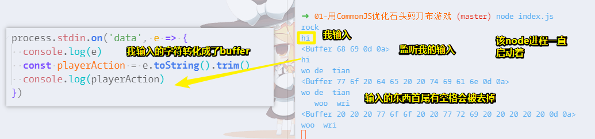

# 模块

## ★模块：使用 模块规范 改造石头剪刀布游戏

目前该游戏对战，电脑是没有情绪的，而我们则希望电脑能像人一样有情绪

那么怎样才算是有情绪呢？

如我们人类赢了电脑三次，电脑就会把进程给杀掉！

由于我们需要加自杀的功能，所以可能会让模块里边的代码变得非常臃肿，所以在这里我们就需要用到 CommonJS 规范来改造一下我们的代码

做法如下：

1. 把游戏逻辑移到一个被依赖的 JS 里边去，如 `game.js`

2. 在 `game.js`里边把该游戏逻辑导出为一个函数 `game` ，由于该函数需要用到 `playerAction`，所以我们就把它作为该函数的形参即可

3. 回到 `index.js`里边来，我们的规划是，在主 JS 里边，获取用户的输入参数，并且传到被依赖的这个 JS 里边去，然后获取结果，并且统计，如果电脑输了三次，那就调用exit命令，把当前进程给退出了。

4. 测试改动后的代码能否正常运行

5. 由于需要统计结果，那么我们就得把游戏结果从`game`里边返回出去，如平局为0，玩家赢为-1，电脑赢为1

6. 由于需要对结果统计，那么该进程就得需要长期存在，并且可以让用户输入多次操作。那么如何完成这个行为呢？

7. 获取进程的标准输入，并且把标准输入转化为字符串，然后输出出来。总之，这涉及到事件监听和buffer处理，之后的课程会涉及到！目前，可以不用去关注这个细节！

   

8. 根据上边的代码，写出符合我们需求的代码即可！

小结：

- 利用 CommonJS 改造了我们的小游戏，即把游戏逻辑封装到一个子模块里边去，并且能够更方便的对游戏的主逻辑进行一个扩展，如统计结果，然后根据统计的结果决定游戏是否继续进行下去！
- 下节课介绍npm包管理工具，也就是 Node.js 的包管理工具！
- [demo](https://github.com/geektime-geekbang/geek-nodejs/blob/master/chapter2/commonjs/%E7%94%A8commonjs%E4%BC%98%E5%8C%96%E7%9F%B3%E5%A4%B4%E5%89%AA%E5%88%80%E5%B8%83%E6%B8%B8%E6%88%8F/index.js)

---

## ★模块：npm


## ★总结

- `process`对象是 Node 的一个全局对象，提供当前 Node 进程的信息。它可以在脚本的任意位置使用，不必通过`require`命令加载。该对象部署了`EventEmitter`接口。`process`对象提供一系列属性，用于返回系统信息。如 `process.exit()`：退出当前进程……

  **➹：**[process对象 -- JavaScript 标准参考教程（alpha）](https://javascript.ruanyifeng.com/nodejs/process.html#toc2)

- 

## ★Q&A

### ①我最终是调用process.exit()方法，而不是kill方法？

> kill方法是根据进程id来杀进程，所以可以用来杀别的进程，不一定是用来自杀的。
>
> <https://nodejs.org/dist/latest-v12.x/docs/api/process.html#process_process_kill_pid_signal>
>
> 当时曾经有想过做成玩家赢了电脑三次之后，电脑就使用process.kill把玩家的微信或者浏览器进程给杀掉。不过这么做就跟模块化规范更没什么关系了。
>
> 毕竟这一节主要还是希望通过一个生动的例子让大家理解模块化规范可以用来干嘛。通过把游戏逻辑封装到一个模块里，以后就能够在不同的地方直接使用这段游戏逻辑（剧透一下，后面的HTTP章节，这个游戏还会再出现一次）。这样未来写大型程序的时候，对扩展性是非常有好处的。  

这段逻辑看起来很不复用啊?

为啥说对扩展性非常有好处？

难道老师你指的对程序的扩展性有非常大的好处，是指划分模块这个操作吗？

### ②node里使用es6语法需要引入什么模块吗？

> 目前lts版本和latest版本的node已经支持大部分es6特性（除了module）

所以这就是依旧使用 CommonJS 规范的缘故？

查看自己所安装的node是否支持module：

安装es-checker：

```bash
yarn global add es-checker
```

运行：

```bash
es-checker
```


所以我只好乖乖的用 CommonJS 规范了

当然，如果真的不支持，可以考虑引入 Babel

### ③关于第二章的内容挺基础的？

> 第二章会比较偏向初学者或者其他语言的使用者，后面会深的

