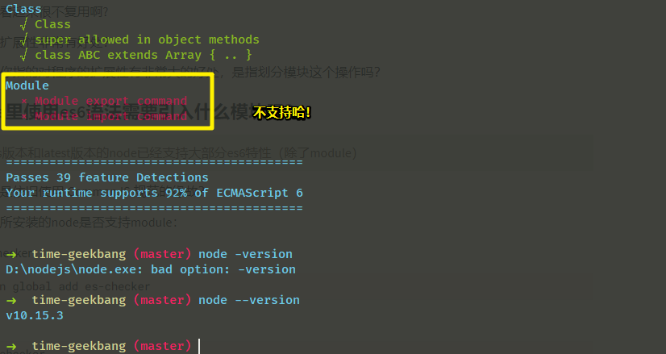

# 模块

## ★模块：使用 模块规范 改造石头剪刀布游戏

目前该游戏对战，电脑是没有情绪的，而我们则希望电脑能像人一样有情绪

那么怎样才算是有情绪呢？

如我们人类赢了电脑三次，电脑就会把进程给杀掉！（电脑表示「我生气了」）

由于我们需要加自杀的功能，所以可能会让模块里边的代码变得非常臃肿，所以在这里我们就需要用到 CommonJS 规范来改造一下我们的代码

做法如下：

1. 把游戏逻辑移到一个被依赖的 JS 里边去，如 `game.js` 

2. 在 `game.js` 里边把该游戏逻辑导出为一个函数 `game` ，由于该函数需要用到 `playerAction` ，所以我们就把它作为该函数的形参即可

3. 回到 `index.js` 里边来，我们的规划是，在主 JS 里边，获取用户的输入参数，并且传到被依赖的这个 JS 里边去，然后获取结果，并且统计，如果电脑输了三次，那就调用exit命令，把当前进程给退出了。

4. 测试改动后的代码能否正常运行

5. 由于需要统计结果，那么我们就得把游戏结果从 `game` 里边返回出去，如平局为0，玩家赢为-1，电脑赢为1

6. 由于需要对结果统计，那么该进程就得需要长期存在，并且可以让用户输入多次操作。那么如何完成这个行为呢？

7. 获取进程的标准输入，并且把标准输入转化为字符串，然后输出出来。总之，这涉及到事件监听和buffer处理，之后的课程会涉及到！目前，可以不用去关注这个细节！

   


8. 根据上边的代码，写出符合我们需求的代码即可！

小结：

* 利用 CommonJS 改造了我们的小游戏，即把游戏逻辑封装到一个子模块里边去，并且能够更方便的对游戏的主逻辑进行一个扩展，如统计结果，然后根据统计的结果决定游戏是否继续进行下去！
* 下节课介绍npm包管理工具，也就是 Node.js 的包管理工具！
* [demo](https://github.com/geektime-geekbang/geek-nodejs/blob/master/chapter2/commonjs/%E7%94%A8commonjs%E4%BC%98%E5%8C%96%E7%9F%B3%E5%A4%B4%E5%89%AA%E5%88%80%E5%B8%83%E6%B8%B8%E6%88%8F/index.js)

---

## ★模块：npm

### ◇概述

npm是啥？—— Node.js 的包管理工具

那么什么是包呢？——这包其实也很好理解哈！那就是别人所写的 Node.js 模块

之前我们已经学习了如何写一个 Node.js 模块，所以如果别人写了一个自己觉得比较好的 Node.js 模块，那么ta就有可能放到npm上，然后你就可以通过npm直接去把别人写得这个优秀的 Node.js 模块下载下来，并且直接使用！

> 听说你写了个 Node.js 模块，发布到了npm上，就成了「包」！而我喜欢吃紫薯包，红豆沙包……就不知道你的馅做得好不好了。在这里我把馅当作是这个包的代码，毕竟npm上有很多包是类似的，而好不好用，好不好吃，就看你的代码写得好不好，你的馅做得好不好了。

### ◇如何使用 npm ？（安装和卸载）

①新建一个叫 `npm` 的目录作为测试目录

②在使用npm之前，有个注意点，那就是这个目录本身就是npm包，那么怎样才是一个npm包呢？——很简单，那就是通过 `npm init` 命令在当前 `npm` 目录下生成一个叫 `package.json` 的文件，该文件用于说明这个目录表达的是一个npm包，那么只要该目录是个npm包，那么它就能装其它的npm包。所以其实我们在写任何 Node.js 工程之前，都应该去把自己的包声明成一个npm包，即通过 `npm init` 命令，这样子我们才能更方便的去装别人的npm包

③把这个npm目录声明成一个npm包之后，我们就可以使用 `npn install` 命令来装一些别人写好的包

> 上传我们的包到GitHub上时，可以忽略上传node_modules目录，当别人使用我们的包的时候，只要 `npm install` 一下就可以自动读取 `package.json` 里边的 `dependencies` 字段旗下所有的包，并且下载它们。当然，你也可以直接安装其它包，如 `npm install jquery` 这样，npm也会自动去读取 `dependencies` 旗下所有的包，然后直接下载安装，或者我们可以认为，这些包的下载安装都是去读取 `dependencies` 旗下所有的包，并不是说你安装 `jquery` 包，就不用去管 `dependencies` 旗下所有的包了。

总之 `dependencies` 这个字段，就是用于声明这个 `npm` 包所有的依赖的！这样子，我们就可以忽略掉node_modules这个目录，然后上传我们的包到GitHub上！

④我现在不想依赖某个包了，如 `extend` ， 那么如何把这个包给删掉呢？

``` BASH
npm uninstall extend
# or
yarn remove extend
```

效果：node_modules下没有了extend这个包， `dependencies` 字段旗下也没有了这个包的键值对。

以上就是有关npm对包的安装与卸载！

⑤由于npm默认用的是国外的下载源，所以这些包的下载是很慢的，耗时是非常旧的，那么如何解决呢？

使用淘宝所做的npm镜像。

**➹：**[淘宝 NPM 镜像](https://npm.taobao.org/)

话说，镜像是什么呢？简单来说就是淘宝把npm所有的包做一层复制和映射，然后把这些包都放在国内的服务器里边

当你使用淘宝这个npm镜像的话，那么这些包的下载就会非常快！

做法如下：

``` BASH
npm install -g cnpm --registry=https://registry.npm.taobao.org
```

稍微解释一下，上边这行安装命令是啥意思：

1. `-g` ：表示把这个包装到全局上

2. `--registry=https://registry.npm.taobao.org` ：表示指定从这个镜像下载这个包

如果执行上边的命令出错，那么很有可能是咩有权限，那么你 `sudo` 一下就好了，即这样：

``` BASH
sudo npm install -g cnpm --registry=https://registry.npm.taobao.org
```

cnpm这个包本身，它其实就是npm包的别名，也就是说，我这样：

``` BASH
cnpm install jquery
```

其实等价于这样：

``` BASH
npm install jquery --registry=https://registry.npm.taobao.org
```

说白了就是，当我 `cnpm` 的时候就会自动帮我加上个参数： `--registry=https://registry.npm.taobao.org` ，即指定一个镜像帮我去下载一个 `npm` 包

不过使用它有个弊端那就是，每次用 `cnpm` 去安装包，你就得加上 `--save` 这个参数，如这样：

``` BASH
cnpm install jquery --save
```

这样一来， `dependencies` 字段旗下，才会有 `jquery` 这个字段，以及它的版本号！

至此，你就可以愉快的使用npm去下载你所需要的npm包了。

熟悉了npm是如何安装一个包和卸载一个包之后，其实还有很多东西是可以讲的，不过内容挺多的，如果你在使用npm的过程中，遇到了问题，那么我推荐你去官网自行查找：

**➹：**[Packages and modules - npm Documentation](https://docs.npmjs.com/packages-and-modules/)

官网的内容目前是很全的，所以可以大胆地去寻找你的答案！

如：

1. 如何弄一个私有的包？

2. 如何对包加一个可见性？即搞一些被人装不了的包

3. 如何创建一个package.json文件？

4. 如何把你的包发布到npm上边？然后让所有人都可以下载访问

5. 遇到 `EACCES` error 如何解决？如之前需要加 `sudo` 命令

6. ……

还有很多有关npm的使用说明，请自行查阅官网学习！

### ◇npm上的著名大神

为啥要认识一些大神呢？

认识一些大神，可以让你大概了解一下，这个npm它的发展历程是怎样子的

有哪些大神？

* TJ
* Mafintosh
* Dominictarr
* ……

TJ 所做的最著名模块就是「Express」，express是 Node.js 上边做HTTP服务比较经典的一个模块，他用了一个中间件的模式来实现了你的HTTP服务器（在后边的HTTP章节，会详细介绍它的用法！）。总之, TJ就是这个包的作者啦！

剩余的两位大神，可以自行查找他们有哪些贡献，总之，他们在npm上都贡献了几百个模块，很多常用模块都是他们做成的

关于第三位有个趣事，那就是 「npm event-stream」事件

那么这是事件啥呢？——这位大神写很多模块，其中一个模块就叫做 「event-stream」, 由于自身比较忙，写了太多模块，于是就把该模块叫给一位xxx去维护，但他并不认识xxx是谁，生平是怎样都不知道，总之就是不熟啦！

而这位新维护者xxx就往这个模块里边加了一些恶意代码，由于这个包是很常用的，意味着你安装的包或多或少都会有依赖到它，说白了，就是包依赖包这种姿势，一旦有一个贼常用的包存在恶意代码，那么就会有成千上万的包，存在恶意代码。因此，这导致什么问题了，那就是成千上万的 Node.js 用户的电脑里边都存有这恶意代码哈！谁叫我们这些吃鸡群众安装了这些包呢？而不是自己去写一个呢？难道菜就是原罪吗？

由于很多 Node.js 用户在本地执行了恶意代码，而这样的结果就是让这新维护者xxx赚取了大量的虚拟货币哈！

而这个事情也让npm官方意识到这个事件会带来严重的后果，从此也对他们的安全性做了更大的防护

现在，其实你每一次安装npm包，npm官方都会对你安装的这个包进行一次校验

虽然npm出现了这么一个严重的问题，当然，可能以后也会有同样的问题存在，但是可以说咩有npm，咩有 CommonJS 模块规范，我们 JS 开发者社区的合作性就咩有现在那么强了，也不会有现在这么繁荣的 JS 社区。

所以npm是一个划时代的一个产品，不仅丰富了 Node.js ，也丰富了整一个 JS 开发者社区！

讲完npm包管理工具之后，下一节课回头讲解一下 Node.js 的内置模块，而这也是有关「模块」知识的最后一部分内容。

**➹：**[吃瓜群众带你了解 NMP 包 event-stream 被植入比特币后门的来龙去脉-前端开发博客](http://caibaojian.com/event-stream.html)

## ★总结

* `process` 对象是 Node 的一个全局对象，提供当前 Node 进程的信息。它可以在脚本的任意位置使用，不必通过 `require` 命令加载。该对象部署了 `EventEmitter` 接口。 `process` 对象提供一系列属性，用于返回系统信息。如 `process.exit()` ：退出当前进程……

  **➹：**[process对象 -- JavaScript 标准参考教程（alpha）](https://javascript.ruanyifeng.com/nodejs/process.html#toc2)

* 可以把npm这个包管理器，看做是一个npm包，即一个 Node.js 模块！

* 推荐两个非常优质常用的工具：用nvm管理本地开发机器上的node版本，用nrm管理npm镜像地址。

* 我在写一个 Node.js  项目，其实是在写一个 模块。为了提高开发效率，以及保证整个团队写出来的代码的平均质量还过得去，那么用他人写好的的模块，显然是一件再正常不过的事了。突然发觉日常开发，无非就是熟悉如何使用他人写好的模块来完成我们的需求！

* 日常中我会使用 `yarn`来安装包，而不是 `npm`，因为 `yarn`没有那么多问题会发生。当然，用 `yarn`安装的包，也是从 `npm`上下载下来的，只是下载到本地的包，这些包的组织方式，同用 `npm`命令下载有所不同。因此，整个项目用 `yarn`安装包的，那就用 `yarn`用到底了，而不是一会儿用 `yarn`，一会又用 `npm`

* 不管你是在写前端项目，还是后端 Node.js 项目，请 `npm init` 或者 `yarn init`下，以此来在项目的根目录下创建一个 `package.json`文件，如果没有该文件，那么就不能把该项目当作是一个 npm 包来看待，而且没有该文件，使用他人的库是贼不方便的！总之必须要有就对了！当然，如果你这个项目都是纯原生的，或者手动去cdn上引入库，而且也不用把该项目分享给人家使用的话，那么你可以不用 `init`；如果你要造轮子给人家使用，或者你的项目需要用到其它的第三方库，如 `Vue`等，  那么请你 `init` 一下。

  总之，如果你的项目要使用npm，那么你的项目目录就得成为一个npm包，而成为一个npm包，那就是该项目目录的根目录下有个 `package.json`文件，而这个文件的产生很简单，那就是 `npm init` or `yarn init` 一下即可！注意，你在 `npm`或 `yarn`时，如果当前目录没有 `package.json`文件，那么就会往上一级含有 `package.json`的目录来安装包！如果你就是要在当前目录安装包，那么你就 `yarn init` or `npm init`一下吧！

* 写一个项目，可以叫写一个模块，模块里边有个主模块，和其它零碎碎的子模块。模块的概念不是绝对的，只有这东西「块」的味道，那么就可以叫做模块！

## ★Q&A

### ①我最终是调用process.exit()方法，而不是kill方法？

> kill方法是根据进程id来杀进程，所以可以用来杀别的进程，不一定是用来自杀的。
>
> <https://nodejs.org/dist/latest-v12.x/docs/api/process.html#process_process_kill_pid_signal>
>
> 当时曾经有想过做成玩家赢了电脑三次之后，电脑就使用process.kill把玩家的微信或者浏览器进程给杀掉。不过这么做就跟模块化规范更没什么关系了。
>
> 毕竟这一节主要还是希望通过一个生动的例子让大家理解模块化规范可以用来干嘛。通过把游戏逻辑封装到一个模块里，以后就能够在不同的地方直接使用这段游戏逻辑（剧透一下，后面的HTTP章节，这个游戏还会再出现一次）。这样未来写大型程序的时候，对扩展性是非常有好处的。  

这段逻辑看起来很不复用啊?

为啥说对扩展性非常有好处？

难道老师你指的对程序的扩展性有非常大的好处，是指划分模块这个操作吗？

### ②node里使用es6语法需要引入什么模块吗？

> 目前lts版本和latest版本的node已经支持大部分es6特性（除了module）

所以这就是依旧使用 CommonJS 规范的缘故？

查看自己所安装的node是否支持module：

安装es-checker：

``` bash
yarn global add es-checker
```

运行：

``` bash
es-checker
```



所以我只好乖乖的用 CommonJS 规范了

当然，如果真的不支持，可以考虑引入 Babel

### ③关于第二章的内容挺基础的？

> 第二章会比较偏向初学者或者其他语言的使用者，后面会深的

### ④用 sudo 安装包，尤其是 安装 cnpm 的话，很可能会带来更多的权限问题。

> 分享一下你的惨痛经历

表示看不懂，反正我不会安装 `cnpm`

