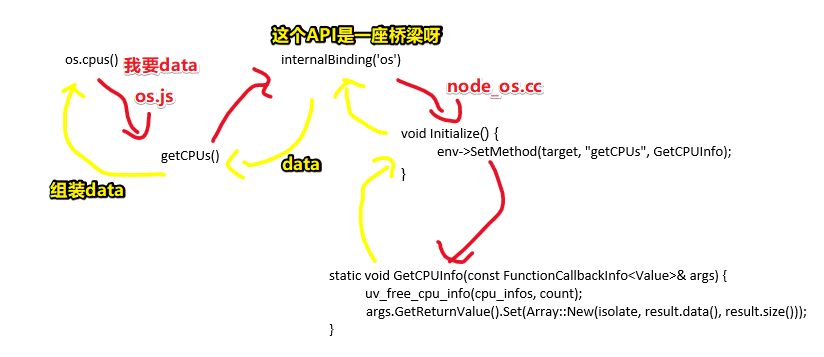
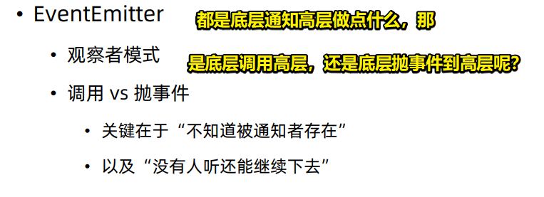
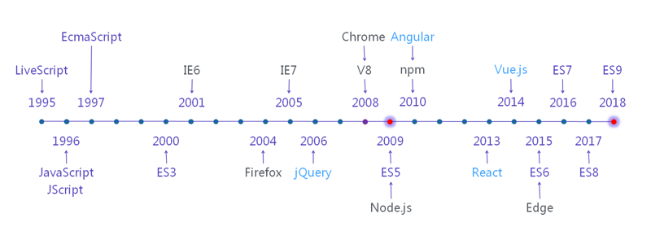

# Node.js 内置模块

 Node.js 有很多内置模块，正是这些内置模块，提供了 Node.js 和操作系统交互的能力，接下来就来了解一下它们……

## ★ Node.js 内置模块

### ◇ Node.js 的系统架构图

在讲解 Node.js 内置模块之前，先来看一张系统架构图：


这张图是在网上找的，它比较清晰的表述了 Node.js 的系统架构

回顾官网对 Node.js 的两句话描述：

* Node.js 是一个基于 **Chrome V8 引擎**的 JavaScript 运行环境。
* Node.js 使用了一个**事件驱动**、**非阻塞式 I/O** 的模型，使其轻量又高效。

而这两句话就在上边的那张架构图里边有所体现：

第一句话体现在左边那部分，即那两列东西。

application就是我们所写的 Node.js 代码，然后它通过V8引擎来运行，而里边涉及到对操作系统的调用，这一部分就会由v8引擎帮我们转发到我们的操作系统层面，丛操作系统层面得到返回结果之后，再通过v8引擎返回到 JS 里边去。

而这就是针对 Node.js 的第一句话的表现了。

来到右边这部分，这是关于第二句话的表现。

这一部分，下节课再讲，现在就先忽略掉它！

### ◇剖析内置模块

从 JS 到 V8 再到 操作系统 的这个能力，有很大一部分都是通过 Node.js 的内置模块来提供的，因此我们先来看一下 Node.js 的一些内置模块。

来到 Node.js 官方网站的这么一个文档页面：

**➹：**[Index - Node.js v12.12.0 Documentation](https://nodejs.org/dist/latest-v12.x/docs/api/)

其里边罗列了 Node.js 所有的内置模块，比如说：

1. 典型的 File System ,一个操作系统层面的用于操作文件的API，我们的 Node.js 通过调用 File System API 就可以操作我们操作系统上的 文件了。
2. Net模块，可以使用操作系统的网络能力
3. Process，记载着 Node.js 这个进程的一些信息
4. OS，接下来用于当例子讲的一个模块，该内置模块如同它的名字一样，就是用于表示一些跟操作系统相关的一些事情。我们可以看看OS模块有哪些函数，或者说是方法（函数在对象里边叫做方法），如 `os.arch()` 表明了操作系统的架构（CPU架构），如32位、64位、arm，我这台就是 x64的、 `os.cpus()` 得到了 Node.js 所运行的这台电脑里边有多少个cpu以及有几个核，参数是怎样子的, 如我的是1个CPU4核的、 `os.freemem()` 表明当前操作系统还有多少空余内存……

总之，这全都是一些操作系统层面的一些数据和能力

那么我们的 JS 是怎么获取到它们的呢？

其实我们凭印象都知道 JS 是没有什么获取这些信息的能力的

那么这些能力是怎么来的呢？

接下来，我们来剖析一下 Node.js 是怎么做的

### ◇调用（自顶向下）

为了剖析 Node.js 的内置模块，我们得打开 Node.js 的源码才行，为啥要看源码呢？——因为不看源码的话，是不太能讲清楚  JS 是如何具备获取到这些信息的能力的。

源码下载：[Release 2019-10-11, Version 12.12.0 (Current), @BridgeAR · nodejs/node](https://github.com/nodejs/node/releases/tag/v12.12.0)

> 千万不要把整个node仓库给下载下来，如果你这样做了，那么将会下载850M左右的东西，而上边这个链接所下载的源码，只有80多M哈!

打开下载下来的源码之后，你会发现它的目录结构非常的复杂！

所有的内置模块都在 `lib` 这个目录里边。

接下来研究一下 `os` 这个内置模块：

1. 打开 `lib/os.js` 文件，定位到这个模块的输出，即 `exports` ，我们在文档里边所看到的那些方法，自然都在这个输出里边。

2. 研究 `cpus` 这个方法

cpus，它是个函数，但在文档上的表现它是一个方法，不过这并不重要，一个称呼而已。

``` js
function cpus() {
  // [] is a bugfix for a regression introduced in 51cea61
  const data = getCPUs() || [];
  const result = [];
  let i = 0;
  while (i < data.length) {
    result.push({
      model: data[i++],
      speed: data[i++],
      times: {
        user: data[i++],
        nice: data[i++],
        sys: data[i++],
        idle: data[i++],
        irq: data[i++]
      }
    });
  }
  return result;
}
```

该函数调用 `getCPUs` ，然后把返回结果组装一层之后，再返回出去.

那么这 `getCPUs` 来自哪儿呢？

它是通过调用 `internalBinding('os')` ，然后从所返回的结果里边取出来的。

那么 `internalBinding` 又是什么呢？

它是去调用我们 Node.js v8 层面的一些方法，然后v8会帮我们去获取这个CPU的一些信息。

> 你可以把 Node.js 看做是个浏览器，而这样会好理解一点，毕竟我们经常跟浏览器打交道！

那么如何去看 `internalBinding('os')` 所对应的代码呢？

这个就在我们的 `src` 目录里边了，我们可以看到该目录全都是一些 c++ 文件，找到 `node_os.cc` ，并打开它

可以看到注释写得非常好，可见这是一个非常专业的机构哈！

代码虽然非常多，但我们只需要找到 `getCPUs` 就好了，查找可知，它在一个 `Initialize` 初始化方法里边：

``` c++
void Initialize() {
  Environment* env = Environment:: GetCurrent(context); 
  env->SetMethod(target, "getCPUs", GetCPUInfo); 
}

``` 

env执行一个 `SetMethod` 方法，然后传一个 `target` 进去，然后又定义了 `getCPUs` ，指向了 `GetCPUInfo` 这堆东西。

``` c++
env->SetMethod(target, "getCPUs", GetCPUInfo);
```

说白了，上边这行代码，就是在定义c++模块的输出，而这个输出，它是使用了 v8 这个库处理之后，那么输出的这些东西，最终都会在 JS 里边直接被调用到！

总之，这个文件的代码都是v8的一些能力，回顾头来看 `GetCPUInfo` 这个方法做了什么事情：

``` c++
static void GetCPUInfo(const FunctionCallbackInfo<Value>& args) { 
   Environment* env = Environment:: GetCurrent(args); 
   //……
}

``` 

`FunctionCallbackInfo` 这个参数非常长，这是v8用来转换 JS 参数的一个对象，即我们 JS 调用这个方法所传的参数最终可以在 `args` 里边取到！

当然，我们这个 `getCPUs` 方法其实是咩有任何参数的，所以这并不会涉及去参数的操作

继续看下去，你会很直观的感受到最终都会通过 `uv_free_cpu_info(cpu_infos, count);` 去c++的一些底层代码里边获取到了我们的cpu信息。

``` C
args.GetReturnValue().Set(Array::New(isolate, result.data(), result.size()));
```

并且最后通过调用v8的接口 `GetReturnValue().Set()` , 然后把执行结果转变成了v8的变量，而这个v8变量最终又会变成我们的 JS 变量！最终实现了，c++到 JS 的变量转换。

回到 `os.js` 这个外边来， `getCPUs()` 拿到了cpu信息 `data` ，并且把这个 `data` 再进行组装，最后返回到 Node.js 应用里边去哈！

以上就是整个内置模块调用的一个通路啦！

从我们的 Node.js 应用代码开始，调用到我们 Node.js 的底层库，然后这个内置模块又去调用 Node.js 里边的C++模块，c++模块又通过c++的一些调用，即调用我们的libuv，总之就是调用c++的一些底层函数，然后把得到的结果返回到我们 Node.js 的内置模块，然后再返回到  Node.js 应用代码。

总之，这就是一个整个内置模块调用的通路，通过这种方式实现了 Node.js 和操作系统的一个交互。



> 通过binding，让 JS 有了与 C++ 沟通的能力，JS说「我想吃雪糕」，C++「帮你弄个雪糕出来」。突然觉得 JS 是一种很声明式编程的体现呀，即站在语言这个层面上， JS 告诉 C++ 我要什么，然后让C++ 去做.

**➹：**[声明式编程和命令式编程有什么区别？ - 知乎](https://www.zhihu.com/question/22285830)

目前，我们已经了解到了这样一个通路：

application👉👉👉V8👉👉👉Node.js bindings👉👉👉V8👉👉👉application

而这就是一个典型的 Node.js 内置模块的运行机制。

### ◇通知（自底向上）

那其实还有一种情况，即有一些数据它可能不是从 Node.js 开始调用的，比如说直接从操作系统底层通知到我们的 Node.js 代码去做一些事情

那么这有啥例子可以体现出这一点呢？

拿我们之前的石头剪刀布游戏来看:

``` js
// index.js
const game = require('./game')
let count = 0
process.stdin.on('data', e => {
  const playerAction = e.toString().trim()
  const result = game(playerAction)
  if (result == -1) {
    count++
  }
  if (count === 3) {
    console.log('好吧！人类，既然我输了三局，那我认输。')
    process.exit()
  }
})
```

当我们 `node index.js` 之后，我会在终端里边输入一些游戏操作，如「石头」、「剪刀」等，然后操作系统会帮我把终端里边接收到的这些信息传到我们的 Node.js 里边来，而在这个过程里边，就会用到另外一个内置模块，叫做 `EventEmitter` ，它是一个专门用来处理事件的模块！

**➹：**[Events - Node.js v12.12.0 Documentation](https://nodejs.org/dist/latest-v12.x/docs/api/events.html#events_class_eventemitter)

在文档里边，可以看到 `EventEmitter` 是属于 `Events` 这个模块里边的Class

然后它有许多方法，其中有个方法 `emitter.addListener(eventName, listener)` ，我想大家都很熟悉吧 ！这跟前端里边的，写一些事件监听器，如鼠标点击 `btn.addEventListener('click',callback)` ……是非常相像
的。

总之， `EventEmitter` 实际上是一个同 `btn.addEventListener('click',callback)` 这样类似的东西，即它可以把底层发生的一些变化，如前端里边的页面接受了鼠标事件，传递到我们的前端上来，然后让你可以做相应的操作！

那么 Node.js 其实也是一样的，它通过 `EventEmitter` 这个模块来做到， 它 的 `process` 全局变量也是 `EventEmitter` 的一个实例，即process其实是继承了EventEmitter的，然后 process就具备了往上抛事件的能力，而这个往上抛事件的能力，我们一般称之为「观察者模式」，就像我们刚才说到前端也有一个很经典的观察者模式，那就是 `addEventListener` 和 `removeEventListener` 这两个方法

简单来说，「观察者模式」就是一个**事件的收发**的这么一个模式！

那么什么时候会用到这种模式呢？——直接用代码来演示一下，即用观察者模式来写一些什么东西

需求：极客时间如果有一个新的课程更新，就会通知到你，然后你就会去观看去学习

``` js
// index.js
// 把抛事件的模块封装起来
// 强调抛事件这种模式更适合底层模块往外传递信息
const geektime = require('./geektime');

geektime.on('newlesson', ({
  price
}) => {
  console.log('yeah! new lesson')
  if (price < 80) {
    console.log('buy')
  }
})

setTimeout(() => {
  // 需要注意的是，EventEmitter如果添加了过多的监听器，Node.js觉得你有内存泄漏嫌疑，会抛出一个warning。
  // 用以下这句则可以消除这个限制
  // geektime.setMaxListeners(200);
  for (let i = 0; i < 100; i++) {
    geektime.on('newlesson', ({
      price
    }) => {})
  }
}, 10000)
```

``` js
//geektime.js
const EventEmitter = require('events').EventEmitter;

class Geektime extends EventEmitter {
  constructor() {
    super();

    setInterval(() => {
      this.emit('newlesson', {
        price: Math.random() * 100
      })
    }, 3000)
  }
}

module.exports = new Geektime;
```

`Geektime` 这个Class就是一个最简单的事件收发器啦！

> 用到 `this` ，必须写上 `super()` 。这里的 `this` 的指向就是 `Geektime` 实例哈！说白了， `geektime` 对象从 EventEmitter 哪里继承了 `on` 、 `emit` 等方法，而这让我们具备了可以自定义事件的能力！对了，可以直接这样 `const EventEmitter = require('events')` 。还有你 `extend` xxx，不单只继承了它的属性和方法，还有它的静态方法

测试：

1. 创建一个 `Geektime` 实例 `geektime` 
2. 为 `geektime` 实例添加事件监听器，即监听 `newlesson` 事件，如果有新课程上线，那就做点什么操作
3. 事件监听器可以获取这个 `newlesson` 事件触发所抛出的内容

收获什么：

1. EventEmitter的实例（Geektime继承自EventEmitter，说Geektime的实例为EventEmitter的实例没有太大区别，因为这能力就是继承自ventEmitter的），它可以任意的抛任何数据出去，总之，该实例可以抛任意的事件出来，并且带着它想要给的一些参数，让外面统统可以接收到！回忆起之前所写的这个代码 `process.stdin.on('data',callback)` , 显然就很好理解了！

以上就是 EventEmitter 的一个使用方法了，即用它来可以做一些通知的事情！

回过头来，为啥要把 `Geektime` 放到一个子模块里边，然后再导出一个 Geektime实例出来呢？

这样做的意图是，因为我们想要把底层的一些逻辑封装起来放到另外一个模块里边，然后外边的业务代码（如 `index.js` 里边的代码）拿到这个模块，通过事件的监听器 `addListener` , 就能够比较方便的知道子模块里边发生的一些变化

而这种变化，并不需要我们的 `geektime` 对象去调用外边的一些函数，只需要往自己身上抛一个事件就可以了！即监听一个事件然后写上callback就好了。

而这样一个做法，最大好处就是我们可以无限的去添加监听我们新课程的人数，然后我们的 `Geektime` 这个类并不需要做任何改变，而这个就是设计模式所要达成的一个目的，即我们扩展一些逻辑，完全不需要改动到底层，然后这样就可以提高我们程序的可维护性！

### ◇观察者模式



回过头来，我们了解了 `EventEmitter` 是一个观察者模式的实践，而观察者模式是用来解决两个对象之间通信的问题的

两个对象之间的通信，我们可以用直接的函数调用，也可以用观察者模式

> 关于直接的函数调用是怎么理解的呢？
>
> `person.cut('jj')` 的意思是这样的：
>
> ①给 persom 对象发送了一个 cut 消息
>
> ②person 对象会响应这个消息
>
> 我们都说这是函数调用，其实 改成 Smalltalk 就理解了 ：
>
> `person cut: 'jj'` 、 `person cut: 'jj'; cut: 'hands'` 
>
> 而不是： `person.cut('jj')` 、 `person.cut('hands')` 

那么什么时候应该用哪一种呢？

现在网上很多的一些关于观察者模式的举例，都比较关注「通知」这件事情，他们觉得只要有「通知」这件事情就适合用观察者模式

比如说老板，通知秘书去做一些事情，然后他们就会举例说用观察者模式来实现，但是这其实是不适合的

因为观察者有一个不好的地方，那就是观察者模式「抛一个事件」，它其实是不知道被接收这通知的人是谁哈！

如「老板通知秘书去做一些事情」用观察者模式来实现的话，那么老板只管抛这么一个事件，那么这个事件有可能不仅仅被秘书知道了，也有可能被门口保安知道了，如果涉及到商业机密，那么这其实是一个很大的问题。

还有一个就是说，「抛事件」这种方式是不适合于说当没有人监听这个事件这个逻辑还能跑下去的情况，也就是说，老板如果抛了一个事件，但是他不管这个事件有没有被监听到的话，那他有可能通知秘书做的事情没有去做，那么这也是一个比较严重的问题。

像老板通知秘书这件事，虽然我们用了「通知」二字，但是实现这个过程最好的方式还是用「调用」，因为这样会有更好的可靠性，也能有更好的私密性

「抛事件」观察者模式这个事情，最适用的场景就是说，我们通知这个消息的人，他并不知道被通知者的存在，比如说极客时间并一定知道你的存在，也就是说，咩有人接收这个事件它还能继续下去，比如说我今天没有接收到极客时间上新课的消息，但是极客时间还是能继续上新课，那这种场景就最适合用抛事件了，并且能够通过抛事件得到更好的可扩展性 

老师通过讲解观察者模式，加深了我们对EventEmitter的理解。总之， Node.js 的内置模块做的事情基本上就是负责 Node.js 的应用层面到我们操作系统层面的一个通信，包括 Node.js 调用 OS 的能力，或者说 OS 通知  Node.js  的能力，而这些都是内置模块会做的事情，那有了内置模块之后了， Node.js 就有了强大的和操作系统交互的能力，也就能够顺利的做成一个服务端的应用！

以上就是关于 Node.js 模块的全部内容了，经过对这部分内容的研究，我们也明确了 Node.js 的其中一个特点，那就是它是一门具备可扩展性的、全面的，能在服务端运行的 JS 技术

下一部分，就来聊聊 Node.js 的另一个特点，那就是异步，以及它通过异步所达成的高性能

## ★扩展阅读

**➹：**[Vernon谈软件设计，到底是自顶向下还是自底向上-InfoQ](https://www.infoq.cn/article/BK-slZpJePA3NuQM7yEp)

**➹：**[类 - JavaScript - MDN](https://developer.mozilla.org/zh-CN/docs/Web/JavaScript/Reference/Classes)

## 总结

* 当你对 Node.js  这个概念产生了疑惑，那就把它替换成 浏览器，即它是一个环境！
* 层面： Node.js 应用层面、V8层面、操作系统层面，不同层面之间发生交互。V8和操作系统层面的交互桥梁是 bindings，而 Node.js 应用层面和V8层面的交互就是你写的 JS 代码！
* 何时用观察者模式？——只管抛事件，不理会有没有人监听这事件。即便没有人监听，自己也能好好的活下去。
* CommonJS 规范、内置模块，让 Node.js 具备高可扩展性！
* Node.js 牛逼！

## ★Q&A

### ①路过一张图： JS 发展简史？



**➹：**[Deno 并不是下一代 Node.js - Go语言中文网 - Golang中文社区](https://studygolang.com/articles/13101)

### ②操作系统架构？CPU架构？

**➹：**[处理器架构、指令集和汇编语言，三者有何关系？ - 知乎](https://www.zhihu.com/question/23474438)

**➹：**[熟悉计算机体系结构是种什么样的体验？ - 知乎](https://www.zhihu.com/question/59057984)

**➹：**[处理器的架构会对操作系统产生什么影响？ - 知乎](https://www.zhihu.com/question/20324698)

**➹：**[X86/X64的处理器和32/64位的系统有什么关系？ - 知乎](https://www.zhihu.com/question/47389187)

**➹：**[库，框架，架构，平台，有什么明确的区别？ - 知乎](https://www.zhihu.com/question/29643471)

**➹：**[玉兔号的 SPACEos 操作系统，系统架构是怎么设计的？ - 知乎](https://www.zhihu.com/question/22346689)

**➹：**[同时兼容Windows和Linux应用软件是否可能？ - 知乎](https://www.zhihu.com/question/22360519)

### ③何为架构？

> CPU是一个执行部件，它之所以能执行，也是因为人们在里面制作了执行各种功能的硬件电路，然后再用一定的逻辑让它按照一定的顺序工作，这样就能完成人们给它的任务。也就是说，如果把CPU看作一个人，首先它要有正常的工作能力（即执行能力），然后又有足够的逻辑能力（能明白做事的顺序），最后还要听的懂别人的话（既指令集），才能正常工作。而这些集中在一起就构成了所谓的“架构”，它可以理解为一套“工具”、“方法”和“规范”的集合。不同的架构之间，工具可能不同，方法可能不同，规范也可能不同，这也造成了它们之间的不兼容——你给一个意大利泥瓦匠看一份中文写成的烹饪指南，他当然不知道应该干什么了。

一个人要能正常工作：能动，干活有顺序，能听懂别人说你该怎么做。

**➹：**[ARM与X86不具备可比性 性能差距可大上千倍 - 视点·观察 - cnBeta. COM](https://www.cnbeta.com/articles/tech/167883.htm)

**➹：**[X86和ARM架构的处理器能效差异为什么会这么大？ - 知乎](https://www.zhihu.com/question/20148756)

**➹：**[为什么Linus Torvalds偏爱x86而不是ARM架构 - 人物 - cnBeta. COM](https://www.cnbeta.com/articles/tech/546655.htm)

### ④我电脑只有一个CPU，但是有4个核？啥意思？

答案一：

> 所谓的单核，就是指这颗CPU里面只封装了一个核芯
> 而双核和四核甚至N核，其实都是指的这颗CPU里面封装的核心数量。
>
> 你可以这样理解，两颗频率相同的CPU，其核芯数量越多越好，核芯数量越多，其计算能力及处理的线程数都会越高。

答案二：

> 核，你可以想象成人脑子，一个核就是一个脑子，四核就说明CPU有四个脑子，脑子越多解决问题的速度越快，Intel的核技术，可以把一个核模拟分成两个线程来用，充分的发挥了cpu的性能，线程8就代表核心数是4核的处理器可以模拟出8个线程来使用。线程我们可以理解每个大脑同时能处理多少件事。

答案三：

> 核是指cpu里封装的核芯 单、双、多指的是核心的数量
> 通常来说 数量越多处理能力就越强
> 补充一点 不同的双核还是有区别的
> 比如说intel的双核cpu，是将两个不同硅晶片上的芯片封装在一起 成为双芯更贴切一些
> amd的双核cpu是将两块芯片做在同一块硅晶片上 是真正意义上的双核
>
> 那哪一种设计更好？
>
> 事实证明AMD的设计更好，不过这是许多年前的设计。现在都是在一块芯片上面。

**➹：**[CPU的“单核”“双核”“四核”是什么意思？ - 知乎](https://www.zhihu.com/question/20231624)

借此引出另外一个问题：

**➹：**[多核 CPU 和多个 CPU 有何区别？ - 知乎](https://www.zhihu.com/question/20998226)

简洁答案：

> 多核CPU和多CPU的区别主要在于性能和成本。多核CPU性能最好，但成本最高；多CPU成本小，便宜，但性能相对较差。

> 简单说就是一家子人干活和几家人干活的区别，假设总人数一样，一家人开个门就能协调，几家人就要过街才能商量

所以：

我这台电脑就是一个CPU芯片，但可以完成计算任务有4个家伙！

### ⑤ 自顶向下和自底向上 ？

> 对于 Vernon 来说，自顶向下和自底向上都只是学习和知识排序的策略，两者只是不同的思维方式，它们都非常有用。自顶向下的思考主要是基于我们已经知道的东西。自顶向下就像逐步分拆问题，而每个问题就像一个内容未知的黑盒子。但分拆到一定程度，我们会陷入困境，这时候就必须转换到自底向上的视角，尝试发现我们不知道的东西。现在我们只是在开发软件的一小部分（它们可以成为参与者），最终它会成为一个更大的系统中的子系统，Vernon 认为这是一种浮现式设计。 

在看某个内置模块的源码实现的时候，从 Node.js 应用层面，到底层C++代码

思维：拆嵌套很多层的盒子，吃到xxx层盒子的时候，发现无法继续下去了，那么能否从核心往上思考了？即结果导向代码实现或者说行为实现

**➹：**[Vernon谈软件设计，到底是自顶向下还是自底向上-InfoQ](https://www.infoq.cn/article/BK-slZpJePA3NuQM7yEp)

### ⑥事件驱动编程？

 在我们使用Java，PHP等语言实现编程的时候，我们面向对象编程是完美的编程设计，这使得他们对其他编程方法不屑一顾。却不知大名鼎鼎Node使用的却是事件驱动编程的思想。

那什么是事件驱动编程呢？

> **事件驱动编程，为需要处理的事件编写相应的事件处理程序。代码在事件发生时执行。**  

为需要处理的事件编写相应的事件处理程序。要理解事件驱动和程序，就需要与非事件驱动的程序进行比较。

实际上，现代的程序大多是事件驱动的，比如多线程的程序，肯定是事件驱动的。早期则存在许多非事件驱动的程序，这样的程序，在需要等待某个条件触发时，会不断地检查这个条件，直到条件满足，这是很浪费cpu时间的。而事件驱动的程序，则有机会释放cpu从而进入睡眠态（注意是有机会，当然程序也可自行决定不释放cpu），当事件触发时被操作系统唤醒，这样就能更加有效地使用cpu。  

> 轮询太费精力了。如不断地看某个动漫更新了没？那么能否有另一种姿势让我知道动漫已经更新了呢？

 来看一张简单的事件驱动模型（草图）： 


事件驱动模型主要包含3个对象：事件源、事件和事件处理程序。

* 事件源：产生事件的地方(html元素)
* 事件：点击/鼠标操作/键盘操作等等
* 事件对象：当某个事件发生时，可能会产生一个事件对象，该事件对象会封装好该事件的信息，传递给事件处理程序
* 事件处理程序：响应用户事件的代码 

> 事件源：在某个子模块里边，有个继承了 EventEmitter 的对象实例 geektime
>
> 事件：geektime主动触发了事件xxx
>
> 事件对象：没有呀! 就带了一个参数上来
>
> 事件处理程序： Node.js 应用层面，监听xxx事件时，所传的callback

其实我们使用的window系统也算得上是事件驱动了。我们来看一个简单的事例：监听鼠标点击事件，并能够显示鼠标点击的位置x, y。 

``` html
<html>

<head>
  <script>
    function test1(e) {
      window.alert( `(x,y)👉👉👉(${e.clientX},${e.clientY})` );
    }
  </script>
</head>

<body onmousedown="test1(event)">
</body>

</html>
```

> 触发一个事件的直面感受是用户与浏览器的界面交互，但本质都是程序与程序之间的交互！或者说主程序与子程序之间的交互！

**➹：**[node.js基本工作原理及流程 - 云+社区 - 腾讯云](https://cloud.tencent.com/developer/article/1037475)

### ⑦ Node.js 底层机制？

> nodejs作为javascript在后端运行的环境，源码由js与C完成。本质上，nodejs是借助于谷歌V8引擎来运行javascript代码。使用了C的libuv库来处理网络，访问文件系统等操作。

**nodejs的作用:**

1. 提供一种接口，仅仅书写javascript的代码，就可以让他们正确执行，不用书写C++代码。

2. 丰富的api。http、fs、path、crypto …modules

**nodejs源码：**

* lib:nodejs库函数
* src: 库函数的C++实现。

internalBinding链接 JS 代码与 C++ 代码

**V8：**

将JS类型转换为c++类型

``` c++
using v8:: Array; 
using v8:: ArrayBuffer; 
using v8:: Boolean; 
using v8:: Context; 
using v8:: Float64Array; 
using v8:: FunctionCallbackInfo; 
using v8:: Int32; 
using v8:: Integer; 
using v8:: Isolate; 
using v8:: Local; 
using v8:: MaybeLocal; 
using v8:: NewStringType; 
using v8:: Null; 
using v8:: Number; 
using v8:: Object; 
using v8:: String; 
using v8:: Value; 

``` 

**libuv：**

处理并发操作

``` c++
uv_free_cpu_info(cpu_infos, count);
args.GetReturnValue().Set(Array::New(isolate, result.data(), result.size()));
```

**➹：**[深度理解nodejs[1]-node底层机制 - 郑建勋的个人网站](https://dreamerjonson.com/2018/11/08/%E6%B7%B1%E5%BA%A6%E7%90%86%E8%A7%A3nodejs/)

### ⑧ 希望老师能出一个node的源码课。对内部逻辑清晰了很多 ？

> 其实其他模块大致也是这个逻辑，有兴趣的话可以自发前往其他源码挖掘！自发学习会有更深刻的印象。
>
> 目前的计划可能后面只会在多进程那块再解析一下cluster模块的源码。 

### ⑨那段测试代码？

// class Geektime 的 constructor 每隔三秒会发布一个事件（this.emit('lesson'))，
// 同时 Geektime 的实例 geektime 在 10 秒后创建了 100 个监听者监听 newlesson 事件（setTimeout 那段代码（geektime.on('newlesson')））。
// 所以监听事件的对象就只能是发布事件对象的实例吗？

> 是的，就像写前端的时候，一个dom对象一样

额，难道这TM不是同一个对象吗？即发布事件的和监听事件的是同一个对象在搞事情啊！我们在写前端的时候，监听一个元素的click事件，用户点击这个元素，那么这个元素就会抛个click事件出来，然后就会处理为这个click事件所绑定的callback，当然如果没有callback，那就拉倒吧，即你看不见效果，即便你这个元素没有监听这个click事件也拉倒！反正click事件是有向上抛的！

### ⑩cluster？

cluster可不可以讲一些关于node进程守护这方面的东西，最近自己有在学习node稳定性，但是对node进程守护不是太明白，也看了一些pm2的原理，emmm.... 目前还是能力有限，自己简单实现还是无法做到。

> 这部分在第五章

