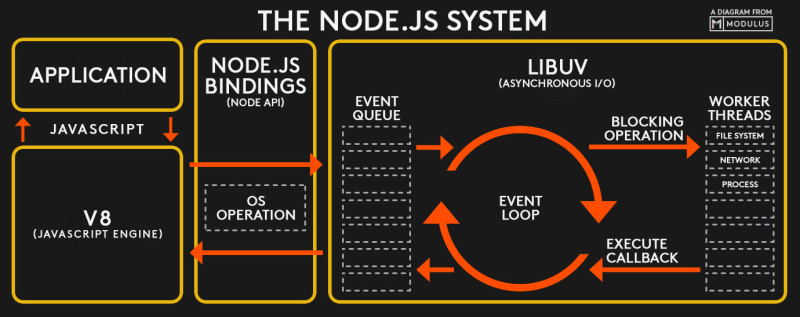

# Node.js 内置模块

 Node.js 有很多内置模块，正是这些内置模块，提供了 Node.js 和操作系统交互的能力，接下来就来了解一下它们……

在讲解 Node.js 内置模块之前，先来看一张系统架构图：



这张图是在网上找的，它比较清晰的表述了 Node.js 的系统架构

回顾官网对 Node.js 的两句话描述：

* Node.js 是一个基于 **Chrome V8 引擎**的 JavaScript 运行环境。
* Node.js 使用了一个**事件驱动**、**非阻塞式 I/O** 的模型，使其轻量又高效。

而这两句话就在上边的那张架构图里边有所体现：

第一句话体现在左边那部分，即那两列东西。

application就是我们所写的 Node.js 代码，然后它通过V8引擎来运行，而里边涉及到对操作系统的调用，这一部分就会由v8引擎帮我们转发到我们的操作系统层面，丛操作系统层面得到返回结果之后，再通过v8引擎返回到 JS 里边去。

而这就是针对 Node.js 的第一句话的表现了。

来到右边这部分，这是关于第二句话的表现。

这一部分，下节课再讲，现在就先忽略掉它！

从 JS 到 V8 再到 操作系统 的这个能力，有很大一部分都是通过 Node.js 的内置模块来提供的，因此我们先来看一下 Node.js 的一些内置模块。

来到 Node.js 官方网站的这么一个文档页面：

**➹：**[Index - Node.js v12.12.0 Documentation](https://nodejs.org/dist/latest-v12.x/docs/api/)

其里边罗列了 Node.js 所有的内置模块，比如说：

1. 典型的 File System ,一个操作系统层面的用于操作文件的API，我们的 Node.js 通过调用 File System API 就可以操作我们操作系统上的 文件了。
2. Net模块，可以使用操作系统的网络能力
3. Process，记载着 Node.js 这个进程的一些信息
4. OS，接下来用于当例子讲的一个模块，该内置模块如同它的名字一样，就是用于表示一些跟操作系统相关的一些事情。我们可以看看OS模块有哪些函数，或者说是方法（函数在对象里边叫做方法），如 `os.arch()` 表明了操作系统的架构（CPU架构），如32位、64位、arm，我这台就是 x64的、 `os.cpus()` 得到了 Node.js 所运行的这台电脑里边有多少个cpu以及有几个核，参数是怎样子的, 如我的是1个CPU4核的、 `os.freemem()` 表明当前操作系统还有多少空余内存……

总之，这全都是一些操作系统层面的一些数据和能力

那么我们的 JS 是怎么获取到它们的呢？

其实我们凭印象都知道 JS 是没有什么获取这些信息的能力的

那么这些能力是怎么来的呢？

接下来，我们来剖析一下 Node.js 是怎么做的

为了剖析 Node.js 的内置模块，我们得打开 Node.js 的源码才行，为啥要看源码呢？——因为不看源码的话，是不太能讲清楚  JS 是如何具备获取到这些信息的能力的。

源码下载：[Release 2019-10-11, Version 12.12.0 (Current), @BridgeAR · nodejs/node](https://github.com/nodejs/node/releases/tag/v12.12.0)

> 千万不要把整个node仓库给下载下来，如果你这样做了，那么将会下载850M左右的东西，而上边这个链接所下载的源码，只有80多M哈!

打开下载下来的源码之后，你会发现它的目录结构非常的复杂！

所有的内置模块都在 `lib` 这个目录里边。

接下来研究一下 `os` 这个内置模块：

1. 打开 `lib/os.js` 文件，定位到这个模块的输出，即 `exports` ，我们在文档里边所看到的那些方法，自然都在这个输出里边。

2. 研究 `cpus` 这个方法

cpus，它是个函数，但在文档上的表现它是一个方法，不过这并不重要，一个称呼而已。

``` JS
function cpus() {
  // [] is a bugfix for a regression introduced in 51cea61
  const data = getCPUs() || [];
  const result = [];
  let i = 0;
  while (i < data.length) {
    result.push({
      model: data[i++],
      speed: data[i++],
      times: {
        user: data[i++],
        nice: data[i++],
        sys: data[i++],
        idle: data[i++],
        irq: data[i++]
      }
    });
  }
  return result;
}
```

该函数调用 `getCPUs` ，然后把返回结果组装一层之后，再返回出去.

那么这 `getCPUs` 来自哪儿呢？

它是通过调用 `internalBinding('os')` ，然后从所返回的结果里边取出来的。

那么 `internalBinding` 又是什么呢？

它是去调用我们 Node.js v8 层面的一些方法，然后v8会帮我们去获取这个CPU的一些信息。

> 你可以把 Node.js 看做是个浏览器，而这样会好理解一点，毕竟我们经常跟浏览器打交道！

那么如何去看 `internalBinding('os')` 所对应的代码呢？

这个就在我们的 `src` 目录里边了，我们可以看到该目录全都是一些 c++ 文件，找到 `node_os.cc` ，并打开它

可以看到注释写得非常好，可见这是一个非常专业的机构哈！

代码虽然非常多，但我们只需要找到 `getCPUs` 就好了

## ★总结

## ★Q&A

### ①路过一张图： JS 发展简史？


**➹：**[Deno 并不是下一代 Node.js - Go语言中文网 - Golang中文社区](https://studygolang.com/articles/13101)

### ②操作系统架构？CPU架构？

**➹：**[处理器架构、指令集和汇编语言，三者有何关系？ - 知乎](https://www.zhihu.com/question/23474438)

**➹：**[熟悉计算机体系结构是种什么样的体验？ - 知乎](https://www.zhihu.com/question/59057984)

**➹：**[处理器的架构会对操作系统产生什么影响？ - 知乎](https://www.zhihu.com/question/20324698)

**➹：**[X86/X64的处理器和32/64位的系统有什么关系？ - 知乎](https://www.zhihu.com/question/47389187)

**➹：**[库，框架，架构，平台，有什么明确的区别？ - 知乎](https://www.zhihu.com/question/29643471)

**➹：**[玉兔号的 SPACEos 操作系统，系统架构是怎么设计的？ - 知乎](https://www.zhihu.com/question/22346689)

**➹：**[同时兼容Windows和Linux应用软件是否可能？ - 知乎](https://www.zhihu.com/question/22360519)

### ③何为架构？

> CPU是一个执行部件，它之所以能执行，也是因为人们在里面制作了执行各种功能的硬件电路，然后再用一定的逻辑让它按照一定的顺序工作，这样就能完成人们给它的任务。也就是说，如果把CPU看作一个人，首先它要有正常的工作能力（即执行能力），然后又有足够的逻辑能力（能明白做事的顺序），最后还要听的懂别人的话（既指令集），才能正常工作。而这些集中在一起就构成了所谓的“架构”，它可以理解为一套“工具”、“方法”和“规范”的集合。不同的架构之间，工具可能不同，方法可能不同，规范也可能不同，这也造成了它们之间的不兼容——你给一个意大利泥瓦匠看一份中文写成的烹饪指南，他当然不知道应该干什么了。

一个人要能正常工作：能动，干活有顺序，能听懂别人说你该怎么做。

**➹：**[ARM与X86不具备可比性 性能差距可大上千倍 - 视点·观察 - cnBeta. COM](https://www.cnbeta.com/articles/tech/167883.htm)

**➹：**[X86和ARM架构的处理器能效差异为什么会这么大？ - 知乎](https://www.zhihu.com/question/20148756)

**➹：**[为什么Linus Torvalds偏爱x86而不是ARM架构 - 人物 - cnBeta. COM](https://www.cnbeta.com/articles/tech/546655.htm)

### ④我电脑只有一个CPU，但是有4个核？啥意思？

答案一：

> 所谓的单核，就是指这颗CPU里面只封装了一个核芯
> 而双核和四核甚至N核，其实都是指的这颗CPU里面封装的核心数量。
>
> 你可以这样理解，两颗频率相同的CPU，其核芯数量越多越好，核芯数量越多，其计算能力及处理的线程数都会越高。

答案二：

> 核，你可以想象成人脑子，一个核就是一个脑子，四核就说明CPU有四个脑子，脑子越多解决问题的速度越快，Intel的核技术，可以把一个核模拟分成两个线程来用，充分的发挥了cpu的性能，线程8就代表核心数是4核的处理器可以模拟出8个线程来使用。线程我们可以理解每个大脑同时能处理多少件事。

答案三：

> 核是指cpu里封装的核芯 单、双、多指的是核心的数量
> 通常来说 数量越多处理能力就越强
> 补充一点 不同的双核还是有区别的
> 比如说intel的双核cpu，是将两个不同硅晶片上的芯片封装在一起 成为双芯更贴切一些
> amd的双核cpu是将两块芯片做在同一块硅晶片上 是真正意义上的双核
>
> 那哪一种设计更好？
>
> 事实证明AMD的设计更好，不过这是许多年前的设计。现在都是在一块芯片上面。

**➹：**[CPU的“单核”“双核”“四核”是什么意思？ - 知乎](https://www.zhihu.com/question/20231624)

借此引出另外一个问题：

**➹：**[多核 CPU 和多个 CPU 有何区别？ - 知乎](https://www.zhihu.com/question/20998226)

简洁答案：

> 多核CPU和多CPU的区别主要在于性能和成本。多核CPU性能最好，但成本最高；多CPU成本小，便宜，但性能相对较差。

> 简单说就是一家子人干活和几家人干活的区别，假设总人数一样，一家人开个门就能协调，几家人就要过街才能商量

所以：

我这台电脑就是一个CPU芯片，但可以完成计算任务有4个家伙！

