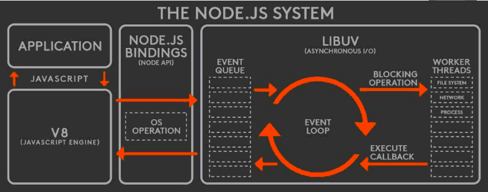
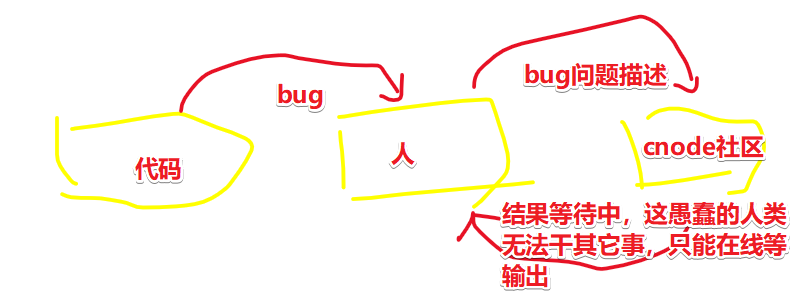
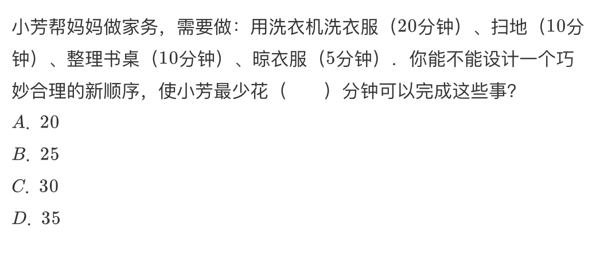
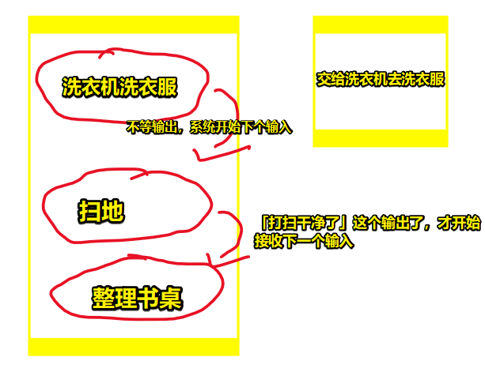
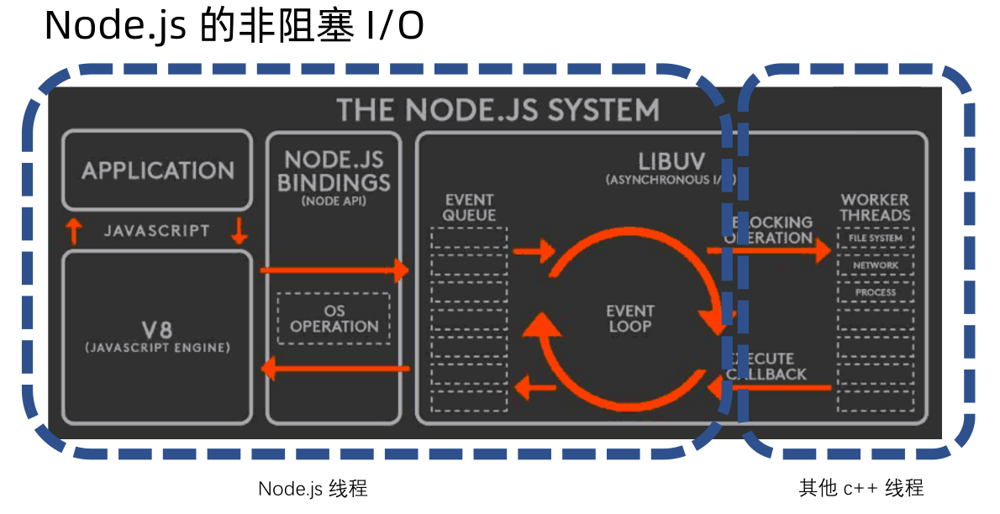
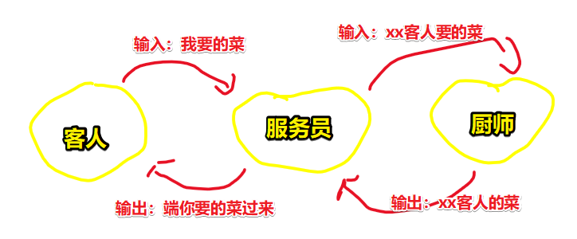
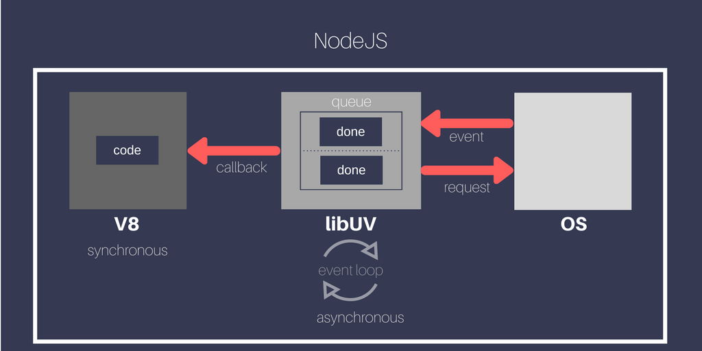
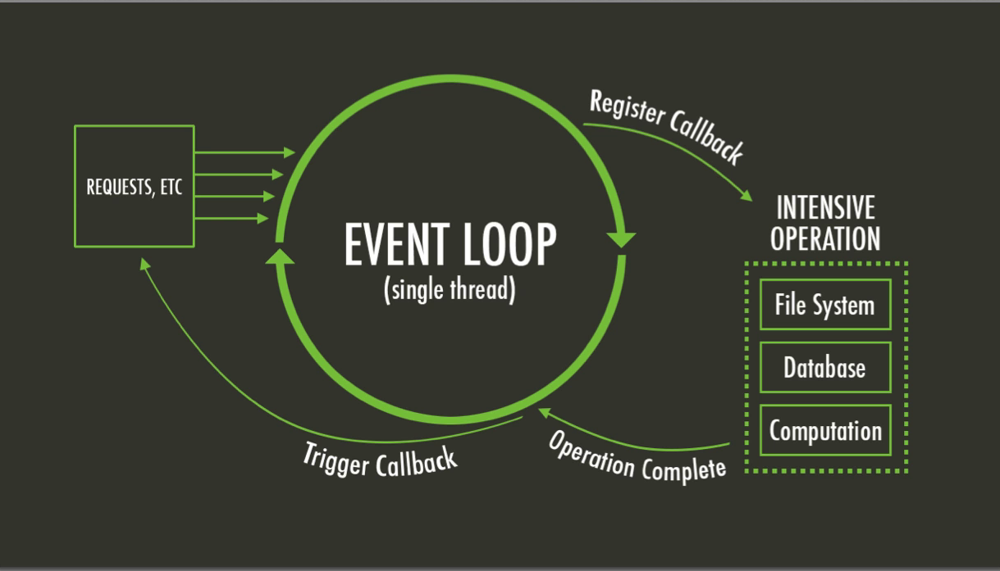

#  异步

> 不想用那种把视频里说到话，抄一遍的方式来写笔记了，毕竟这忒TM耗时间了，而且很容易导致学习疲劳！那么，现在我要切换方式去学了，即「反复写代码+看视频」。关于笔记，记住能改变自己行为方式以及思考方式的点即可！（其实说白了，就是理解老师给出的PPT），我其实挺想知道老师是如何讲解一个知识点的！总之，不求全部弄懂，只求弄懂个大概即可！



## ★Node.js 的非阻塞 I/O

### ◇概述

* I/O 即 Input/Output，一个系统的输入和输出。
* 阻塞 I/O 和非阻塞 I/O 的区别就在于**系统接收输入再到输出期间，能不能接收其他输入**。

> 理解 I/O 的关键点在于你如何定义一个系统，何为阻塞与非阻塞？按照我已有的理解，那就是把阻塞视为「等结果」，而非阻塞视为「不等结果」

### ◇例子

#### 生活例子

日常中，我们要吃个饭有好几种方式：

* 自己买菜自己煮（耗时、健康）
* 在饭堂打饭吃（实惠）
* 下馆子（贵、好吃）
* ……

去饭堂吃：排队吃饭


发工资了，出去吃：餐厅点菜


那么这两个例子对于我们理解非阻塞 I/O 有啥作用呢？

排队打饭 vs 餐厅点菜：

对于点菜人员：（食堂大妈和餐厅服务员）

* 排队打饭是阻塞 I/O 的，因为食堂大妈不能同时帮另外一个人打饭打菜，等打完你的菜后，才到下一个人（等结果）
* 餐厅点菜是非阻塞 I/O 的，因为餐厅服务员不会一直到等你的菜做好为止，才为下一个人点菜（不等结果）

> 你的输入：我要这个菜，那个菜
>
> 你得到的输出：你的饭你的菜来了
>
> 系统：食堂大妈、餐厅服务员

回顾那两句话：

> - I/O 即 Input/Output，一个系统的输入和输出。
> - 阻塞 I/O 和非阻塞 I/O 的区别就在于**系统接收输入再到输出期间，能不能接收其他输入**。

代入上边的生活例子可解释为：

系统=食堂阿姨/服务生，输入=点菜，输出=端菜

* 饭堂阿姨只能一份一份饭地打 -> 阻塞 I/O
* 服务生点完菜之后可以服务其他客人 -> 非阻塞 I/O

> 「食堂大妈」接收「点菜」再到「勺菜到盘里」期间，不能接收其它人的「点菜」，必须等这个人所需要的菜勺完之后，才到下一个人「点菜」。而这就是「阻塞I/O」
>
> 「服务生」接收「点菜」再到「端菜上来」期间，可以接收其它人的「点菜」。而这就是「非阻塞 I/O」
>
> 脱离「系统」去讲 「I/O」就是在耍流氓！

**再举几个例子：**

**例子（1）：**

你在 cnode 社区提了一个问题：「“这个 Node.js 问题怎么解决？在线等，急。”」，而这是你的输入，你想要的输出是，这问题的解决答案。

如果你不断地在刷新页面，看看有没有答案，那么这就是「**阻塞 I/O**」的，说白了，你目前就是个系统，你不能干其它事，必须等拿到结果之后，才能继续写代码，不然无法进行！

> 我现在有点模糊了，到底是「提问题的这个人」是系统，还是 「cnode 社区」是系统？
>
> 我想了想，二者都是系统。
>
> 假如 「提出问题的这个人」是系统，那么 「bug」就是输入，可是输出呢？——要等「cnode社区」这个系统的输出。
>
>  



**例子（2）：**



显然是25分钟。根据题目，要花最少时间，由于人类不是手洗衣服，而是洗衣机洗，所以在拿到洗好的衣服这个输出前， 人类这个系统是可以干其它事的，即可以接收其它事的输入，不等洗衣机的结果，而此时人类这个系统是非阻塞 I/O 的，当人类这个系统继续接收其它输入，如「扫地」，此时该系统就是阻塞I/O的，因为它无法在接收其它输入了，即便洗衣机的衣服洗好了这个结果输出出来了，也无法去处理。

简单用代码来说的话，可以把「晾衣服」作为监听「衣服洗好了」这个事件的callback。

``` js
洗衣机洗衣服() {
  setTimeout(() => {
    晾衣服()
  }, 20 分钟);
}
洗衣机洗衣服()
扫地()
整理书桌()
```



> 洗衣机给我的感觉就像是有另外一个线程帮我干事情，而不是我自己手洗！这样就节约了整整20分钟的时间了。
>
> 而人这个系统就是主线程。

### ◇理解非阻塞 I/O 的要点

* 理解非阻塞 I/O 的要点在于

  + 确定一个进行 Input/Output 的系统。
  + 思考在 I/O 过程中，能不能进行其他 I/O

### ◇代码演示 （glob）

#### 技术预研：

**① `console.time` 和 `console.timeEnd` 这两个方法可以用来让WEB开发人员测量一个 JS 脚本程序执行消耗的时间**

用法：

``` js
// 启动计时器
console.time('testForEach');

// (写一些测试用代码)

// 停止计时，输出时间
console.timeEnd('testForEach');

// 4522.303ms
```

**➹：**[console.time和console.timeEnd用法 – WEB骇客](http://www.webhek.com/post/console-time-console-timeend.html)

**②glob**

这是 JS 里边的glob实现，用于匹配文件

**➹：**[isaacs/node-glob: glob functionality for node.js](https://github.com/isaacs/node-glob)

#### 代码

``` js
const glob = require('glob');

console.time('sync')
const result = glob.sync(__dirname + '/**/*')
console.timeEnd('sync') //sync: 34.687ms
console.log(result.length)

console.time('async')
const result2 = glob(__dirname + '/**/*', function(err, result) {
  console.log(result.length)
})
console.timeEnd('async') //async: 3.408ms
// IO完成之前还可以做别的事
console.log('hello geekbang')
```

在这里为啥不把 `async` 这个结束timer放到callback里边，然后等  获取文件路径的方法 执行完，再结束呢？

> 在这个比较短的时间过去之后，就已经可以执行其他操作了。而不需要等获取文件完成。
>
> 如果只是从处理一个请求的角度来看，这样并不会变快。但是想一想如果是并发处理很多个请求，这样的机制就能节省非常多时间。 

没有怎么看懂哈！这里的请求是指http请求吗？还是单纯的获取文件路径的请求？

有人问到「 非阻塞io是node处理并发请求的方法吗？ 」——老师回答「是的」

总之， `glob(__dirname + '/**/*', function(err, result) {}` 这样一个操作就是一个非阻塞I/O，而这个非阻塞I/O减少了我们在 Node.js 里边所等待的时间，而且也能在进行 `glob` 的过程中，还能进行其它操作，或者进行其它输入和输出！

### ◇回顾那张系统架构图



这张架构图里边，它其实有4个线框，这4个线框都是代表着一个 Node.js 的程序模块，比如application就是你写的代码，即应用程序。V8、bindings层、libuv。

libuv就是实现 Node.js 异步非阻塞的一个模块，但其实这样的划分并没有很适合我们去理解非阻塞 I/O。

我们知道要理解非阻塞I/O的一个重要点就是说「我们要先确定我们的系统边界」，而这个**系统边界**就是一个线程，如果把这个架构图按照线程的维度来划分的话，实际上时这样子分的：

1. 左边部分：application、v8、bindings、libuv的一半，都是在一个 Node.js 线程里边完成的！不过，这里有个例外就是，除非你的application又开了一个另外的线程！总之，正常情况下，这部分都是一个 Node.js 线程

2. 而 Node.js 所有的 I/O 操作都是非阻塞的，然后它会把大量的计算能力，分发到其它的C++线程里边去计算，等到C++线程把这些计算都执行完毕之后 ，再把结果回调到我们的 Node.js 线程里边去！ Node.js 这个线程再把结果返回给我们的应用程序

总之，如果按照生活的例子来说的话，左边的 Node.js 就是我们的点菜人员，其它C++线程就是我们的厨师、洗碗工等，然后如果这样子划分的话，那么我们 Node.js 的非阻塞I/O就比较好理解了，即我们左边是一个 Node.js 线程，它通过调度其它C++线程 worker threads 的方式来实现了整个 Node.js 线程的非阻塞I/O

下一节课学习 Node.js 的异步编程！

## ★总结

* 为啥理解 Node.js 的非阻塞 I/O 要确定系统边界呢？——如果不确定的话，你是无法直观感受到非阻塞I/O到底是什么：



在这里，厨师是阻塞 I/O 的，它无法同时为多个客人的菜单煮菜，即其系统无法处理其它输入，要等当前的输入，有了输出结果之后，才会开始处理下一个输入。而「服务员」这个系统则是 非阻塞 I/O 的，因为服务员收到客人点菜的输入后，在服务员给客人输出之前，还可以服务其它客人，即可以接收其它客人的输入。不过总体上来看，客人吃到菜这个过程并没有节省多少时间。对于服务员来说，如果整个餐厅就只有一位客人，那么其实非阻塞I/O机制并没有变快，但是如果有10位客人呢？非阻塞I/O的机制就会节省大量的时间，即一个个请求的间隔基本忽略掉，不然其它客人肯定会跑的，毕竟点一个菜都要那么久的话，还不如走了算了，然后去其它餐厅吃。

回到代码层面来看，似乎可以把一个个异步任务看做是一个个异步请求，即一位位客人，而 Node.js 线程就像是服务员一样，而厨师则是 C++ 线程。

* 关于系统？——是一个函数吗？即系统有输入和输出！如果把人看做是一个系统，我们学习「非阻塞I/O 」这节内容，老师讲解的知识就是对我们的输入，那么输出是什么？如何才算是一个输出？即我们得理解到一个什么程度才算是 ok 的输出？会用算不算？会举一反三算不算？有时候，我们并咩有得到输出，就开始下一个知识点的输入了，而咩有得到输出，那就算是白学了，浪费了大量的时间，更严重的情况就是，由于知识是存在关联性的，即你这个知识点没有理解好，那么下一个知识也会没有理解好，那么同样会导致咩有输出，总之，「没有输出」就会触发连锁反应！但有时你在看书的时候，前边的有些内容不是很懂，但你看到后边的时候，回过头来看再前边的时候，你发现自己懂了，也就说对知识的理解不是单向的，而是双向的，发散式的理解。

## ★Q&A

### ① 好读书，不求甚解，每有会意，便欣然忘食 ？

> “好读书，不求甚解，每有会意，便欣然忘食”出自《五柳先生传》
>
> 孟子云：读书当不以文害辞，不以辞害志，以意逆志，是为得之。
>
> 即不能拘泥于文字而误解词句，也不能因为拘泥于词句而误解作者意思，能以自己的切身体会来推测作者的本意，方算读书。
>
> 卢梭言“我们的头脑是用来思考和感悟的，而不是别人思想的跑马场”，
>
> 读书切忌陷入书里去，重在“会意”。
> 有会意，足矣。
> 知识不是用来束缚人和载重的，真正的知识很轻，如一阵风。
> 懂之，自会手之舞之足之蹈之，
> 然后言“**正合我意”**
>
>
> 题主，读书没印象，不是读书读少了，或读书不认真之故，是人生经历和自我思考太少罢了。

**➹：** [请问“好读书不求甚解”是怎么做到？ - 知妖的回答 - 知乎](https://www.zhihu.com/question/21222148/answer/24676424 ) 

**➹：**[罗振宇、吴晓波都错了，知识是免费的_36氪](https://36kr.com/p/5255672)

**➹：**[「知识」是什么？ - 知乎](https://www.zhihu.com/question/20044371)

**➹：**[什么是「形而上」和「形而下」？ - 知乎](https://www.zhihu.com/question/21039799)

**➹：**[有没有人能一句话讲清形而上学和形而下学？ - 知乎](https://www.zhihu.com/question/299645762)

关于形而上学，我之前在小说里边了解到，每个人都可以看做是由符文道数来衡量，即生命是可以用某种东西来量化的！

### ②非阻塞I/O与异步?

> 有同学感觉非阻塞和异步的理解很相近 ， 感觉记得有点混乱。可以理解非阻塞I/O也属于异步方式么。 

> 异步一般指的是编程的方式。非阻塞IO是底层机制的名字。我个人平时工作也不会太区分这两个词，反正知道这个概念的人能懂就行。 

我们编写的代码通常都是按从上到下的顺序执行的，从某种程度上说，它们都是按部就班地执行的，但JavaScript代码通常不是这样编写的，大多数JavaScript代码都是事件响应式的，即是用异步编程方式的！

### ③知识到底是什么呀？

我们在企业内容管理领域有一个划分，一般内容分为如下形态：

1）数据：就是硬盘里面的数据块；

2）信息：数据经过处理，里面包含时间，地点，人物等信息；

3）知识：怎么做？信息里面表达的内容是怎么做到的。这部分内容就是信息；

4）理解：就是为什么。为什么这样做就可以弄成那个样子。呵呵。

5）智慧：最高级别啦。就是可以评估，判断未发生的事情。

**➹：**[大家如何理解“知识是相通的”，剥去知识的外衣，核心的东西是什么？ - 知乎](https://www.zhihu.com/question/20008016)

**➹：**[知识的意义是什么？ - 知乎](https://www.zhihu.com/question/310795039)

**➹：**[你怎么理解知识？ - 知乎](https://www.zhihu.com/question/46613925)

**➹：**[如何理解知识的形式和知识的类型？ - 知乎](https://www.zhihu.com/question/276997615)

**➹：**[学习知识主要是记忆还是理解？ - 知乎](https://www.zhihu.com/question/26115225)

**➹：**[如何理解知识和信息的区别，人类获取信息和获取知识的不同是什么？ - 知乎](https://www.zhihu.com/question/20267347)

**➹：**[★如何学习（4）：利用旧知识理解新知识 - 海枫的专栏 - CSDN博客](https://blog.csdn.net/linyt/article/details/50383462)

### ④一些图？

 


   

> intensive：密集的

**➹：**[What Is Node.js for Java Developers? - DZone Java](https://dzone.com/articles/what-is-nodejs-for-java-developers)

**➹：**[Why NodeJS is asynchronous? - The Web Stop](http://thewebstop.blogspot.com/2017/09/why-nodejs-is-asynchronous.html)

**➹：**[nodejs system - Google 搜索](https://www.google.com/search?rlz=1C1SQJL_zh-CNJP843JP843&biw=1350&bih=644&tbm=isch&sxsrf=ACYBGNSnQonxZlUt9M1jbsgCgfYUzZk4Zg%3A1570947178960&sa=1&ei=asCiXd-QOqnemAWdxbLABw&q=nodejs+system&oq=nodejs&gs_l=img.3.1.35i39l2j0l3j0i30l5.423778.423778..426535...0.0..0.496.496.4-1......0....1..gws-wiz-img.8wxQnc6yJTo)

**➹：**[★The only NodeJs introduction you’ll ever need. - codeburst](https://codeburst.io/the-only-nodejs-introduction-youll-ever-need-d969a47ef219)

​	