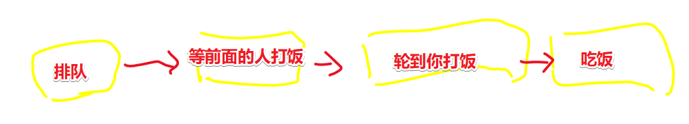

#  异步

> 不想用那种把视频里说到话，抄一遍的方式来写笔记了，毕竟这忒TM耗时间了，而且很容易导致学习疲劳！那么，现在我要切换方式去学了，即「反复写代码+看视频」。关于笔记，记住能改变自己行为方式以及思考方式的点即可！（其实说白了，就是理解老师给出的PPT），我其实挺想知道老师是如何讲解一个知识点的！总之，不求全部弄懂，只求弄懂个大概即可！


## ★Node.js 的非阻塞 I/O

### ◇概述

* I/O 即 Input/Output，一个系统的输入和输出。
* 阻塞 I/O 和非阻塞 I/O 的区别就在于系统接收输入再到输出期间，能不能接收其

> 理解 I/O 的关键点在于你如何定义一个系统，何为阻塞与非阻塞？按照我已有的理解，那就是把阻塞视为「等结果」，而非阻塞视为「不等结果」

### ◇例子

#### 生活例子

日常中，我们要吃个饭有好几种方式：

* 自己买菜自己煮（耗时、健康）
* 在饭堂打饭吃（实惠）
* 下馆子（贵、好吃）
* ……

去饭堂吃：排队吃饭



发工资了，出去吃：餐厅点菜


那么这两个例子对于我们理解非阻塞 I/O 有啥作用呢？

排队打饭 vs 餐厅点菜：

对于点菜人员：（食堂大妈和餐厅服务员）

* 排队打饭是阻塞 I/O 的，因为食堂大妈不能同时帮另外一个人打饭打菜，等打完你的菜后，才到下一个人（等结果）
* 餐厅点菜是非阻塞 I/O 的，因为餐厅服务员不会一直到等你的菜做好为止，才为下一个人点菜（不等结果）

> 你的输入：我要这个菜，那个菜
>
> 你得到的输出：你的饭你的菜来了
>
> 系统：食堂大妈、餐厅服务员

回顾那两句话：

> - I/O 即 Input/Output，一个系统的输入和输出。
> - 阻塞 I/O 和非阻塞 I/O 的区别就在于**系统接收输入再到输出期间，能不能接收其他输入**。

代入上边的生活例子可解释为：

系统=食堂阿姨/服务生，输入=点菜，输出=端菜

* 饭堂阿姨只能一份一份饭地打 -> 阻塞 I/O
* 服务生点完菜之后可以服务其他客人 -> 非阻塞 I/O

> 「食堂大妈」接收「点菜」再到「勺菜到盘里」期间，不能接收其它人的「点菜」，必须等这个人所需要的菜勺完之后，才到下一个人「点菜」。而这就是「阻塞I/O」
>
> 「服务生」接收「点菜」再到「端菜上来」期间，可以接收其它人的「点菜」。而这就是「非阻塞 I/O」
>
> 脱离「系统」去讲 「I/O」就是在耍流氓！

**再举几个例子：**

**例子（1）：**

你在 cnode 社区提了一个问题：「“这个 Node.js 问题怎么解决？在线等，急。”」，而这是你的输入，你想要的输出是，这问题的解决答案。

如果你不断地在刷新页面，看看有没有答案，那么这就是「**阻塞 I/O**」的，说白了，你目前就是个系统，你不能干其它事，必须等拿到结果之后，才能继续写代码，不然无法进行！

> 我现在有点模糊了，到底是「提问题的这个人」是系统，还是 「cnode 社区」是系统？
>
> 我想了想，二者都是系统。
>
> 假如 「提出问题的这个人」是系统，那么 「bug」就是输入，可是输出呢？——要等「cnode社区」这个系统的输出。
>
>  


**例子（2）：**


显然是25分钟。根据题目，要花最少时间，由于人类不是手洗衣服，而是洗衣机洗，所以在拿到洗好的衣服这个输出前， 人类这个系统是可以干其它事的，即可以接收其它事的输入，不等洗衣机的结果，而此时人类这个系统是非阻塞 I/O 的，当人类这个系统继续接收其它输入，如「扫地」，此时该系统就是阻塞I/O的，因为它无法在接收其它输入了，即便洗衣机的衣服洗好了这个结果输出出来了，也无法去处理。

简单用代码来说的话，可以把「晾衣服」作为监听「衣服洗好了」这个事件的callback。

``` js
洗衣机洗衣服() {
  setTimeout(() => {
    晾衣服()
  }, 20 分钟);
}
洗衣机洗衣服()
扫地()
整理书桌()
```


> 洗衣机给我的感觉就像是有另外一个线程帮我干事情，而不是我自己手洗！这样就节约了整整20分钟的时间了。
>
> 而人这个系统就是主线程。

### ◇理解非阻塞 I/O 的要点

* 理解非阻塞 I/O 的要点在于

  + 确定一个进行 Input/Output 的系统。
  + 思考在 I/O 过程中，能不能进行其他 I/O

### ◇代码演示 （glob）

#### 技术预研：

**① `console.time` 和 `console.timeEnd` 这两个方法可以用来让WEB开发人员测量一个 JS 脚本程序执行消耗的时间**

用法：

``` js
// 启动计时器
console.time('testForEach');

// (写一些测试用代码)

// 停止计时，输出时间
console.timeEnd('testForEach');

// 4522.303ms
```

**➹：**[console.time和console.timeEnd用法 – WEB骇客](http://www.webhek.com/post/console-time-console-timeend.html)

**②glob**

这是 JS 里边的glob实现，用于匹配文件

**➹：**[isaacs/node-glob: glob functionality for node.js](https://github.com/isaacs/node-glob)

#### 代码

```js
const glob = require('glob');

console.time('sync')
const result = glob.sync(__dirname + '/**/*')
console.timeEnd('sync') //sync: 34.687ms
console.log(result.length)


console.time('async')
const result2 = glob(__dirname + '/**/*', function (err, result) {
    console.log(result.length)
})
console.timeEnd('async') //async: 3.408ms
// IO完成之前还可以做别的事
console.log('hello geekbang')
```

◇


## ★总结


## ★Q&A

### ① 好读书，不求甚解，每有会意，便欣然忘食 ？

> “好读书，不求甚解，每有会意，便欣然忘食”出自《五柳先生传》
>
> 孟子云：读书当不以文害辞，不以辞害志，以意逆志，是为得之。
>
> 即不能拘泥于文字而误解词句，也不能因为拘泥于词句而误解作者意思，能以自己的切身体会来推测作者的本意，方算读书。
>
> 卢梭言“我们的头脑是用来思考和感悟的，而不是别人思想的跑马场”，
>
> 读书切忌陷入书里去，重在“会意”。
> 有会意，足矣。
> 知识不是用来束缚人和载重的，真正的知识很轻，如一阵风。
> 懂之，自会手之舞之足之蹈之，
> 然后言“**正合我意”**
>
>
> 题主，读书没印象，不是读书读少了，或读书不认真之故，是人生经历和自我思考太少罢了。

**➹：** [请问“好读书不求甚解”是怎么做到？ - 知妖的回答 - 知乎](https://www.zhihu.com/question/21222148/answer/24676424 ) 

**➹：**[罗振宇、吴晓波都错了，知识是免费的_36氪](https://36kr.com/p/5255672)

**➹：**[「知识」是什么？ - 知乎](https://www.zhihu.com/question/20044371)

**➹：**[什么是「形而上」和「形而下」？ - 知乎](https://www.zhihu.com/question/21039799)

**➹：**[有没有人能一句话讲清形而上学和形而下学？ - 知乎](https://www.zhihu.com/question/299645762)

关于形而上学，我之前在小说里边了解到，每个人都可以看做是由符文道数来衡量，即生命是可以用某种东西来量化的！


