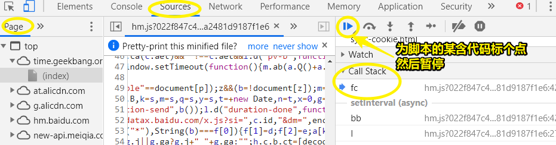

# 异步编程之callback

之前说到， Node.js 有大量的非阻塞 I/O，这些非阻塞 I/O 的程序运行结果是需要回调函数来获取的，这种通过回调函数来编程的方式就是异步编程。

异步编程还有很多的技巧和知识点，所以接下来就来聊聊 Node.js 异步编程。

## ★代码示例

实现一个比较简单的非阻塞I/O的带callback的一个程序操作：

场景：面试完之后等通知，过一段时间之后，这个通知将告知你是否通过

分析：这是一个非阻塞I/O，也是一个异步操作

``` js
//demo1
interview(function() {
  console.log('smile')
})

function interview(callback) {
  setTimeout(() => {
    callback('success')
  }, 500)
}
```

在上边这个代码里边，500ms之后（现实中一般都要好几天）面试官必然会通知我们通过了，然后我们开心的笑了一下，感觉人生达到了巅峰！

在 Node.js 里边，回调函数其实是有一个格式规范的，那么这个格式规范是什么呢?

那就是「error-first callback」啦！，当然，你也可以叫做「node-style callback」

而它的这种格式规范的含义就是说「所有的callback函数，它都要遵循一个参数格式」，这个格式就是说：**callback函数的第一个参数是 error，剩余的参数才是表示这个callback函数的执行结果**。

那么为啥要这样做呢？——接下来大概展示一下回调函数的演变过程

在demo1里边，我们的callback的第一个参数是一个字符串 `success` ，这意味着我们的面试肯定是通过的，但是现实中肯定存在不通过的情况，除非你是真TM牛逼。

因此，我们改造了一下代码：

``` js
// demo2
try {
  interview(function() {
    console.log('smile')
  })
} catch (e) {
  console.log('cry', e)
}

function interview(callback) {
  setTimeout(() => {
    if (Math.random() < 0.5) {
      callback('success')
    } else {
      throw new Error('fail')
    }
  }, 500)
}
```

面试只有50%的几率会通过，我们希望的结果是当我们这个面试失败了，程序它可以在try catch 里边抓取到这个错误并且把结果打印出来。如面试失败了：


抛一个错误上去也算是一个回调哈！但是这个错误并没有被我们的try catch 给抓取到，反而是被抛到了 Node.js 全局里边去了，然后 造成了一个全局的错误，而在 Node.js 里边造成全局错误是一个非常严重的事情，它会导致我们的 Node.js 程序崩溃，而这也是 Node.js 比较难处理的一个部分！

那么为啥会这样子呢？——其实我们的try catch 和throw跟一个概念叫做调用栈是非常有关系的！

调用栈是什么呢?



我们知道代码里边是有函数调函数的情况的，效果就是每次增加调用一个函数的操作，就会往栈里边增加一个元素，最终的结果就是整个栈看起来非常之高。

而 try catch 的机制是怎样子的呢？

假如你在栈顶抛一个错误，那么这个错误的流向就是从顶部开始往下抛，最终在某个含有try……catch的元素里边被捕获到：


而这就是try catch的使用机制了

如果我们的这个throw语句不是在try catch的包裹的一个调用里边的话，那么它就不会被try catch所抓取到！

或许你会疑问「我们的interview函数的调用 就是在try catch里边写的啊！为啥没有被抓取到呢？」

而这就涉及到 Node.js 的另一个概念了，那就是事件循环，也就是说每一个事件循环都是一个全新的调用栈，而我们这个setTimeout的一个参数，即callback函数，是在另外一个事件循环里边回调的，说白了，这是一个全新的调用栈，所以这个 throw语句就会被抛到 Node.js 全局，而不是在demo2所写的try catch 里边被抓取到！

> 事件循环和调用栈下一节课会讲。在我看来，其实理解浏览器里边的事件循环机制之后，也是可以很好的直观理解的！调用interview这个函数，遇到一个非阻塞I/O，该interview函数调用结束，然后清空当前 Call Stack，0.5s后有个callback被push到了任务队列里边去了，然后看到Call Stack为空，就把该callback push 到Call Stack 里边执行，假设面试没有通过，那么此时就会抛一个错误出来，而这个错误最终被抛到全局上来，毕竟 Call Stack里边没有哪个元素可以捕捉它！

言归正传，回到demo2这段代码来看，在setTimeout里边，即在一个异步任务里边throw一个错误，是不能被外边的try catch所抓取到的，因此我们的错误也是需要通过callback来callback出去的！即这样：

``` js
// demo3
// try {
interview(function(res) {
  // 判断第一个参数是怎样子的格式，即是一个怎样子的数据
  if (res instanceof Error) {
    return console.log('cry')
  }
  console.log('smile')
})
// } catch (e) {
//   console.log('cry', e)
// }
function interview(callback) {
  setTimeout(() => {
    if (Math.random() < 0.5) {
      callback('success')
    } else {
      // 通过callback来把错误抛出去
      callback(new Error('fail'))
    }
  }, 500)
}
```

以上代码就模拟出了有时成功有时失败的人生常态了！

在 Node.js 里边有很多的callback，换言之有很多异步任务，那么写回调函数的人是不可能理解所有的callback的第一个参数到底有哪几种格式的，毕竟这个理解起来是非常困难的！

所以 Node.js 官方就提出了一种写回调函数的规范，就是说我们的所有Error都放在callback的第一个参数，而第二个参数、第三个参数……才是我们的结果！即异步任务所输出的结果！

因此，就形成了一个约定俗成的习惯，那就是如果非阻塞I/O或者说异步调用发生了错误的话，那我们就会知道在写callback的时候，其callback函数里边哪一部分代码是处理错误的，哪一部分是处理成功的！对于整个异步任务的错误处理，目前来看就稍微了简单了许多！


以上就是 Node.js 官方形成这样一个规范的原因所在了！

## ★异步流程控制

我们在写callback的时候，其实有一个比较严重的点就是「异步流程控制」

那么「异步流程控制」是什么意思呢？

演示一下为什么「异步流程控制」会成为一个问题：

场景：我们都知道面试不一定是一次就结束的，肯定会有很多轮面试官轮番向你发起挑战，那我们的面试实际上是一个串行的过程，如一面、二面这样……

代码实现：

``` js
interview(function(err) {
  if (err) {
    return console.log('cry at 1st round')
  }

  interview(function(err) {
    if (err) {
      return console.log('cry at 2nd round')
    }

    interview(function(err) {
      if (err) {
        return console.log('cry at 3rd round')
      }
      console.log('smile')
    })
  })
})
```

以上是一个进行三轮面试的程序，可以看到程序嵌套了三层，而这可以从缩进里看出，表明上看这程序也是比较容易读懂的，毕竟逻辑简单，代码结构也简单，然而在实际应用的时候，每一个异步任务有可能很短有可能很长，那么这看起来就很恶心了，而这个问题也被称为**回调地狱**，而这就是callback这种方式所遇到的比较严重的一个异步流程控制的问题，即容易产生回调地狱！

除了这个问题，还有第二个问题，那就是有两个异步任务是有可能并发的，比如说：

你同时去两家公司面试，那么你比较贪心，需要等两次面试都通过之后，才「笑」出来！

``` js
var count = 0

interview((err, res) => {
  if (err) {
    console.log('第一个异步任务')
    return console.log('cry')
  }
  count++
  if (count == 2) {
    console.log('第一个异步任务')
    console.log(res)
    console.log('smile')
  }
})

interview((err, res) => {
  if (err) {
    console.log('第二个异步任务')
    return console.log('cry')
  }
  count++
  if (count == 2) {
    console.log('第二个异步任务')
    console.log(res)
    console.log('smile')
  }
})
```

如果你打算面试三家公司都通过了，然后才「笑」出来，那么又得写一堆差不多一样代码，而这样显然很麻烦呀！

而这也是callback这种方式比较容易遇到的一个异步流程控制的问题，即异步的并发

当然，针对这两个问题，社区是有一些解决方案的

比如这个npm包：async.js

> 在遇到任何关于npm包的问题的时候，第一时间想到的是到npm官网查询这个包的作用是什么，毕竟很出名的包都会写有一个详细的文档，以及有配套的例子，就算你看不懂英文，看一下例子也大概会知道这个包的作用是什么！

**➹：**[async - npm](https://www.npmjs.com/package/async)

``` js
// for use with Node-style callbacks...
var async = require("async");

var obj = {
  dev: "/dev.json",
  test: "/test.json",
  prod: "/prod.json"
};
var configs = {};

async.forEachOf(obj, (value, key, callback) => {
  fs.readFile(__dirname + value, "utf8", (err, data) => {
    if (err) return callback(err);
    try {
      configs[key] = JSON.parse(data);
    } catch (e) {
      return callback(e);
    }
    callback();
  });
}, err => {
  if (err) console.error(err.message);
  // configs is now a map of JSON data
  doSomethingWith(configs);
});
```

async这个库可以帮我们做异步并发的控制，上边这个代码要做的事情是，它要同时读三个文件，执行三次非阻塞I/O，然后等着这三次非阻塞I/O都完成之后，再执行这段逻辑：

``` js
err => {
  if (err) console.error(err.message);
  // configs is now a map of JSON data
  doSomethingWith(configs);
}
```

简单来说，async 提供了个 `forEachOf` 方法，它可以遍历一个对象, 针对每一个key 、value都会有一个callback去搞事情，当这三个callback都被执行了之后，它才会往下执行上边这个代码！

而这个就是 Node.js 里边最初始的、最原始的、最流行的异步流程控制库了！

但是它现在有点过时了，如果对这个库有什么使用问题，那就上官网看它的作用！

除了async.js之外，之前还流行过一种异步流程控制的方式，叫thunk（笨拙的）

它不是一个库，也不是一个框架，它只是一种编程范式，目前它基本上也退出历史舞台了

**➹：**[Thunk - Wikipedia](https://en.wikipedia.org/wiki/Thunk)

这是一个看起来很厉害的库：

**➹：**[thunks/api-zh.md at master · thunks/thunks](https://github.com/thunks/thunks/blob/master/docs/api-zh.md)

**➹：**[有Promise了为什么还要用Thunk？ · Issue #1 · thunks/thunks](https://github.com/thunks/thunks/issues/1)

还有一个：

**➹：**[mafintosh/thunky: Delay the evaluation of a paramless async function and cache the result](https://github.com/mafintosh/thunky)

以上就是关于回调函数这一个异步编程方法的内容了，由于之前说到了事件循环，那么接下就趁热打铁、深入了解一下事件循环这个 Node.js 底层机制！

## ★总结

* [Thunk 函数的含义和用法 - 阮一峰的网络日志](http://www.ruanyifeng.com/blog/2015/05/thunk.html)

  * 参数的求值策略， **即函数的参数到底应该何时求值** 

    * 传值调用， 在进入函数体之前，就计算传入的表达式值。如C、JS
    * 传名调用，直接把表达式传进来， 只在用到它的时候求值（即只在执行时求值 ） 。如 Hskell 

    选择谁呢？——各有利弊呀！ 传值调用比较简单 ，但如果咩有用到这个参数，那就 有可能造成性能损失 

* Thunk函数？—— **它是"传名调用"的一种实现策略，用来替换某个表达式** 

```js
function f(m){
  return m * 2;     
}

f(x + 5);

// 等同于

var thunk = function () {
  return x + 5;
};

function f(thunk){
  return thunk() * 2;
}
```

这样子么？

```js
var thunk = function (x) {
  return x + 5;
};

function f(x){
  return thunk(x) * 2;
}

f(5)
```

说白了，就是用函数的返回值替换成表达式？

## ★Q&A

### ①现在流行的处理异步操作的方法是什么？

> promise await async 差不多了吧?

### ②看的不是很懂？

那张系统架构图摆出来很久了，但是一直没有说的很清楚。还有就是感觉啥都提及了一下，但是让人抓不住重点。可能是老师授课经验还有一些欠缺，但是真的希望能讲的更好一些。

> 我也是node的小白，个人感觉老师讲的挺好理解的，而且老师很早就说了，他讲的我们不一定马上就能理解，但是随着时间的推移，经验的积累，逐渐会深入理解。并且事实上，本人对学习这方面的看法也是如此，不可能会有一门课是，老师讲什么，我们就能立刻领悟，还得结合自己的思考和实践去进一步的理解～

