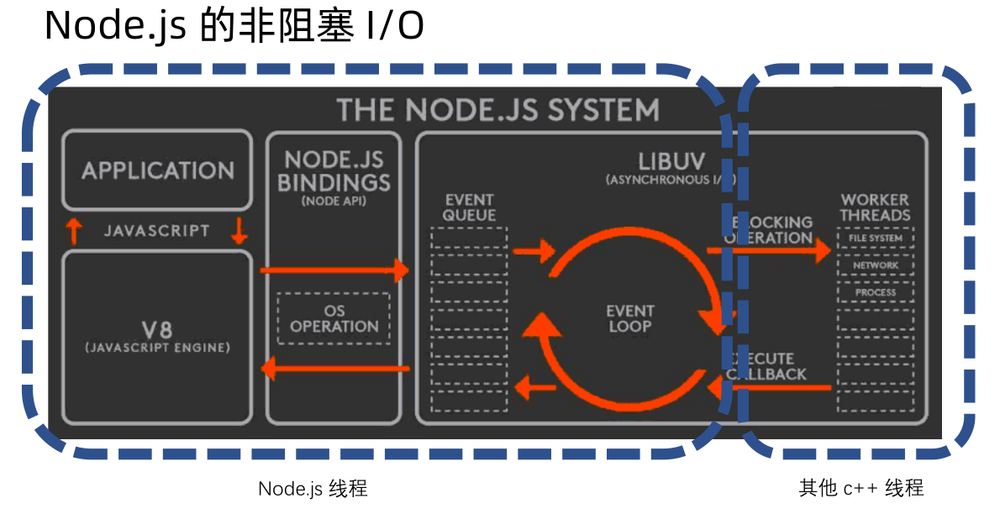
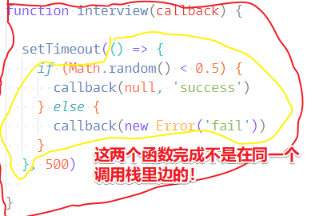

# 异步：事件循环

事件循环是一个很重要的东西！

在讲事件循环之前，先来看看之前那张贯穿整个 Node.js 异步系统的架构图：



我们之前已经知道了非阻塞I/O这部分内容是啥了，即图中右边虚线框的两个箭头！

我们可以发现这两个箭头是紧邻着代表着「事件循环」的箭头的，而这意味着我们的「事件循环」是让我们 Node.js 实现非阻塞I/O的一个关键的部分，即它是非阻塞I/O的一个基础，而 非阻塞I/O 跟event loop ，它们都属于 libuv 这个C++库所提供的能力！也就是说理解了event loop 跟  非阻塞I/O 就已经差不多能理解libuv了，也就差不多能理解完整个 Node.js 的异步它是怎样运行的！

## ★生活例子

举个栗子来讲一下 event loop 是个什么样的东西！

还是拿餐厅那个例子来举例吧！


服务生： Node.js 线程

点菜顺序：

1. 客人A：鱼香茄子

2. 客人B：波士顿龙虾（要弄很久）

3. 客人C：番茄炒蛋

A客人进来，点了份鱼香茄子，于是服务生就把这菜告诉了厨房，而厨房就派了个厨师来帮客人A做这份鱼香茄子，即建立一个叫鱼香茄子的线程哈！而客人A则看着极客时间等着菜做好！

同理，B客人，C客人也是如此……

此刻大家都在这儿等着，看着极客时间……此时A的鱼香茄子做好了，那么服务生就会把这道菜端到A的面前，这样我们的「鱼香茄子」任务也就完成了！接着就是「番茄炒蛋」做好了，毕竟它要「波士顿龙虾」要简单很多，同理，服务生也要端出去，这样「番茄炒蛋」任务也完成了……最后三个任务都完成了，那么「餐厅」的任务也就完成了！

以上就是有关事件循环的这么一个例子了，即它是一个处理事件的循环。

每当有事件，那么事件循环就会等着，但是一旦有事件完成了，那么它就会把这个事件所需要的数据，回调出去哈！

## ★代码演示

用代码演示一下这个事件循环要如何去写，写完之后，你可能就会对整个事件循环的机制以及逻辑会了解得更加清楚、更加清晰一点！

注意，这不是一个真正的event loop，但是也能大概模拟出事件循环这么执行的一个方法！通过它，你就会明白event loop 的执行逻辑是怎样子的！

做法：

1. 定义一个 `eventloop` 对象
2. 添加一个 `queue` 数组
3. 添加 `loop` 方法，用于模拟多少ms执行一次循环，在这里我们用50ms来模拟，实际情况要远远小于50ms。loop的函数体需要不停的检测队列，检测一下是否还有未处理完的消息，如果有那就去处理它，即把排头的元素 `unshift` 出去，交给 V8 去处理！
4. 添加 `add` 方法，用于往 `queue` 里边添加回调函数
5. 测试，添加两个定时器，一个是500ms后就把callback扔到队列里边去，还有一个是800ms后。

代码如下：

``` js
const eventloop = {
  queue: [],
  loop() {
    while (this.queue.length) {
      // 模拟把排头的元素弹出去，交给 V8，让V8把这个cb搞到Call Stack里边执行！
      const cb = this.queue.shift()
      cb()
    }
    // setTimeout(() => {
    //   console.log('每隔50ms看看queue是否有元素')
    //   this.loop()
    // }, 50)
    // bind返回这一个指定了this的新loop函数，当然也可以使用上边的箭头函数，
    // 毕竟箭头函数里边的this值指向的是上一级作用域里边this值，而且函数this值是在定义时确定的，可不是在callback调用时确定的！
    setTimeout(this.loop.bind(this), 50)

    // 这里的this则是Timeout对象，cb.call(timeout)，我们这里的eventloop写的过于简单，并没有体现给callback传参数，或许添加到任务队列里边的callback都是用bind指定了this才添加进去的！
    // setTimeout(function () {
    //   console.log(this)
    // }, 50)
  },
  add(callback) {
    this.queue.push(callback)
  }
}

eventloop.loop()

setTimeout(() => {
  // 模拟有一个异步任务完成了，事件循环就完任务队列里边添加元素，即添加callback
  eventloop.add(() => {
    console.log('callback 500ms')
  })
}, 500)

setTimeout(() => {
  eventloop.add(() => {
    console.log('callback 800ms')
  })
}, 800)
```

500ms过后，事件循环就把一个callback添加到 `queue` 里边去了，同理，800ms过后也是如此！

> 此刻的认识：传给 非阻塞I/O 的callback，是其它线程自己主动发个消息给eventloop说「老哥，我这个任务完成了，并且我已经把处理结果作为实参交给该callback了，至于该callback什么时候执行，老哥你自己看着办吧！」

那么以上就是事件循环最基本的一个例子了，即我们可以往eventloop里边添加一堆消息，然后隔一段时间eventloop就会检测一下，当然，实际情况下，不会有50ms这么长！而是它会在很短的时间里边帮我们不停地检测队列里边是不是还有消息没有处理完！如果有，那么就会拿出来，帮我们去做一些处理！

需要注意的是，实际的事件循环是要比我们上边的代码要复杂得多的，比如说：

`eventloop.add(callback)` 不仅仅只有这么一个回调函数，比如我们的文件操作，实际上可能会添加一个叫写文件的事件，如这样：

``` js
eventloop.add('fswrite', callback)
```

然后就会特地放一个队列，比如说叫 `fsqueue:[]` ，当然，除了文件操作队列以外，还可能会有一些定时操作的队列 `timeoutqueue` ……

然后在loop方法里边，会**依次**为不同的队列做一个遍历，如文件操作队列，eventloop它就会去看哪个一个callback所对应的文件操作是已经完成了，如果完成了，它才会调用callback！如果没有完成，它就会跳过……而这就是eventloop它的一个执行方式啦！

``` js
const eventloop = {
  queue: [],
  timeoutqueue: [],
  fsqueue: [],
  loop() {
    while (this.queue.length) {
      const cb = this.queue.shift()
      cb()
    }
    this.fsqueue.forEach(callback => {
      if (done) {
        callback()
      }
    });
    setTimeout(this.loop.bind(this), 50)
  },
  add(queueType, callback) {
    switch (queueType) {
      case 'fswrite':
        this.fsqueue.push(callback)
        break;
      default:
        break;
    }
  }
}

setTimeout(() => {
  eventloop.add('fswrite', () => {
    console.log('callback 800ms')
  })
}, 800)
```

> 难道不是文件操作完成后，才会把callback扔到事件队列里边去吗？目前的状况是，任务未完成，callback就已经扔到到任务队列去了，一旦文件操作完成后，其它线程就会抛出一个xxx事件, 并带着任务的输出结果，通知给eventloop说「老哥，任务已完成」！或许文件操作的机制是这样子的，添加到任务队列里边去的callback带有一个「done为0」的标志，一旦完成了「done就为1」。

总之，以上代码只是演示了eventloop的一个最简单执行方式，实际情况里边的eventloop，要比上边的代码要复杂得多。
总之，我们的目的是赶紧先把一些底层的东西研究好，然后确定我们这个异步是怎么用的，之后就快速进入实战了。

至此关于eventloop的运行机制就讲到这儿了！

之前说到每一个事件循环，它都是一个全新的调用栈，我们知道调用栈是一个一个层级这样往上走的，那么我们调用栈底部的那个函数是由谁触发的呢？

在我们 Node.js 里边，调用栈的底部就是eventloop里边触发的一个事件，你可见理解为就是传给 非阻塞I/O 的那个callback啦！

``` js
 while (this.queue.length) {
   const cb = this.queue.shift()
   cb() //这个callback就是我们 Node.js 调用栈的底部！
 }
```

在调用这个callback之前，前边的代码都是C++代码（libuv这个库），而从这个callback开始，才是 JS ，然后才有 JS 的调用栈。

回顾之前的面试代码：

``` js
function interview(callback) {
  setTimeout(() => {
    if (Math.random() < 0.5) {
      callback(null, 'success')
    } else {
      callback(new Error('fail'))
    }
  }, 500)
}
```

setTimeout所做的事情，实际上就是把它的callback提交到eventloop里边，形成了一个eventloop里边的timeout事件，等到500ms之后，eventloop会检测到这个事件 ，然后说一句「嗯，应该得回调了」，那么就会调用这个callback啦！然后，同时这个callback也就成了一个新的调用栈，即一个新的事件循环的调用栈的底部，换句话说该callback已经处于调用栈的最底部了，那么这意味着其下边咩有 任何的元素可以通过try catch来帮助我们抓住这个错误！

因此，假如该callback的执行会 `throw new Error('fail')` 一个错误的话，那么这当然会抛到 Node.js 的全局里边去！而不是说在这里被抓住了：

``` js
try {
  interview(callback)
} catch (e) {
  console.log('cry')
}
```

如果你还不懂，那么换言之：



这个世界最遥远的距离就是eventloop所造成的，看上去非常难理解，毕竟这很不符合我们平时的编程习惯呀！然而，这却是 Node.js 一个非常重要的基础，也是 Node.js 一个高性能的基础。因此，最好还是理解一下eventloop！

> 你写多了异步代码，就会明白callback是怎么被调用执行的！

事件循环是一个比较抽象和比较复杂的概念，就像老师之前说的那样「理解事件循环这个概念，是一个需要你用日常的 Node.js 开发经历来慢慢体会的概念」，在这里，老师最多只能是抛砖引玉了！

下一节课，回到 Node.js 异步编程上来！这次要讲的是Promise

---

## ★总结

* event loop这个对象，push元素到事件队列里边去是它，shift元素出事件队列外边去也是它，队列有很多，有事件队列、定时器队列、文件队列等，而这意味着队列之间是有次序之分的！

* 如果你要定义「同一时间做能做一件事」，那么你得确定一件事的粒度是多大，或者说确定有几件事，比方说，一共就有三件事「洗衣机洗衣服」、「扫地」、「整理书桌」，假如你不这样做的话，那么我们在「扫地」过程中，「听音乐」是不是同样在做一件事呢？

* 快速理解一个 非阻塞I/O 任务的执行流程，只需要把异步API以及传给它的callback拆分到不同的Call Stack去看即可！至于多个异步任务的callback的执行顺序是怎样子的，那你得去看看eventloop是如何处理那些事件队列了！

* 一个新的认识，根据不同的异步API，evenntloop会把callback push 到其相应的队列里边去，如果某个异步任务有了结果，那么eventloop就会把执行使用该结果的callback交给V8引擎去处理！需要注意的是，eventloop每次通知V8去执行callback的前提是，当前的Call Stack得是空空如也哈！说白了，callback在没有得到异步任务处理的结果之前是处于冻结状态的，但有了结果之后，此时就处于活跃状态了，或者说是可执行状态了，但是这会立刻执行吗？——可能会也可能不会，这得看看eventloop是怎么处理的了，毕竟这世界不只有你一个callback存在，还有很多callback此时也是处于活跃状态的！

