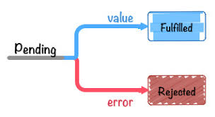
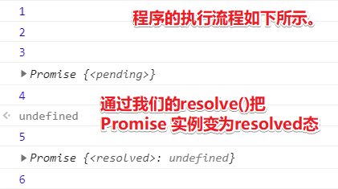
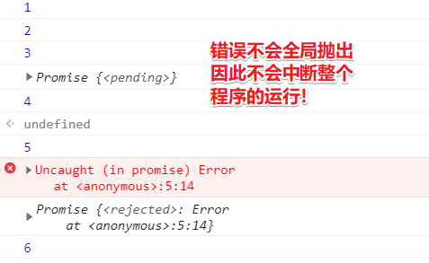

# 异步：异步编程之Promise

Promise是第二种异步编程方法！Promise和模块化规范一样，都出自于 CommonJS 规范，但是它最终被 JS 官方所采用，现在它已经成为了社区所最推荐的一种异步编程解决方案！因此，需要重点讲一下这个Promise！

Promise是啥意思？

就如它的字面单词意思一样，即「承诺」之意，它承诺你现在还得不到一个结果，但是在未来等到确定之后，就会给你一个结果，而这听起来就像是一个渣男所说的话一样！

总之，Promise其实就是这样一个渣男！

回到 Node.js ，Promise的意思就是说「在当前这个事件循环里边，它是一个没有确切结果的东西，但是在未来的一个事件循环里边，它会给到你结果！」

当然Promise ，不仅是个宅男，它还是个状态机！

它有3个状态

* pending
* fulfilled/resovled
* rejected



pending表示还咩有得到结果的状态，然后它会从该pending态扭转到resoveled态 或者是 rejected态。

fulfilled 态也可以叫做 resoveled态，代表Promise 得到一个正常的返回，得到一个确切的结果，就会进入这个 resoveled态.

但是如果得到一个错误的结果，那么Promise 就会进入rejected态

以上就是Promise 状态扭转的一个方式啦！

从实际代码来看一下，这个状态扭转是怎样子的：

1. new 一个 Promise ，并传入一个函数参数，而该函数参数有两个形参，分别是resolve和reject
2. 这两个参数的含义：resolve会把当前这个Promise 实例扭转到 resoveled态 ，而reject则是扭转到 rejected态

测试代码如下：

需求：我希望这个Promise 对象能在500ms之后从pending态扭转为 resoveled态 

检测效果：800ms查看这个Promise 对象的状态，由于终端不好展示测试效果，所以可以把代码搞定浏览器里边去执行（搞个立即执行函数就行）！毕竟Promise 已经成为了JS 的官方标准，所以这是可以在Chrome里边调试的！

``` js
(function() {
  const promise = new Promise((resolve, reject) => {
    console.log(1)
    setTimeout(() => {
      resolve()
      console.log(5)
    }, 500)
    console.log(2)
  })

  console.log(3)
  console.log(promise)

  setTimeout(() => {
    console.log(promise)
    console.log(6)
  }, 800)
  console.log(4)
})()
```

log结果：



> 传给Promise的函数，其里边的代码是同步代码哈！

以上就是pending态到 resoveled态 的状态扭转过程！

同理，扭转为 rejected态也是如此：

``` js
(function() {
  const promise = new Promise((resolve, reject) => {
    console.log(1)
    setTimeout(() => {
      reject(new Error('hi'))
      console.log(5)
    }, 500)
    console.log(2)
  })
  console.log(3)
  console.log(promise)
  setTimeout(() => {
    console.log(promise)
    console.log(6)
  }, 800)
  console.log(4)
})()
```

log结果：



关于那个错误：当一个Promise如果进入了 rejected态，而且如果这个错误又咩有被正确的捕捉的话，那这个错误就会被抛到我们的 JS 解释执行环境的全局了。说白了就是抛到浏览器的全局，或者说是Node.js 的全局，然后形成一个未捕获的错误！

> 看来我的理解有问题哈！错误确实是抛在全局里边，但并没有出现我想要的中断程序的执行。（我之前认为只要抛到全局就会打断整个程序的运行，而且假如整个程序没有被打断了，那么这个错误并不是被抛到全局的）
>  
> 在Node.js 环境里边，抛出了这样一个错误 `UnhandledPromiseRejectionWarning: Error: hi` ，该错误并咩有中断剩余的代码执行！即没有所谓的导致整个Node.js程序崩溃，之前在callback那节里边抛出一个错误是一个很严重的结果

那么如何解决这个未捕获的错误呢？——之后会说到！

目前，我们可以确定Promise确实是一个状态机，并且它可以从pending状态扭转到 resolved 状态 或者是 rejected状态！

话说，Promise 进入到 resoveled态 or rejected态之后， 它是否还能互相转换呢？简单来说，就是目前 它 是 resoveled态，那么它能否转成是rejected态呢？

写代码验证一下这件事能否发生：

> 测试：300ms之后，Promise 从pending态，扭转到了 resoveled态，然后在500ms之后，尝试把Promise 从 resoveled态 扭转到 rejected态，然后最终在800ms的时候再打印它的状态机！

## ★总结

## Q&A

### ①状态机？

我觉得理解状态机，得先看看状态模式：

**简介：**

> 状态模式(State)允许一个对象在其内部状态改变的时候改变它的行为，对象看起来似乎修改了它的类。
> 其实就是用一个对象或者数组记录一组状态，每个状态对应一个实现，实现的时候根据状态挨个去运行实现。

**实现状态模式的思路：**

> 首先创建一个状态对象或者数组，内部保存状态变量，然后内部封装好每种动作对应的状态，然后状态对象返回一个接口对象，它可以对内部的状态修改或者调用

所谓的接口对象，即一个构造函数返回了一个对象 `{}` ，其中该对象里边拥有访问构造函数里边的私有对象里边的某个API

**demo：**

``` js
class SuperMarry {
  constructor() {
    this._currentState = []
    this.states = {
      jump() {
        console.log('跳跃!')
      },
      move() {
        console.log('移动!')
      },
      shoot() {
        console.log('射击!')
      },
      squat() {
        console.log('蹲下!')
      }
    }
  }

  change(arr) { // 更改当前动作
    this._currentState = arr
    return this
  }

  go() {
    console.log('触发动作')
    this._currentState.forEach(T => this.states[T] && this.states[T]())
    return this
  }
}

new SuperMarry()
  .change(['jump', 'shoot'])
  .go() // 触发动作  跳跃!  射击!
  .go() // 触发动作  跳跃!  射击!
  .change(['squat'])
  .go() // 触发动作  蹲下!
```

**无糖demo:**

``` js
const SuperMarry = (function() {
  let _currentState = [], // 状态数组
    states = {
      jump() {
        console.log('跳跃!')
      },
      move() {
        console.log('移动!')
      },
      shoot() {
        console.log('射击!')
      },
      squat() {
        console.log('蹲下!')
      }
    }

  const Action = {
    changeState(arr) { // 更改当前动作
      _currentState = arr
      return this
    },
    goes() {
      console.log('触发动作')
      _currentState.forEach(T => states[T] && states[T]())
      return this
    }
  }

  return {
    change: Action.changeState,
    go: Action.goes
  }
})()

SuperMarry
  .change(['jump', 'shoot'])
  .go() // 触发动作  跳跃!  射击!
  .go() // 触发动作  跳跃!  射击!
  .change(['squat'])
  .go() // 触发动作  蹲下!
```

**小结：**

状态模式的使用场景也特别明确，有如下两点：

1. 一个对象的行为取决于它的状态，并且它必须在运行时刻根据状态改变它的行为。(对象同样是调用go方法，但是结果却因为状态的变化而变化)
2. 一个操作中含有大量的分支语句，而且这些分支语句依赖于该对象的状态。状态通常为一个或多个枚举常量的表示。

简而言之，当遇到很多同级if-else或者switch的时候，可以使用状态模式来进行简化。

> 给我的认识，Promise实例具体执行then的第一个参数还是第二参数，这取决于它的状态！

**进一步认识：**

> 有限状态机（FSM）、分层状态机（HFSM）

状态模式既不属于有限状态机也不属于分层状态机。

* 有限状态机是目标只有一个状态，只能通过事件触发跳转其他状态。
* 分层状态机是目标分为几个大状态，大状态中封装一些小状态，小状态之间互相可以跳转，大状态之间也可以跳转。

而本例中的状态模式既没有固定的状态可以互相跳转，也没有分大状态，而是目标可以有多个状态，通过操作可以使目标有其他多个状态

> 是行为改变了状态？还是状态改变了行为？
> 用户输入 `jump` 和 `shot` 对应的键，如 `w` 和 `j` ，可见用户把两种状态都给了超级玛丽，即用户的行为改变了超级玛丽的状态，而根据超级玛丽的状态，又改变了超级玛丽自己的行为。所以这是状态改变了行为！毕竟对于超级玛丽这个系统来说状态才是输入，而行为则是输出！而对用户这个系统来说，敲打的键符是输入，而输出则是给超级玛丽的状态！

**回到「有限状态机」 这个话题来：**

「有限状态机」它是一个非常有用的模型（可以把模型看做是写代码的套路）

那么一个东西怎样才能叫做「有限状态机」呢？——简单来说，它得有以下三个特征才行：

1. 状态总数（state）是有限的。
2. 任一时刻，只处在一种状态之中。
3. 某种条件下，会从一种状态转变（transition）到另一种状态。

话说，我了解这个有限状态机有啥用？

写JS 代码的时候，其实很多对象可以写成有限状态机

举例来说，网页上有一个菜单元素。鼠标悬停的时候，菜单显示；鼠标移开的时候，菜单隐藏。如果使用有限状态机描述，就是这个菜单只有两种状态（显示和隐藏），鼠标会引发状态转变。

> 菜单有show 和 hide这两种状态，而状态之间的切换来自于事件的触发！

代码可写成为：

``` js
var menu = {

  // 当前状态
  currentState: 'hide',

  // 绑定事件
  initialize: function() {
    var self = this;
    self.on("hover", self.transition);
  },

  // 状态转换
  transition: function(event) {
    switch (this.currentState) {
      case "hide":
        this.currentState = 'show';
        doSomething();
        break;
      case "show":
        this.currentState = 'hide';
        doSomething();
        break;
      default:
        console.log('Invalid State!');
        break;
    }
  }

};
```
可以看到，有限状态机的写法，逻辑清晰，表达力强，有利于封装事件。一个对象的状态越多、发生的事件越多，就越适合采用有限状态机的写法。

> 事件名，即行为名。关于红绿灯，stop事件触发了才使得状态机从黄灯变为绿灯，这并不符合生活的定义，因为这得是看到绿灯才触发stop事件，不过对于红绿灯这个系统而言，时间的输入触发了stop事件，而不是我们的人眼触发了stop事件！而红绿灯因为stop事件改变了状态，即它的输出，影响了人们的行为！说白了这有3个系统：定时器、灯、行为！

另外，JavaScript语言是一种异步操作特别多的语言，常用的解决方法是指定回调函数，但这样会造成代码结构混乱、难以测试和除错等问题。有限状态机提供了更好的办法：把异步操作与对象的状态改变挂钩，当异步操作结束的时候，发生相应的状态改变，由此再触发其他操作。这要比回调函数、事件监听、发布/订阅等解决方案，在逻辑上更合理，更易于降低代码的复杂度。（这一点很重要）

> `new Promise(()=>{})`，函数参数里边的异步任务决定了Promise实例从初始的Pending态切换到 resoveled态 or rejected态，而状态的切换意味着会执行相应的行为（即函数）！
> 因此Promise是一个有限状态机，即它符合以上所述的三个特征！如只有3个状态，这是有限的；不能同时有多种状态，即任意时刻只有一种状态存在，如果异步任务抛错误了就 rejected态，否则异步任务有结果，就 resoveled态。

> 把你看到的对象抽象成状态和行为


**➹：**[JS 状态模式 - 前端下午茶 - SegmentFault 思否](https://segmentfault.com/a/1190000012506631)

**➹：**[JavaScript与有限状态机 - 阮一峰的网络日志](http://www.ruanyifeng.com/blog/2013/09/finite-state_machine_for_javascript.html)

**➹：**[层次化状态机的讨论 – AI分享站](http://www.aisharing.com/archives/393)

**➹：**[前端设计模式用起来（1）状态模式 - 有赞美业前端团队 - SegmentFault 思否](https://segmentfault.com/a/1190000016961475)


### ②目前Promise实例是 resoveled态，那么该Promise实例能切换成 rejected态吗？


### ③关于思考模型？

知乎xxx提问：「有没有值得推荐的思考模型？」

>我的思考模型是：问题分解，然后进行溯本求源
>比如本题：有没有值得推荐的思考模型？
>分解：值得；思考模型
>溯本求源：什么叫值得，判断标准是什么；什么叫思考模型

推荐一本书「史上最简单的问题解决手册 」（该书罗列了很多思考模型）

**➹：**[有没有值得推荐的思考模型？ - 知乎](https://www.zhihu.com/question/24445101)