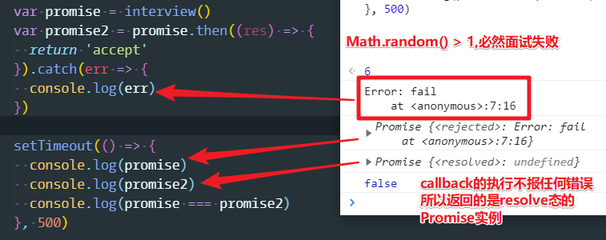

# 异步：异步编程之Promise

## ★概述

Promise是第二种异步编程方法！Promise和模块化规范一样，都出自于 CommonJS 规范，但是它最终被 JS 官方所采用，现在它已经成为了社区所最推荐的一种异步编程解决方案！因此，需要重点讲一下这个Promise！

Promise是啥意思？

就如它的字面单词意思一样，即「承诺」之意，它承诺你现在还得不到一个结果，但是在未来等到确定之后，就会给你一个结果，而这听起来就像是一个渣男所说的话一样！

总之，Promise其实就是这样一个渣男！

## ★Promise实例就是个状态机

回到 Node.js ，Promise的意思就是说「在当前这个事件循环里边，它是一个没有确切结果的东西，但是在未来的一个事件循环里边，它会给到你结果！」

当然Promise ，不仅是个宅男，它还是个状态机！

它有3个状态

* pending
* fulfilled/resovled
* rejected


pending表示还咩有得到结果的状态，然后它会从该pending态扭转到resoveled态 或者是 rejected态。

fulfilled 态也可以叫做 resoveled态，代表Promise 得到一个正常的返回，得到一个确切的结果，就会进入这个 resoveled态.

但是如果得到一个错误的结果，那么Promise 就会进入rejected态

以上就是Promise 状态扭转的一个方式啦！

从实际代码来看一下，这个状态扭转是怎样子的：

1. new 一个 Promise ，并传入一个函数参数，而该函数参数有两个形参，分别是resolve和reject
2. 这两个参数的含义：resolve会把当前这个Promise 实例扭转到 resoveled态 ，而reject则是扭转到 rejected态

测试代码如下：

需求：我希望这个Promise 对象能在500ms之后从pending态扭转为 resoveled态 

检测效果：800ms查看这个Promise 对象的状态，由于终端不好展示测试效果，所以可以把代码搞定浏览器里边去执行（搞个立即执行函数就行）！毕竟Promise 已经成为了JS 的官方标准，所以这是可以在Chrome里边调试的！

``` js
(function() {
  const promise = new Promise((resolve, reject) => {
    console.log(1)
    setTimeout(() => {
      resolve()
      console.log(5)
    }, 500)
    console.log(2)
  })

  console.log(3)
  console.log(promise)

  setTimeout(() => {
    console.log(promise)
    console.log(6)
  }, 800)
  console.log(4)
})()
```

log结果：


> 传给Promise的函数，其里边的代码是同步代码哈！

以上就是pending态到 resoveled态 的状态扭转过程！

同理，扭转为 rejected态也是如此：

``` js
(function() {
  const promise = new Promise((resolve, reject) => {
    console.log(1)
    setTimeout(() => {
      reject(new Error('hi'))
      console.log(5)
    }, 500)
    console.log(2)
  })
  console.log(3)
  console.log(promise)
  setTimeout(() => {
    console.log(promise)
    console.log(6)
  }, 800)
  console.log(4)
})()
```

log结果：


关于那个错误：当一个Promise如果进入了 rejected态，而且如果这个错误又咩有被正确的捕捉的话，那这个错误就会被抛到我们的 JS 解释执行环境的全局了。说白了就是抛到浏览器的全局，或者说是Node.js 的全局，然后形成一个未捕获的错误！

> 看来我的理解有问题哈！错误确实是抛在全局里边，但并没有出现我想要的中断程序的执行。（我之前认为只要抛到全局就会打断整个程序的运行，而且假如整个程序没有被打断了，那么这个错误并不是被抛到全局的）
>  
> 在Node.js 环境里边，抛出了这样一个错误 `UnhandledPromiseRejectionWarning: Error: hi` ，该错误并咩有中断剩余的代码执行！即没有所谓的导致整个Node.js程序崩溃，之前在callback那节里边抛出一个错误是一个很严重的结果

那么如何解决这个未捕获的错误呢？——之后会说到！

目前，我们可以确定Promise确实是一个状态机，并且它可以从pending状态扭转到 resolved 状态 或者是 rejected状态！

话说，Promise 进入到 resoveled态 or rejected态之后， 它是否还能互相转换呢？简单来说，就是目前 它 是 resoveled态，那么它能否转成是rejected态呢？

写代码验证一下这件事能否发生：

> 测试：300ms之后，Promise 从pending态，扭转到了 resoveled态，然后在500ms之后，尝试把Promise 从 resoveled态 扭转到 rejected态，然后最终在800ms的时候再打印它的状态机！

``` js
(function () {
  const promise = new Promise((resolve, reject) => {
    console.log(1)
    setTimeout(() => {
      resolve()
    }, 300)
    setTimeout(() => {
      console.log(5)
      reject(new Error('hi'))
      console.log(6)
    }, 500)
    console.log(2)
  })
  console.log(3)
  console.log(promise)
  setTimeout(() => {
    console.log(promise)
    console.log(7)
  }, 800)
  console.log(4)
})()
```
结果：


可见，Promise实例的状态，还是我们第一次扭转的那个状态！即第一次是resolved了，那么就是这个状态，而resoveled态和rejected态之间是不能互相转换的！

我们知道Promise实例它是一个状态机，我们想检测它的状态，然后根据这个状态去做某些事情，而我们用定时器这种姿势去检测它的状态机有咩有变化显然是不可能的

我们使用Promise来解决异步问题，是希望它在得到结果的同时，马上通知我们，所以这个代码该怎么写呢？

> 这个时候Promise实例的两个方法就出场了，而这两个方法一个是`then`，一个是 `catch`

## ★then和catch的用法

`then`是啥意思？——拿代码来看：


说白了，then前边那个Promise实例进入了 resoveled态 ,那么then的第个函数参数就会被回调，并且把 resolve的结果给拿到！

代码测试如下：

``` js
(function () {
  const promise = new Promise((resolve, reject) => {
    setTimeout(() => {
      resolve(3)
    }, 300)
  }).then((res) => {
    console.log(res)
  }).catch(() => {

  })
  console.log(promise)
  setTimeout(() => {
    console.log(promise)
  }, 800)
})()
```
结果：


> 我测试了上边代码两个定时器同为300ms的情况，结果会先去执行then里边的callback，当然这或许是第一个定时器先被解析执行的！

总之，Promise实例一旦有了结果，那么第一时间内就会交给then去处理（这涉及到宏任务和微任务，微任务的优先级更高）

话又说回来，`catch`是干嘛的呢？——同 `then`的原理那样，但是它所接收的是前边的Promise实例是 rejected态，然后catch的函数参数才会被回调

测试：


> 不管这个为啥会这样了，我只能说是Chrome的问题了

从上边的结果，可以注意到，rejected态的Promise实例， 经过catch的处理之后，之前所产生的全局的 `Uncaught (in promise) Error`（醒目的红色字眼）打印就已经消失了，即当一个 Promise 实例 进入 rejected态，但是它又被后边的catch捕捉到之后，那么它这个错误就不会被抛到全局了。

总结一下，then和catch的用法：

- .then 和 .catch
  - resolved 状态的 Promise 会回调后面的第一个 .then
  - rejected 状态的 Promise 会回调后面的第一个 .catch
  - 任何一个 rejected 状态且后面没有 .catch 的 Promise，都会造成 浏览器 /node 环境的全局错误

> 关于catch这点的理解，它会忽略掉第一个then，然后把catch作为第一个类似的then的家伙来调用！同理，你先写catch然后再写then，如果是resolve态的Promise实例，也会先忽略掉catch，然后执行第一个出现的then
> 全局错误，有可能造成浏览器或者node环境的崩溃！

如果Promise只有执行异步任务，然后通过then或catch获取执行结果的功能的话，那么Promise其实跟callback那种处理异步流程姿势，也没啥区别！甚至要比callback的写法还要复杂一些！

既然Promise出现了，那么它优秀的地方在哪儿呢？

## ★Promise它优秀的地方

Promise优秀的地方在于它可以解决很多异步流程控制的问题，之前在callback那节内容提到了，如果我们在面试多轮的情况，或者说需要同时获取多家公司面试结果的情况下，会遭遇到异步流程控制的问题

那么接下来就看一下，Promise是如何帮我们解决这些问题的

做法：

1. `interview`函数返回的是一个Promise实例，而不是使用callback来搞
2. 给Promise构造函数传入一个固定格式的函数参数，而且在这个函数参数的函数体里边执行异步任务，说白了就是在这个Promise里边执行异步任务啦！
3. 如果说我面试成功了，那我就调用 resolve，并把成功的结果给返回出去，即这样`resolve('success')`传个参数
4. 同理，面试失败了，那就调用 reject，然后把失败的结果给返回出去，即这样 `reject(new Error('fail'))`

> 注意：resolve和 reject它们俩都只能接收一个参数

``` js
function interview() {
  return new Promise((resolve, reject) => {
    setTimeout(() => {
      if (Math.random() > 0.2) {
        resolve('success')
      } else {
        reject(new Error('fail'))
      }
    })
  }
  )
}
```

至此，`interview`函数就被我们改造成一个返回Promise实例的函数了！

测试这个 `interview`函数（由于不需要看到状态，因此可以在node环境下来测试）：

``` js
let promise = interview()

promise.then((res) => {
  console.log('smile')
}).catch((err) => {
  console.log('cry')
})
```

以上就是一个最基础的Promise的使用方法了！

至此，这个 `interview`函数已经成功的被我们改成了使用Promise 的方式来处理异步了，当然，Promise实际上还可以做一些更加牛逼的操作

那么这是什么样的牛逼操作呢？

举例来说：

在我得知我面试的这家公司成功通过之后，我狠狠的拒绝了这家公司offer：


> 我在定时器里边追加了一行 `console.log(promise === promise2)` ，结果是 `false`

从上边的截图来看，`then`这个方法其实是会返回一个全新的Promise实例的，而这个 `promise2`的状态是会根据那个 `promise.then(callback)`里边的callback的执行结果来决定的！即如果该callback是throw了一个错误或者其它语法错误什么的，那返回的Promise实例，即这个 `promise2`就是 rejected态的，同样，我们可以推测，假如我们开开心心地接受了这个offer：


那么返回出去的Promise实例就是很正常的 `resolved`态，而且这个Promise实例的值，就是我们这个 `then` return 出去的值！

总之， `.then`是会产生一个新的Promise实例的，而这个新的Promise实例的结果是会根据 `.then`里边的第一个callback的返回或者说抛出的错误来决定的！
同理，`.catch`也是如此！

测试（改成必然会面试失败，显然这非常的凄惨哈！）：



可见，catch和then一样，都是会根据callback的执行结果来决定返回的Promise实例是什么状态！

那么如何让 `promise2`为 rejected态呢？——很简单，抛个错误即可！

``` js
var promise = interview()
var promise2 = promise.then((res) => {
  return 'accept'
}).catch(err => {
  throw new Error('refuse')
})
```

总结一下：

- 执行 then 和 catch 会返回一个新 Promise，该 Promise 最终状态根据 then 和catch 的回调函数的执行结果决
  - 如果回调函数最终是 throw，该 Promise 是 rejected 状态
  - 如果回调函数最终是 return，该 Promise 是 resolved 状态

## ★then or catch显示地返回了一个Promise实例

或许你会有这样的疑问：以上两点，即这两个功能，对我们解决异步的流程控制问题到底有啥帮助呢？

其实对Promise的使用还有一个更强大的功能，了解了这个功能之后，你就会明白Promise确实可以帮助我们解决异步流程控制问题！

测试：「如果在then或catch里直接显示返回一个新的Promise实例会咋样呢？而且在这个Promise实例里边也要执行一个异步任务」

``` js
function interview() {
  return new Promise((resolve, reject) => {
    setTimeout(() => {
      if (Math.random() > 0) {
        resolve('success')
      } else {
        reject(new Error('fail'))
      }
    }, 500)
  }
  )
}

var promise = interview()
var promise2 = promise.then((res) => {
  return new Promise((resolve, reject) => {
    setTimeout(() => {
      resolve('accept')
    }, 400)
  })
})

setTimeout(() => {
  console.log(promise)
  console.log(promise2)
}, 800)

setTimeout(() => {
  console.log(promise)
  console.log(promise2)
}, 1200)
```

结果：


那么这说明了什么呢？

说明了 `promise2`这个新Promise实例的状态是会跟这个显示声明的 `new Promise()`一起的！即 `promise2`会等待这个显示声明的 Promise 的执行结果结束之后，那么 `promise2`才会执行结束！

而这个就是Promise链式调用的第三个知识点了：

- 如果 then 和 catch 的回调函数最终 return 了一个 Promise ，那么该 Promise 会和回调函数 return 的 Promise 状态保持一致

> new Promise会返回一个Promise实例，then同样也会返回一个Promise实例，是这样子么？还是说一个是显式的返回，一个是隐式的返回呢？——我觉得不是显式和隐式问题，因为在使用 `then`的时候，我们把 `return`的结果给返回出去了！说白了，之所以在 `then`里边 显式返回一个Promise实例，那是因为我们想追加一个异步任务，然后看看结果是否是好的！（有种异步任务同步执行的调调，即一个异步任务处理完之后，才轮到下一个新的异步任务……！不会出现类似多个定时器那样时间抵消的情况，即假如有2个定时器，一个400ms后执行，一个500ms后执行，首先400ms的执行了，再过100ms之后就会执行500ms那个定时器！而这对于Promise来说就可以实现，400m一次执行，然后再过500ms后一次执行，说白了就是重新计时呗！）


以上这样一种机制，就决定了我们可以在Promise的链式调用里边串行的执行多个异步任务

## ★回调地狱？异步并发？这通通不是问题

### ◇在then里边return一个promise

接下来，就来实际演示一下多轮面试这种情况，在Promise里边要怎么写？

``` js
// 加个round参数代表是第几轮面试
function interview(round) {
  return new Promise((resolve, reject) => {
    setTimeout(() => {
      // 80%的几率通过这个面试
      if (Math.random() > 0.2) {
        resolve('success')
      } else {
        let error = new Error('fail')
        error.round = round //通过error把这个轮次数给记下来，以此来知道我们是在第几轮失败的！
        reject(error)
      }
    }, 500)
  }
  )
}

var promise = interview(1)
  .then(() => {
    // 在then里边返回了一个新的promise，那么后续的操作都会等这个promise状态扭转之后才会继续执行
    return interview(2)
  })
  .then(() => {
    return interview(3)
  })
  .then(() => {
    // 三轮面试成功之后就开心的笑出来
    console.log('smile')
  })
  .catch((err) => {
    // 处理面试失败的情况，当我们的promise被reject的时候，就会忽略前边的then，然后跑到这第一个catch来执行！
    console.log('cry at ' + err.round + ' round !')
  })

```

> 别忘了then每次都是返回一个新的Promise实例的（设它为A），而且这可不是return的那个Promise实例（设它为B），而且B的状态即是A的状态，B的值即是A的值！（传给resolve或reject的那个参数值）

可见，通过以上这种方式，把我们三轮面试这整个的过程的写法，给简化成了一个比较容易看懂的这么一段代码！而这也就是Promise 神奇的地方，通过then和catch，把我们之前所遭遇到的回调地狱，变成了一个比较线性的一段代码，而且看起来也比较舒服一点！而且需求也能完成起来！

### ◇Promise.all([]).then(callback).catch(callback)

还有一个异步流程控制的问题，那就是我们在callback那节所提到的「并发异步」的问题！

需求是这样的：面试两家公司，然后这两家同时面试成功之后，我们再笑出来！

做法：

1. 改造一下我们interview函数，即把round形参改成为公司的名字，即name
2. 并发控制处理：`Promise.all([])`，该API接受一个数组，然后可以把多个promise放在这个数组里边，而all的返回值还是promise，所以可以这样 `Promise.all().then(callback).catch(callback)`，当then触发了，那么意味着数组里边的元素，都完成了异步任务，但是如果数组里边只要有一个元素GG了，那就走到 `catch`这个callback了。

代码如下：

``` js
function interview(name) {
  return new Promise((resolve, reject) => {
    setTimeout(() => {
      // 50%的几率通过这个面试
      if (Math.random() > 0.5) {
        resolve('success')
      } else {
        let error = new Error('fail')
        error.name = name
        reject(error)
      }
    }, 500)
  }
  )
}

Promise.all([
  interview('geekbang'),
  interview('tencent')
]).then(() => {
  console.log('smile')
}).catch((err) => {
  // 把失败的原因打出来！如是在xxx公司挂了
  console.log('cry for ' + err.name)
})

```

关于 `Promise.all()`的使用，需要注意的是：

`Promise.all().then().catch()`这个catch它是接收第一个失败的Promise实例，也就说假设你的「tencent」和「geekbang」面试都挂了，那么这个catch方法里边能接收到的只是先挂的那一个，即先把拒绝通知给到你的那家公司！（先reject那个呗！）总之，在这个catch里边，你是不太能知道你的所有的面试结果是怎样子的，如果你想知道所有 的面试结果，那么你就需要手动去把数组里边的几个promise元素传下去，然后在catch里边处理一下，然后去获取它们具体的面试结果！但是Promise.all已经是一个非常不错的控制异步并发的方式了，通过Promise.all，你基本上已经可以完成大部分的并发控制的异步调用了！

测试，如果你想知道两家公司的面试情况：

``` js
Promise.all([
  interview('geekbang').catch(err => {
    return err
  }),
  interview('tencent').catch(err => {
    return err
  })
]).then((data) => {
  console.log(data)
  console.log('smile')
}).catch((err) => {
  console.log('cry for ' + err.name)
})
```
通过以上代码，你就会知道是两家公司都挂了，还是任意一家公司挂了！（注：`Promise.all().then().catch()`里边的 `catch()`其实可以扔掉的！ ）

**➹：**[Promise.all错误处理 - 知乎](https://zhuanlan.zhihu.com/p/25743960)

下一节学习 `async/await`，啃下这节课，那么学习下一节真得是非常轻松！


## ★总结

- catch的本质是then的第二个callback参数
- Promise 实例是一个状态机
- 把一个异步函数改造成Promise，很简单，只需要返回一个promise实例即可！需要注意的是，`new Promise((resolve,reject)=>{})`是固定形式，即你形参就是 `resolve`和 `reject`，你去看Promise的源码实现，就会知道resolve和reject都是一个函数的名字！
- then or catch 都是会返回一个新的隐式Promise实例。
- 要执行 `.then()` or `.catch()`，那么其前边的Promise实例得是发生了状态变化才会执行，即由 `pending`变为 `resolved` or `rejected`
- `.then()` or `.catch()`的return值，如果不是一个Promise实例，那么该值就作为处理结果，传给下一个then or catch的callback。如果是一个Promise实例，那么该实例的处理结果就会交给then所返回的Promise实例，而且状态保持一致！
- `resolve()` or `reject()` 只接收一个参数。
- 在then or catch里边可以返回promise实例这种机制，解决了如「回调地狱、异步并发」这样的异步流程控制问题，前者做法是代码形式上的级联操作，做到了异步任务的串行执行，后者做法是利用 `Promise.all()`这个API。

## Q&A

### ①状态机？

我觉得理解状态机，得先看看状态模式：

**简介：**

> 状态模式(State)允许一个对象在其内部状态改变的时候改变它的行为，对象看起来似乎修改了它的类。
> 其实就是用一个对象或者数组记录一组状态，每个状态对应一个实现，实现的时候根据状态挨个去运行实现。

**实现状态模式的思路：**

> 首先创建一个状态对象或者数组，内部保存状态变量，然后内部封装好每种动作对应的状态，然后状态对象返回一个接口对象，它可以对内部的状态修改或者调用

所谓的接口对象，即一个构造函数返回了一个对象 `{}` ，其中该对象里边拥有访问构造函数里边的私有对象里边的某个API

**demo：**

``` js
class SuperMarry {
  constructor() {
    this._currentState = []
    this.states = {
      jump() {
        console.log('跳跃!')
      },
      move() {
        console.log('移动!')
      },
      shoot() {
        console.log('射击!')
      },
      squat() {
        console.log('蹲下!')
      }
    }
  }

  change(arr) { // 更改当前动作
    this._currentState = arr
    return this
  }

  go() {
    console.log('触发动作')
    this._currentState.forEach(T => this.states[T] && this.states[T]())
    return this
  }
}

new SuperMarry()
  .change(['jump', 'shoot'])
  .go() // 触发动作  跳跃!  射击!
  .go() // 触发动作  跳跃!  射击!
  .change(['squat'])
  .go() // 触发动作  蹲下!
```

**无糖demo:**

``` js
const SuperMarry = (function() {
  let _currentState = [], // 状态数组
    states = {
      jump() {
        console.log('跳跃!')
      },
      move() {
        console.log('移动!')
      },
      shoot() {
        console.log('射击!')
      },
      squat() {
        console.log('蹲下!')
      }
    }

  const Action = {
    changeState(arr) { // 更改当前动作
      _currentState = arr
      return this
    },
    goes() {
      console.log('触发动作')
      _currentState.forEach(T => states[T] && states[T]())
      return this
    }
  }

  return {
    change: Action.changeState,
    go: Action.goes
  }
})()

SuperMarry
  .change(['jump', 'shoot'])
  .go() // 触发动作  跳跃!  射击!
  .go() // 触发动作  跳跃!  射击!
  .change(['squat'])
  .go() // 触发动作  蹲下!
```

**小结：**

状态模式的使用场景也特别明确，有如下两点：

1. 一个对象的行为取决于它的状态，并且它必须在运行时刻根据状态改变它的行为。(对象同样是调用go方法，但是结果却因为状态的变化而变化)
2. 一个操作中含有大量的分支语句，而且这些分支语句依赖于该对象的状态。状态通常为一个或多个枚举常量的表示。

简而言之，当遇到很多同级if-else或者switch的时候，可以使用状态模式来进行简化。

> 给我的认识，Promise实例具体执行then的第一个参数还是第二参数，这取决于它的状态！

**进一步认识：**

> 有限状态机（FSM）、分层状态机（HFSM）

状态模式既不属于有限状态机也不属于分层状态机。

* 有限状态机是目标只有一个状态，只能通过事件触发跳转其他状态。
* 分层状态机是目标分为几个大状态，大状态中封装一些小状态，小状态之间互相可以跳转，大状态之间也可以跳转。

而本例中的状态模式既没有固定的状态可以互相跳转，也没有分大状态，而是目标可以有多个状态，通过操作可以使目标有其他多个状态

> 是行为改变了状态？还是状态改变了行为？
> 用户输入 `jump` 和 `shot` 对应的键，如 `w` 和 `j` ，可见用户把两种状态都给了超级玛丽，即用户的行为改变了超级玛丽的状态，而根据超级玛丽的状态，又改变了超级玛丽自己的行为。所以这是状态改变了行为！毕竟对于超级玛丽这个系统来说状态才是输入，而行为则是输出！而对用户这个系统来说，敲打的键符是输入，而输出则是给超级玛丽的状态！

**回到「有限状态机」 这个话题来：**

「有限状态机」它是一个非常有用的模型（可以把模型看做是写代码的套路）

那么一个东西怎样才能叫做「有限状态机」呢？——简单来说，它得有以下三个特征才行：

1. 状态总数（state）是有限的。
2. 任一时刻，只处在一种状态之中。
3. 某种条件下，会从一种状态转变（transition）到另一种状态。

话说，我了解这个有限状态机有啥用？

写JS 代码的时候，其实很多对象可以写成有限状态机

举例来说，网页上有一个菜单元素。鼠标悬停的时候，菜单显示；鼠标移开的时候，菜单隐藏。如果使用有限状态机描述，就是这个菜单只有两种状态（显示和隐藏），鼠标会引发状态转变。

> 菜单有show 和 hide这两种状态，而状态之间的切换来自于事件的触发！

代码可写成为：

``` js
var menu = {

  // 当前状态
  currentState: 'hide',

  // 绑定事件
  initialize: function() {
    var self = this;
    self.on("hover", self.transition);
  },

  // 状态转换
  transition: function(event) {
    switch (this.currentState) {
      case "hide":
        this.currentState = 'show';
        doSomething();
        break;
      case "show":
        this.currentState = 'hide';
        doSomething();
        break;
      default:
        console.log('Invalid State!');
        break;
    }
  }

};
```
可以看到，有限状态机的写法，逻辑清晰，表达力强，有利于封装事件。一个对象的状态越多、发生的事件越多，就越适合采用有限状态机的写法。

> 事件名，即行为名。关于红绿灯，stop事件触发了才使得状态机从黄灯变为绿灯，这并不符合生活的定义，因为这得是看到绿灯才触发stop事件，不过对于红绿灯这个系统而言，时间的输入触发了stop事件，而不是我们的人眼触发了stop事件！而红绿灯因为stop事件改变了状态，即它的输出，影响了人们的行为！说白了这有3个系统：定时器、灯、行为！

另外，JavaScript语言是一种异步操作特别多的语言，常用的解决方法是指定回调函数，但这样会造成代码结构混乱、难以测试和除错等问题。有限状态机提供了更好的办法：把异步操作与对象的状态改变挂钩，当异步操作结束的时候，发生相应的状态改变，由此再触发其他操作。这要比回调函数、事件监听、发布/订阅等解决方案，在逻辑上更合理，更易于降低代码的复杂度。（这一点很重要）

> `new Promise(()=>{})`，函数参数里边的异步任务决定了Promise实例从初始的Pending态切换到 resoveled态 or rejected态，而状态的切换意味着会执行相应的行为（即函数）！
> 因此Promise是一个有限状态机，即它符合以上所述的三个特征！如只有3个状态，这是有限的；不能同时有多种状态，即任意时刻只有一种状态存在，如果异步任务抛错误了就 rejected态，否则异步任务有结果，就 resoveled态。

> 把你看到的对象抽象成状态和行为


**➹：**[JS 状态模式 - 前端下午茶 - SegmentFault 思否](https://segmentfault.com/a/1190000012506631)

**➹：**[JavaScript与有限状态机 - 阮一峰的网络日志](http://www.ruanyifeng.com/blog/2013/09/finite-state_machine_for_javascript.html)

**➹：**[层次化状态机的讨论 – AI分享站](http://www.aisharing.com/archives/393)

**➹：**[前端设计模式用起来（1）状态模式 - 有赞美业前端团队 - SegmentFault 思否](https://segmentfault.com/a/1190000016961475)


### ②目前Promise实例是 resoveled态，那么该Promise实例能切换成 rejected态吗？


### ③关于思考模型？

知乎xxx提问：「有没有值得推荐的思考模型？」

>我的思考模型是：问题分解，然后进行溯本求源
>比如本题：有没有值得推荐的思考模型？
>分解：值得；思考模型
>溯本求源：什么叫值得，判断标准是什么；什么叫思考模型

推荐一本书「史上最简单的问题解决手册 」（该书罗列了很多思考模型）

**➹：**[有没有值得推荐的思考模型？ - 知乎](https://www.zhihu.com/question/24445101)