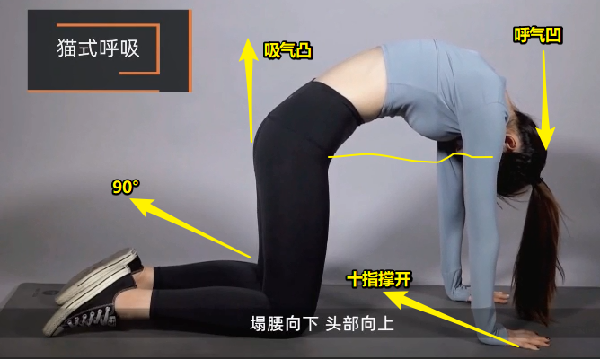
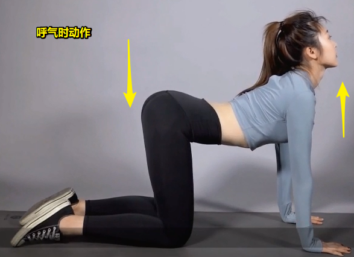

# 久坐办公室，如何锻炼腰椎？

## ★引子

你的身边有没有一些上班的朋友，或者说就是你自己，在办公室坐久了，腰部会感觉酸痛呢？这是因为久坐不运动导致出现了腰肌劳损、腿部酸麻、腰间盘膨出、腰间盘突出等情况。那为什么会出现这种情况，又如何防预和改善这些问题呢？

## ★腰部出现酸痛缘由

腰部问题出现的源头 -> 生活习惯不够好 -> 如久坐、不科学的运动方式、搬重物、跷二郎腿等 -> 造成腰痛的头号杀手 -> 久坐 -> 腰部肌肉很紧张 -> 腰椎很容易受伤 

腰椎出现问题 -> 不可逆，只能加以静养，并且进行恢复性的训练

想要缓解腰部酸痛问题 -> 需要强化腰部肌肉、背部肌肉、臀腿部肌肉 -> 唯有这样才能更好地提高腰椎的稳定性

## ★实用的背部、腰部以及臀腿的训练

动作 -> 简单 -> 可在家进行 -> 用于提高背部和臀腿部肌肉的稳定性

可放松和强化肌肉的动作：

1、背部训练 -> 坐在瑜伽垫或床上 -> 需要用到弹力绳 （目前无）

2、猫式呼吸 -> 跪在垫子上 -> 大小腿成90° -> 十指张开撑在地面上 -> 背部朝天花板的方向上弓，并且同时吸气哈 -> 呼气时塌腰向下，头部向上 -> 背部得到舒展 -> 整套动作做10次

初始化动作：

吸气：

呼气：

> 要注意的点 -> 手臂不能屈 -> 呼气时不用90°

**➹：**[猫式（全套）图文分解图_瑜珈体式_新浪博客](http://blog.sina.com.cn/s/blog_12c055ceb0102wnrg.html)
