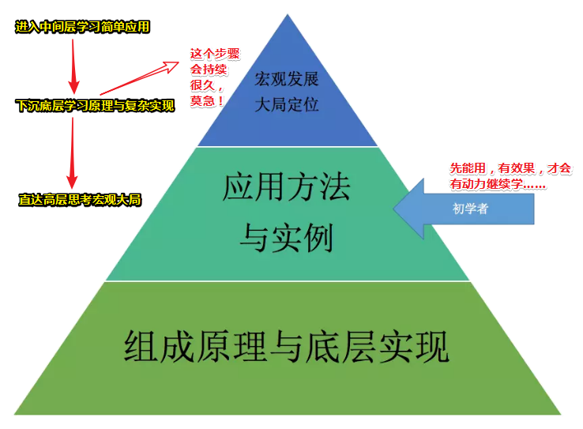
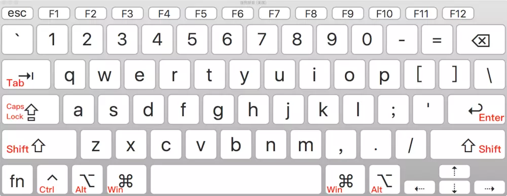
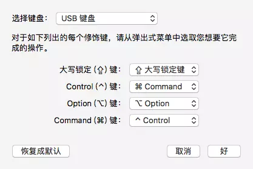

# 学编辑器，到底应该学什么？

## ★「学习路径」

什么叫「学习路径」？——额……不知道。可以看看这个：

**➹：**[如何深入学习，学习路径是什么？ - 简书](https://www.jianshu.com/p/9fe748a59612)

就像是第一次接触编辑器，你不应该深入到具体细节里，而是要知道怎么才能**快速熟练掌握**一个新的编辑器。

## ★编辑器？编程语言？

对于编辑器的学习，这和编程语言有一点类似。为什么这么说呢？

因为你可以找一本官方手册，从头到尾事无巨细全部学习一遍，这里面包括基本语法、数据类型、控制结构、函数、设计模式、框架等等……一开始在你不熟悉这门编程语言的时候，你可能会**陷入到某一个语法的细节里很久不能自拔**，但最后等你掌握了之后，你才发现，当初自学时自己纠结的点根本不影响大局，那些你当初认为重要的细节其实一点不那么重要。

> 确实如此，千万不要想着学一次就能学会它……所以怎样才算学会一个东西呢？
>
> **➹：**[怎样才算学会一样东西？ - 知乎](https://www.zhihu.com/question/58596512)
>
> 有人认为：「学习是分四步，认识，理解，感悟，创造，觉得达到这四步才能说明真正学会一个东西」
>
> 也有人认为：「这个由需求决定，只要你能解决问题就算学会了……」
>
> 当然还有人认为：「了然于胸（心里非常明白），灵活运用（把理论灵活的应用在实践当中，这里的灵活可以认为是善于随机应变，不拘泥「拘泥：固守某种东西，不知变通」）」
>
> 综上所述，我认为就是灵活运用……

在掌握了第一门编程语言之后，你想要学习另外一门新的编程语言，如果这个时候，你的学习路径还像学习第一门编程语言时那样，那我可以武断地说，你并没有从全局上理解这门编程语言，也没有在脑海中建立起“学习框架”。

怎么说呢？其实编程语言在设计上大同小异，新的编程语言往往都是在解决老的语言的某一个短板，但他们在最本质的设计上不会有大的变化。在有了这个框架之后，你再去学习，就不至于“拣了芝麻丢了西瓜”了。

> 或者这就是所谓的触类旁通……总之，遇到了类似的东西，就不要想着从0开始学了……
>
> 就像是你看「高程JavaScript程序设计3」一样，哪个知识点不太懂，就先看哪个，不要从头看到尾，因为你已经有基础了……

同样，编辑器的学习，也和编程语言一模一样。

所以当使用一个工具时，你关心的应该是**它能用来做什么，它最擅长做什么，以及它做不了什么**，换句话说，就是这个工具的“下限”和“上限”。

> 手机：用来上网聊天玩游戏，最擅长打电话，不能敲代码……也就说下限是打电话，上限是敲代码……就像是NBA选秀一样，这个13号秀上限是科比，下限是利拉德……

## ★如何学编辑器？

### ◇下限

**①首先，我们一起来找下编辑器或者 IDE 的“下限”。**

> 既然是下限，那就是你之所以成为编辑器而存在的最基本功能了

一款开发工具的“下限”是由它默认自带的功能决定的，也就是它开箱即用时的体验。对于大部分用户而言，工具的“下限”也就决定了他们会不会马上卸载它。

> 从用户体验的角度来看，sublime Text给我的感觉就是启动快、界面简洁……而vscode则是有种介于编辑器和IDE之间的赶脚
>
> 从默认自带功能的角度来看，我想大部分人一旦用了Webstorm这个IDE肯定会爱不释手的！因为它自带的默认功能忒他妈强大了！虽然体积有点大，但这碍事啊！

1. **快捷键的选用**——看看编辑器默认的快捷键是怎样的！
2. **编程语言与框架支持**——看看编辑器对编程语言和框架的支持，如写IOS应用则是Xcode、C#则是Visual Studio、Ruby on Rails「一个使用Ruby语言写的开源Web应用框架」，由于Ruby 社区没有钦定的官方开发工具，所以可以是Vim、TextMate、RubyMine 等……它们各有特点……
3. **对工作流的选择和支持**——VS Code集成了资源管理器、版本管理

### ◇上限

**②说完“下限”，我们再接着来说说编辑器的“上限”**。

> 如果编辑器支持用户写插件来定制功能，那它的“上限”就很高了。像 Emacs、Eclipse 和 Atom 这样允许修改任意功能的工具来说，它们的“上限”理论上是无限的。但扩展编辑器这个事情，由于最终还是要落实到社区和个人，真正能达到的高度就很难说了。

Atom 和 VS Code 的插件开发语言都是 JavaScript，可以说写扩展对于很多人是没有门槛的，因为大家多少都会写一些 JavaScript。所以从这个角度看，对于 Atom 和 VS Code 这类基于浏览器和 JavaScript 引擎的编辑器，插件社区的活跃度是不用担心的……

### ◇总结

关于编辑器“上限”和“下限”，这是作者学习新编辑器时会着重研究的方向，在研究时，其实作者有个“三步走”的演变过程，也就是极客时间团队提到的学习路径：

- 最开始的时候，我特别关心快捷键和语言支持，在这上面花了很多时间，这个过程就像是打怪升级，不断更新自己的装备库；
- 再往后，我就会开始挑剔编辑器的其他组件，但凡是跟自己的工作习惯或者工作流不匹配的，就会想办法换掉它，这是个做减法的过程；
- 最后一步，就是自己学习写插件了，编辑器本身的功能和社区不能够完全满足自己的需求，本着“麻烦别人不如磨炼自己”的精神，我开始自己动手。

> 1. 快捷键——肌肉记忆，关于语言：看看语法高亮是否正确，是否有自动补全功能，能否直接调试和运行测试，甚至需要根据语言研究怎么让编辑器支持你电脑上特殊的环境变量，怎么更好地和你们使用的框架集成
> 2. 那些不会用到的组件，就扔了吧！你看看sublime Text多么的清爽……
> 3. 写插件
>
> 先把核心给搞定，即经常使用的，如写代码，经常会用到快捷键等等……接着把那些边边角角，用不上的，都给换掉！……最后个性化……
>
> 其实这给我就是——加法——减法——个性化

## ★建议

我的建议是这样的：

1. 快捷键的学习是值得多花时间的；
2. 语言的支持方面，如果你是初学者，我不太建议使用一款什么都得自己配置的编辑器，把时间放在这上面不太划算（通常来说，语言或者框架作者推荐啥我就先用啥，等经验丰富了，再去研究那些更灵活的编辑器，才更游刃有余）；
3. 至于工作流这块，选择“有态度的”编辑器可能会更好一些，一款流行且社区活跃的编辑器推崇的工作流，大概率上是经得起工程上的考验的。
4. 而插件开发的学习，既可以当做语言的学习，也能够当做业余项目，还能够锻炼跟社区的沟通能力，每个人都值得尝试。我在开发 VS Code 和一些插件的时候，就认识了不少朋友，这些人都非常优秀，也一直激励和影响着现在的我。

以上就是我在学习编辑器时的一些感悟，以及对于怎么学习编辑器、该学什么的一点看法，希望对你的编辑器探索之路有所帮助。当然，**学习没有捷径，最重要的永远是立刻动手**。

## ★总结

- 看了这节，回顾了上一节，发觉「编辑器」和「IDE」确实不是一回事……

- 学习很多工具的时候，你都可以想想，如果你是设计者，你会怎么做，顺着这条主线去思考问题，你应该会更容易理解为什么是这个“现状”。

  如编辑器开发者实现快捷键特性的思路和出发点：

  1. 保证这些快捷键的默认配置接近大家的使用习惯
  2. 除了看系统上的惯用快捷键，开发工具之间也会互相参考
  3. 看快捷键的配置是否有统一性。如Shift 键能用于控制文本选择的，Ctrl 或者 Cmd 键能当做辅助键的，Tab 是用于在控件之间跳转的……也就是说，如果编辑器在选择快捷键的时候使用了某些规则，那么就要坚定地贯彻下去，否则就会给用户带来困扰。

- 如何学习快捷键？

  1. 先看看默认的快捷键有哪些是标准的、主流的，快捷键之间有没有什么内在的规则

     > 这个不太懂哈！

  2. 试着找出快捷键的分类方式。毕竟**功能总是比键帽的数量多**，所以能够把这么多功能映射成快捷键本身就是门学问，了解了这门学问后，你再来掌握所用编辑器的快捷键，就会轻松很多。

  举个例子：

  VS Code 的做法是搭配组合辅助键 Ctrl、Alt 和 Meta 键，然后**根据当前用户正在使用的组件来决定是什么功能**；Vim 则是运用了“模态”的概念，把输入文本信息，和光标移动、文本操作等分开为不同的模态，**不同模态各有一套自己的快捷键**。大家都说 Vim 的学习曲线比较陡峭，一个很重要的原因就是“模态”的概念实在是另辟蹊径。

  > Meta键是Mac上的，对应Windows上的win键

  如何想快速学习快捷键？

  根据作者和很多编辑器爱好者的交流来看，掌握一套设计良好的快捷键，是折腾编辑器的过程中最划算的投资。大部分编辑器都支持自定义快捷键，这样你就可以一直使用自己熟悉的那一套了。

  如：Vim 都快 30 岁了，现在哪个开发工具要是说没法支持 Vim 的操作方式，那真的会相形见绌（**和同类的事物相比较显出不足**，也就是说你这个编辑器不支持Vim的操作方式，会流失很多用户……）。投资一种高效的快捷键操作，花点时间让它成为你的肌肉记忆，然后用 30 年，这样你的整个职业生涯都会受益。

  > 难道我真得要去学Vim吗？

- 如果你看到某些概念很玄乎，如闭包、模态什么的，你就忽这些词的样子，只需要看看这些词在表达什么的东西就好了……为了下次与人交谈时装逼，你就把这些词给用出来，给人一种深不可测的赶脚……让他人对你产生膜拜之感……这样你就会感到头顶有光……

- 一个人的兴趣点和精力都是有限的，任何事都没办法一蹴而就（比喻事情轻而易举，一下子就成功），因此有的放矢（比喻说话做事有明确的目的性和针对性）才是精进（努力向善向上）的关键。

  > 这是在告诉我「要学得有效率，即要想追赶一蹴而就的脚步，就得抓大放小吗？毕竟做到面面俱到，很容易会让一个人失去兴趣，让人半途而废，因为这会让人觉得看不到终点……也就是说你需要像闯关一样学习某个东西，每过一关，就像是完成了一件事一样，心中会很踏实，这会让你觉得自己正逐渐接近终点，唯一这样，你才会有动力完成下一关……」

  **➹：**[如何评价采铜的新书《精进：如何成为一个很厉害的人》？ - 知乎](https://www.zhihu.com/question/42961923)

- 

## ★Q&A

### ①什么叫快捷键？

> **快捷键**，又称为**快速键**、**组合键**或**热键**，指**通过某些特定的按键、按键顺序或按键组合来完成一个操作**，很多快捷键往往与如Ctrl键、Shift键、Alt键、Fn键以及Windows平台下的Win键和Mac机上的Cmd键（曾有Meta键（英语：Meta key））等配合使用。

cmd键：Command键又称苹果键（Apple key），是苹果标准键盘中的按键，其中一个位于Option键与空格键之间，其作用近似于PC键盘上的Ctrl键。而在运行Windows的Mac中，此键功能与Windows键完全相同。

如：你在Windows上是 `Ctrl+C`复制，那么Mac则是 `⌘ Cmd+C`，也就是说苹果电脑本身键盘上没有ctrl这个键

关于这个 `⌘ Cmd`为什么是Ctrl键，因为这是出于习惯而配置的：

**➹：**[快捷键 - Wikiwand](https://www.wikiwand.com/zh-hans/%E5%BF%AB%E6%8D%B7%E9%94%AE)

**➹：**[为什么苹果公司不将 Mac 的 command 键和 control 键合并？ - 知乎](https://www.zhihu.com/question/19814844)

**➹：**[Mac键盘对应win键盘布局 - 简书](https://www.jianshu.com/p/e3cae3b1dcbc)

关于热键冲突：

**一个热键一般只能对应一个功能**，如果两个不同的功能定义了同一个热键，并且热键都启用了，则会发生**热键冲突**，导致热键失效。这种情况一般发生在两个系统热键之间，或是**一个系统热键和一个应用程序的热键**之间。如果是同级菜单项的访问键，则会在访问键相同的项目之间来回跳转。

> 还有就是应用程序之间的热键也会冲突，讲真我很讨厌QQ的截图键……

### ②模态是什么？

把模态二字拆解来看：

在拆解它之前，需要引入这么一个场景：**想要表达一种特定状态下的内容**，你说用什么词来表达这个概念？

模：「模型」这个词有「一种事物的固定抽象」的含义，那么模态它就可以表达一种「固定模式的含义」

态：「状态」一词，则可以表示事物在某种情形下的表现

所以二者结合，「模态」这个词便呼之欲出了。当然，实际的翻译和词汇创造肯定远远比上面描述的情况复杂，但核心思想是一致的，也即：**如何信达雅的表示出一个事物的概念**。

可见，我们可以认为「模态」指的是**某种特定的状态**。

因此关于那些「模态分析」、「模态矩阵」、「模态逻辑」、「模态框」等什么的装逼词，它们都会有一种「**研究某些特定状态下的事物**」的意思！

那么Vim的「模态」则是在说明不同状态下（如输入文本信息状态、文件操作状态、光标移动状态）有不同的快捷键……突然感觉Vim甚是牛逼！有种很哲学的味道

对了，不知道状态机是不是也是如此，状态机给我的感觉也是不同状态就执行不同的操作，如轮播图，当前选中的的图片状态，然后上一张和下一张应该是什么……你要注意JS是单线程的，借此你可以打消状态冲突的赶脚……

ps：关于特定状态是相较于正常状态来说的！如你一天活着的正常状态——起床、吃饭、上床睡觉，那么特定状态呢？就是**从正常状态中中断出来，将关注点放在这个特定状态的处理上**，如吃着饭，突然肚子疼……操！需要上厕所，准备纸巾等……（不要想着边这个边吃饭，因为这有点恶心）

---

一个小技巧：

> 在计算机领域的词汇中，我一直抱有这样一种信念：如果**一个词汇显得玄乎**，那它背后肯定隐藏着更多的东西，或许是某些[隐喻](http://metaphor.space/2016/02/26/metaphor/)，或许是一些更深层次的设计原理等等。无论如何，都值得去好好调查一番这些词汇背后的含义，可能这些小小的词汇就成了通往一个个饶有趣味的世界的门径。

**➹：**[什么是模态框 - 小狐濡尾](http://metaphor.space/2016/03/19/model-dialog/)

**➹：**[非模态对话框_百度百科](https://baike.baidu.com/item/%E9%9D%9E%E6%A8%A1%E6%80%81%E5%AF%B9%E8%AF%9D%E6%A1%86)

### ③工作流是什么？

流？了解过rap的flow，我想这不是[工作风格](https://zhuanlan.zhihu.com/p/20729622)吧！……工作流？我认为是一些套路的流水操作……

关于风格：

> 它的词语概念：风格，是指具有独特于其他人的表现，打扮，行事作风等行为和观念
>
> **➹：**[风格（词语概念）_百度百科](https://baike.baidu.com/item/%E9%A3%8E%E6%A0%BC/3719)
>
> **➹：**[风格（艺术概念）_百度百科](https://baike.baidu.com/item/%E9%A3%8E%E6%A0%BC/3531616)

关于前端的开发工作流：

> 你已经学会了 HTML 与 CSS，了解了 Bootstrap 这个框架，会用 Sass 或者 Less 的方式去创建样式，又学了点 JavaScript。现在就可以去做些东西了，不用等到什么都准备好以后再去做，因为不太可能什么都准备好。这个手册介绍了基本的前端开发工作流程相关的东西，主要是会用 Bower 管理前端项目的**依赖**，用 Grunt 或者 Gulp **自动化去执行任务**，用 Git 来做项目的**版本控制**。

**➹：**[前端开发工作流 - 简书](https://www.jianshu.com/p/2984c6de8a8f)

**➹：**[工作流技术 - Wikiwand](https://www.wikiwand.com/zh-hans/%E5%B7%A5%E4%BD%9C%E6%B5%81%E6%8A%80%E6%9C%AF)

**➹：**[浅谈web前端工作流 - 知乎](https://zhuanlan.zhihu.com/p/29302809)

**➹：**[前端的工作流程是怎样的？前端难道只眼把页面写完就万事大吉了吗？ - 知乎](https://www.zhihu.com/question/47381141)

