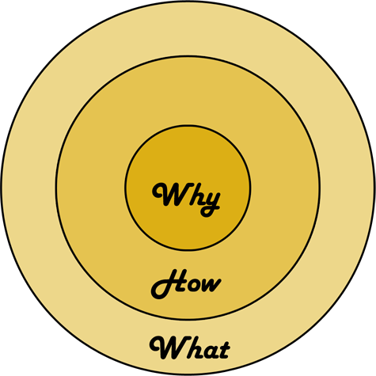

# VS Code的Why、How和What

## ★为什么叫它「VS Code」?

VS Code 的全称是 Visual Studio Code，但这全名实在是太长了，我和很多用户一样，喜欢叫它 VS Code。

## ★是什么？

官方定义它是一个免费的、开源的跨平台编辑器。之所以强调 “编辑器”，我想是因为 VS Code 并无意成为一个全尺寸的集成开发环境，也就是 IDE。

## ★编辑器与IDE？等价的？

非也，从专业角度来讲：

IDE 更为关注开箱即用的编程体验、对代码往往有很好的智能理解，同时侧重于工程项目，为代码调试、测试、工作流等都有图形化界面的支持，因此相对笨重，Java 程序员常用的 Eclipse 定位就是 IDE；

而编辑器则相对更轻量，侧重于文件或者文件夹，语言和工作流的支持更丰富和自由，VS Code 把自己**定位在编辑器这个方向上，但又不完全局限于此**。

> VS Code给我的赶脚就像是追求性价比最高的开发工具！

总之，近几年流行风向是轻量的编辑器，而且这也是大势所趋。

## ★理解 VS Code 代码编辑器的设计思路？

### ◇发展轨迹

从我的角度看，不管你是学习编程语言，还是框架、编辑器，都应该先去看看它的来龙去脉，了解它们是怎么发展而来的，曾经遇到了什么问题，又是怎么解决的，这些信息都便于你从大局上提高对事情本质的认识。

**➷：**[①](#yi)

1. 2011年底，微软请来大神—— Erich Gamma，其背书：

   在IBM 领导 Java 开发工具的开发工作、「设计模式」作者之一、JUnit发明人之一……

   请它过来干嘛？——老哥，能否打造一款在线的开发工具，让开发者们能够在浏览器里获得 IDE 般的开发体验？

   这就是之后为人所知的 [Monaco Editor](https://microsoft.github.io/monaco-editor/)

2. 大神它是如何设计Monaco Editor的？

   他见证了 Eclipse 从崛起到逐渐臃肿，再逐渐式微的整个历程

   他深刻认识到 Eclipse 成功的一部分原因是**极度的可定制化特性**，**任何功能**在 Eclipse 中都可以用**插件**来实现

   由于 Eclipse 的插件跟核心代码运行在同一个进程内，随着插件的增多，核心功能经常会被插件拖累，也就更加让人觉得**笨重**

   所以，在打造 Monaco Editor 时，开发团队非常**注重核心功能的性能**，尽可能地**保持轻量**，而对**资源和性能消耗较大的功能**，则运行在**其他的进程**之中。

   > 可见要搞一个编辑器，总得要到其它开发工具里取取经……

3. 2015年，Erich Gamma 带领团队把 Monaco Editor 移植到桌面平台上，也就是所谓的VS Code啦！

### ◇小结

VS Code 继承了 Monaco Editor 的设计原则，其核心是做一个高性能的轻量级编辑器；个性化的功能，则交给插件系统来完成。这一点可以说是师承 Eclipse，但同时又吸取了 Eclipse 的教训，把插件系统运行在主进程之外，高度可定制但同时又是可控的。

> 核心：高性能、轻量编辑器
>
> 汲取的优点：个性化的功能，交给插件系统完成
>
> 吸取的教训：这个插件系统运行在主进程之外

与此同时，VS Code 也有自己的使命，那就是让开发者在编辑器里拥有 IDE 那样的开发体验，比如对源代码有智能的理解、图形化的调试工具、版本管理等等。

> 你以为吸取了Eclipse的教训就完事了吗？不不，这还远远不够，我得把目前正在使用IDE开发的开发者们给拉过来！

不难发现，**VS Code 希望在编辑器和 IDE 之间找到一个平衡**。

在这样的设计思路下，你打开编辑器，**不需要创建任何的项目工程文件**就可以开始使用，并**高效便捷地操作文本**；同时在编程语言插件的支持下能够得到语法检查、智能提示；你还可以**借助丰富的插件 API 拓展 VS Code 以满足自己的需求**

> 我觉得丰富的插件API甚是关键呀！

### ◇目标难度之大

要达成这样的目标，难度可以说是非常大的，但 VS Code 取得了不错的成果。究其原因，在我看来就是微软打造了一个**开放**的平台。

## ★开源与开放的平台

### ◇三个点

1. **其源代码以 MIT 协议开源**——这意味着大家能够免费获取到 VS Code 的核心代码，而且更意味着社区能够基于 VS Code 的代码，**开发自己的产品**。

   如基于 VS Code 的项目有 SourceGraph、StackBlitz、CodeSandbox 等，当然，VS Code也会经常从它们身上吸取技术和产品层面的宝贵经验

   > 就像React经常把很多问题都留给社区

2. **开发过程和反馈渠道的开放**——每个用户都可以在 GitHub 上了解到 VS Code 的开发进度，而且也能实时反馈

3. **接口的开放**——VS Code 为编程语言工作者提供了统一的 API ，即 Language Server Protocol 和 Code Debugging Protocol，每种语言都能够通过实现两个 API 在 VS Code 上得到类似 IDE 的开发和调试体验。

   > 我知道关于「接口」有很多种说法，在这里又是一种说法

### ◇小结

在这样的平台上，编辑器开发者、编程语言工作者和社区，各自做自己最擅长的事情，把份内事做到极致。同时，**从开发到测试，再到用户反馈都是公开透明的**，每个人都能参与其中，把产品往自己希望的方向推进。VS Code 的技术实践和成果，最后也以开源的形式回馈给社区，让大家都能够借助 VS Code 去打造自己的产品，一起成功。

> 「开源」这两个字真是有无穷的魔力，在这里没有说谁付出得少，谁付出得多，我们的目标只想让这个产品变得更好，仅此而已，而且也会乐此不疲

## ★VS Code 学习指南

简短地了解了 VS Code 的历史后，如果你也**认同它的设计哲学和使命**，你肯定还想知道该如何把 VS Code 的这一套**转化为自己的内力**。我在第一讲 “学编辑器，到底应该‘学’什么？” 里讲过编辑器学习的通用办法，在 VS Code 身上也是适用的。你可以按照以下三个步骤来逐步掌握 VS Code。

### ◇核心编辑器的使用

VS Code 有一套自己的快捷键，你可以通过快捷键的学习了解核心编辑器所支持的功能。同时， VS Code 允许自定义快捷键的映射，如果你有自己熟悉的一套快捷键操作，也可以无缝地在 VS Code 上使用。除了快捷键，VS Code 对鼠标操作、多光标、搜索都有完备的支持；在编程语言的支持上面，VS Code 也向 IDE 看齐，自动补全、代码片段等一应俱全。掌握了核心编辑器，VS Code 就能够胜任你的日常通用编辑器。

### ◇工作台、工作区的使用

VS Code 中除了编辑器区域，还有很多其他的功能，像是**资源管理器、跨文件搜索、插件管理等，它们一起组成了统一的界面，我们称之为工作台**。这个工作台的设计，代表了 VS Code 对工作流的选择。内置的软件版本管理，终端模拟器，调试器等，掌握这些 VS Code “钦定” 的工具，进一步提**升工作效率**。

### ◇VS Code 定制和插件开发

作为一个百万级别用户量的工具，很多功能的默认设置不可能满足每个人或者每个工作场景，你可以学习如何定制 VS Code 的各个部件，不能永远**按部就班**；对于 VS Code 没有实现的功能，还可以学习一下如何使用 JavaScript 书写插件，把自己的想法，变成工具的一部分。

> 关于按部就班 ——**➷：** [②](#er)
>
> 如果有一天你不打算按部就班来行事，那么我想此刻的你是付出了多么大的热情与努力才能到这一步！

### ◇小结

通过这三个步骤，你在使用 VS Code 时就能够 “随心所欲” 了。除此之外，我也建议你关注 VS Code 每月的发布更新日志，官方团队会详细讲解每个版本新增的功能。VS Code 的官方博客也非常值得订阅，团队成员会经常分享开发过程的心得感悟，算得上是最前沿的技术分享。

## ★题外话

另外，我想你还会问我 VS Code 支持哪些编程语言，我这里就不列举了，你可以去官网看看，除了 JavaScript，其实 Java、Go、Python、PHP 等后端编程语言也都在 VS Code 的考虑范围之内，并且我个人认为做得也足够专业。

## ★简单总结

好了，关于 VS Code 的 why、how 和 what 就聊到这里，我再简单总结下：

VS Code 的定位是轻量级的代码编辑器，它综合了 Eclipse 等很多优秀开发工具的优势，同时，也解决了它们的痛点问题，在性能、语言支持、开源社区方面都做得不错，所以一经发布也就受到了社区的喜欢，如果你经常上 Reddit，也能看到它经常霸占 Reddit 头条。

其实我今天聊到的 why、how 和 what 也是一个经典的问题思考模型，外界称之为黄金圆环法则，如果你不知道，可以去谷歌查查，这里就不再赘述。

留个思考题，你之前都用过哪些编辑器或者 IDE 呢？你理解它的 why、how 和 what 么？

## ★参考链接

**➹：** [戳此查看 VS Code 官方博客](https://code.visualstudio.com/blogs)

**➹：** [戳此查看 VS Code 更新日志](https://code.visualstudio.com/updates)

**➹：** [戳此查看 Erich Gamma 在 Goto Conference 上对 VS Code 的介绍](https://www.youtube.com/watch?v=uLrnQtAq5Ec)

## ★总结

- **把专业的事情交给专业的人来做**，如VS Code团队中并不能精通所有语言，所以需要开放接口！

- VS Code自带buff：

  VS Code 自带了 TypeScript 和 Node.js 的支持，用户下载 VS Code 后，立刻就能够在书写 JavaScript 和 TypeScript 时获得智能提示，而且无需任何配置即可立即调试 Node.js 代码

## ★Q&A

### <a id="yi">①Vuejs的发展史？</a>

在此之前，先来认识这么一句话：

> 不学自知，不问自晓，古今行事，未之有也 

而这句话是说「不用学习天生就知道，不用求教于人什么都明白，自古至今，这样的事从未有过啊！」，可见这是从反面强调凡是治学，必须勤学不已，虚心好问。任何人不要幻想不学自知，不问自晓。

简略的前端发展史：

1. 完全静态的页面
2. 由于需要针对不同用户显示不同的页面，为此出现了CGI技术（一种利用C、C++这些编程语言拼接字符串然后响应给浏览器的技术）
3. 话说，复杂的HTML页面，如果也是这样拼接，其不是GG了，毕竟这可是有很多不变的HTML片段，变化的只有少数和用户相关的数据，所以能否有新的创建动态HTML的方式？——ASP、JSP、PHP……
4. 更新内容，需要重新向服务器获取一份新的HTML内容？——AJAX

MVVM原理——**JavaScript操作HTML**：

1. 原生JS直接操作DOM
2. jQuery
3. MVC——**所有通信都是单向的**
4. MVVM——前后分离，真正在这里得以实现，双向绑定。核心思想「关注Model的变化，让MVVM框架利用自己的机制去自动更新DOM，从而把开发者从操作DOM的繁琐中解脱出来！」，也就是所谓的 数据 - 视图分离，数据驱动视图， 视图不影响数据，再也不用管繁琐的DOM结构操作了，世界顿时清净，完美！

**➹：**[秒懂Vuejs、Angular、React原理和前端发展历史](https://mp.weixin.qq.com/s/7G9PzydEpHMfpmhpvFQeog)

**➹：**[中国教育出版网写作成语词典](http://chengyu.zzstep.com/mingju_content.php?classid=802&contentid=16618)

**➹：**[janl/mustache.js: Minimal templating with {{mustaches}} in JavaScript](https://github.com/janl/mustache.js)

**➹：**[cv/message.js at master · ppambler/cv](https://github.com/ppambler/cv/blob/master/dist/js/message.js)

**➹：**[比较详细的采访 Vue 作者尤雨溪 - 众成翻译](https://www.zcfy.cc/article/an-interview-with-vue-js-creator-evan-you)

### <a id="er">②按部就班？</a>

按部就班是一个成语，读音是àn bù jiù bān，原意是写文章时篇章结构安排得体，用字造句合乎规范 。后来引申为照章办事，依次进行，不越轨，不逾格。也指按老[规矩](https://baike.baidu.com/item/%E8%A7%84%E7%9F%A9)办事，缺乏创新精神。出自清·石玉昆《三侠五义》。

**➹：**[按部就班_百度百科](https://baike.baidu.com/item/%E6%8C%89%E9%83%A8%E5%B0%B1%E7%8F%AD)

### ③关于emeditor编辑器？

>   emeditor，世界上最快的文本编辑器，快捷键与vs很接近，所以一用就喜欢了，甚至很多快捷键是他现有然后vs才有的。
>
> 他的宏可以用vbs或js写，无帮助就能自行上手。
>
> 正则也是用他学的，筛选功能很强大
>
> 现在他已经是我思维的一部分了  

VSCode 还没有支持宏

我[下载](https://zh-cn.emeditor.com/#download)了18.5.0版本，目前还不知晓如何用

其注册码：

姓 名：`ttrar.com`

序 列 号：`DKAZQ-R9TYP-5SM2A-9Z8KD-3E2RK`

### ④一个要求？

是否可以做一个快捷键功能及相关代码实现的福利视频。加深对快捷键的理解。我相信从代码中我们能够更好的吸收为什么开发者对快捷键设定的思考方式……

> 我没有想过快捷键功能也是通过程序代码实现的……

### ⑤黄金圆环法则？

我有十万个为什么，所以你不要告诉我是什么，因为这很平白……毕竟我真得非常需要一个理由！

这三个单词的意思，从内到外，分别是为什么、怎样、什么……

所以VS Code：

为什么会搞一个VS Code出来？——在浏览器里获得 IDE 般的开发体验，元芳，你怎么看？……有种目标的调调

是怎样搞出来的？——有关设计思想之类的……有种行动的调调……

什么？——一个轻量高效的编辑器之类的……有种结果的调调……

所以为什么学习黄金圆环法则？——那是因为大部分人是由外向内去思考， 而一些成就非常的人，都是由内而外去思考的……

以「道」的角度来看，道生一这个「一」即是why，然后一生「二」，「二」生「三」，「三」生「万物」这个过程则描述了如何（how）生？然后结果就是万物（what）！

总之，借用「道」的哲学观来说，这些「伟人」的思维模式，是遵循「道」的，是顺天而为的。

**➹：**[西蒙·斯涅克：伟大的领袖如何激励行动 - TED Talk](https://www.ted.com/talks/simon_sinek_how_great_leaders_inspire_action?language=zh-cn)

**➹：**[「黄金圆环法则」与「道」 « 悟道集](http://tao.logdown.com/posts/177119-golden-ring-law-and-morality)

**➹：**[译言网 | [TED演讲]西蒙·斯涅克：伟大的领导者如何激励行动](https://web.archive.org/web/20160217235710/http://article.yeeyan.org/view/146334/104878)

**➹：**[马云：伟大的领导者是如何激励行动的？ - 知乎](https://zhuanlan.zhihu.com/p/42902526)

