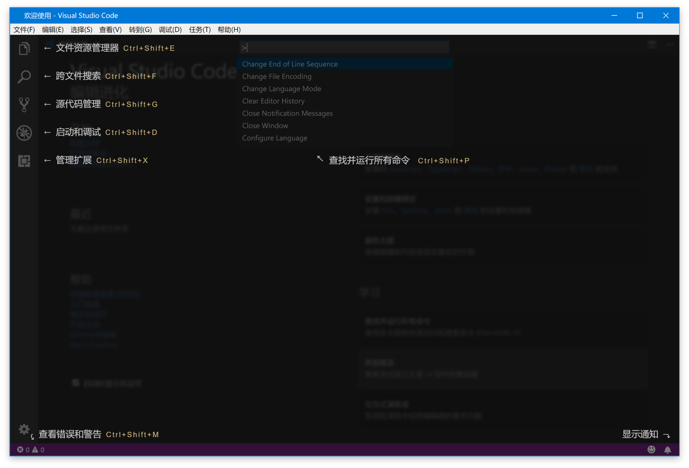

# 如何快速上手VS Code?

1. 之前知道了VS Code 的历史以及定位
2. 如今想充分利用 VS Code 来提高编程效率

不过，在此之前我们先来谈谈这些：

- VS Code 的安装和更新
- VS Code 初次使用的指引界面
- 语言设置
- 命令行使用
- ……

只要了解了这些基础问题之后，你才能快速上手 VS Code

## ★安装与版本选择

有两个版本可以供你下载VS Code

一个是我们经常使用的稳定版（Stable），这是每个月发布一个主版本

还有一个叫做  Insiders（圈内版、内部版……），即这是 VS Code 团队在使用的版本，而且它还有个名字叫做「吃自己的狗粮」(eat your own dog food)，它的存在是为了让团队可以在第一时间用上自己新加的功能并及时发现问题


那么到底选择哪个版本呢？

如果你是刚接触 VS Code，那就稳定版吧！

如果你已经使用 VS Code 有一段时间，那就试一试 Insiders 吧！

为啥要试试 Insiders 版？——因为使用它有几个好处呀！如：

1. **你可以尽早使用上最新的功能**，新功能会在 Insiders 版里运行一段时间，如果稳定那就随当月的稳定版发布，如果新功能改动大，那就运行它两个月之后才搞到稳定版里去

2. **你可以深度参与 VS Code 产品的开发过程**，一个新功能首次搞到Insiders里去往往是不成熟的，所以你可以在 GitHub 上第一时间反馈你对这个新功能的看法和建议，甚至可以为它贡献代码。

   > 在简历上写着：为VS Code贡献过代码，你看这又可以「装逼」了不是！

那么如何下载和安装呢？

同样到[官网](https://code.visualstudio.com/)下载即可

而且 Insiders 版本的VS Code同样也会自动更新的，这样你就不需要前往官网重新下载了！

> 专栏里面使用的 VS Code 版本是最新的稳定版，因为这样便于大家理解（毕竟我们大都是使用稳定版的！毕竟除去 VS Code 核心开发团队，现在全世界大概还有一万五千名用户在使用 Insiders 版本）

## ★初次使用

初次启动，你会看到一个「欢迎使用」页面，这个页面主要是方便你快速打开文件、文件夹以及访问历史文件，同时还会附带一些帮助信息，比如“快捷键速查表”。

如果你不是初次启动，那么你可以像这样打开：


你可以多多点击和访问这个界面上的各种链接和按钮，主动发现和了解你可能感兴趣的功能。

> 之前了解过学会使用工具的方法，那就是把你能看到的、能点的都给点一遍……

这里我主要讲一下 “学习” 区域的三个功能：**命令面板、界面概览和交互式演习场**。

### ◇命令面板

#### 是什么？

它是 VS Code 快捷键的主要交互界面，你可以通过 F1 或者 “Cmd+Shift+P”(Windows 上是 “Ctrl+Shift+P”) 打开这个命令面板


#### 可以干啥？

既然打开了这个命令面板，那么我们可以干啥呢？

> 可以在命令面板中快速搜索命令并且执行。如果你的 VS Code 是简体中文版，那么你可以在命令面板里使用中文或者英文来搜索命令。VS Code 的绝大多数命令都可以在命令面板里搜到，所以熟练使用命令面板，你就可以摆脱鼠标，完全通过键盘操作来完成全部编码工作。

就像这样：


### ◇界面概览

它展示了 VS Code 默认界面里的不同部件的位置、名称和快捷键。VS Code 强调无鼠标操作，但是对于初学者而言快捷键的记忆是个麻烦，这个界面恰好可以帮助你渡过最初的不适应阶段。



总之界面概览，展示 VS Code 默认界面里的不同部件的位置、名称和快捷键

### ◇交互式演习场

打开这个界面，你会看到一个全英文的初学者教程，其中通过各种交互示例给出了 VS Code 的核心功能，展示了一些高级代码编辑功能的使用，每个功能都会有一个**代码片段**和**编辑器**供你实时使用。


> 这个界面现在还没有中文版，不过没有关系，它里面提到的所有功能我都会在这个专栏中详细介绍。


## ★命令行的使用

关于命令行，我想你应该不陌生，毕竟我们脑海中的大神级程序员都是可以在 Linux 中随意敲打长串的命令，或是与黑客斗智斗勇，或是解决某个紧急的线上问题。而对于 VS Code 而言，最基础的命令行当然是让你能够**不动鼠标，就能快速打开界面**了。

### ◇code命令

那么是什么命令行就可以做到这一点呢？

- Windows用户的话，安装并重启系统后，你就可以在命令行中使用 `code` 或者 `code-insiders`了。如果你希望立刻而不是等待重启后使用，可以将 VS Code 的安装目录添加到系统环境变量 `PATH`中， Windows 64 位下的 VS Code 安装路径是 `C:\Program FIles\Microsoft VS Code`下。

  > 其实还有一种快捷方式，那就是把vscode的快捷方式弄到PATH里面去，然后通过 `win+R`输入那个快捷方式的名字就可以打开vscode了

-  macOS 用户的话，安装后打开命令面板，搜索`Shell 命令：在 PATH 中安装 “Code” 命令`并执行，然后重启终端模拟就可以了。

-  Linux 用户的话，我相信你一定知道怎么在终端中调用 VS Code。

接下来，我们看一下 VS Code 的命令行都支持哪些操作，这里我先运行了 `code --help`来打印出 VS Code 命令行所支持的所有参数。


> 这是运行 `code --help` 的结果页面，当然，你也可以 `code -help`或者是 `code -h`

我的测试结果：


### ◇打开文件或文件夹

#### 直接打开

最基本的命令行使用方式是在 `code` 命令后加上**文件或者文件夹的地址**，这样 VS Code 就会在一个**新窗口**中打开这个文件或文件夹。

如果你希望使用已经打开的窗口来打开文件，可以在 `code` 命令后添加参数 `-r`来进行**窗口的复用**。


> 可见，我们在已经打开的窗口来打开当前目录
>
> 这个命令其实挺实用的，因为我之前把git仓库都扔到同一个Documents目录下了，为此每次打开这个Documents，我就会看到有很多个仓库在vscode里边
>
> 所以我下次就可以只针对某个仓库来用vscode打开了，如这样：
> 
>
> 然后：
>
> 

#### 可以定位某行某列

你也可以使用参数 `-g <file:line[:character]>` 打开文件，然后滚动到文件中某个特定的行和列，比如输入 `code -r -g package.json:128`命令，你就可以打开 package.json 这个文件，然后自动跳转到 128 行。这个命令可以方便你从终端里快速地在 VS Code 里打开一个文件进行预览，一个特别常见的例子就是**当我们使用脚本执行某个命令，这个命令告诉我们某个文件的某一行出现了错误，我们就能够快速定位了**。


总之，我们可以通过该命令行打开文件，并滚动至特定的行

### ◇比较两个文件的内容

> 之前一直使用的是Beyond Compare 4来比较两个文件的内容，毕竟有时候需要对着视频敲代码哈！为此难免不会敲错！
>
> 还有就是这个功能，Sublime Text也有
>
> 不过我当初使用的时候，针对简单的文件比较还是可以的，如果是代码方面的话就不太行了，因为空格换行那些是不一致的。为此我采用了Beyond Compare 4

VS Code 也可以用来比较两个文件的内容，你只需使用 `-d`参数，并传入两个文件路径，比如输入 `code -r -d a.txt b.txt`命令，就可以比较 a.txt 和 b.txt 两个文件的内容了。

有了这个命令，你就可以既使用命令行运行脚本，也可以借助 VS Code 的图形化界面进行文件内容的对比了。


> 总之，我们可以通过命令行，比较两个文件的内容
>
> 感觉挺好用的，我不知道是否比sublime text好用，因为我对它也不是很熟悉，不过目前在我看来确实比sublime text好用

### ◇查看来自管道中的数据

VS Code 命令行除了支持打开磁盘上的文件以外，也接受来自管道中的数据。这样你就可以将原本在命令行中展示的内容，实时地展示在 VS Code 里，然后在编辑器中搜索和修改。比如，你可以把当前目录下所有的文件名都展示在编辑器里，此时只需使用`ls | code -`命令。


> 可见，我们将命令行 ls 的执行结果在 VS Code 的编辑器中打开
>
> 如这样：
>
> 
>
> 不过我测试的结果出现中文乱码了……就像这样：
>
> 

### ◇其它的

另外，VS Code 命令行还能够管理插件，查看 VS Code 的运行情况，记录和分析 VS Code 运行性能，这些我会在之后的章节介绍。当然，你也可以现在小试牛刀，试试它的威力。

在我的日常工作中，经常会使用终端来操作脚本。这个时候，如果我需要打开 VS Code，使用命令行来打开 VS Code 再方便不过了。另外 VS Code 的命令行的各个参数，其实能够定制 VS Code 是怎样运行的，比如`--disable-extensions`、`--max-memory`，它们都有特殊的应用场景。当然，如果你发现了哪个配置是你特别希望默认就打开的，那么你可以在 shell 环境里创建一个别名 (alias)，而不用局限于 `code` 这个命令。

> 讲真，目前确实咩有特别希望默认就打开的东西……


## ★总结


## ★Q&A

### ①快捷键？

**➹：**[VS Code 快捷键（中英文对照版） - HelloJason - SegmentFault 思否](https://segmentfault.com/a/1190000007688656)

**➹：**[crper/Visual-Studio-Code-CNKEYMAP: Visual Studio Code快捷键中文版](https://github.com/crper/Visual-Studio-Code-CNKEYMAP)

### ②什么叫面板？

现代生活中，一般来说，凡家具面上的板都可称之谓“面板”！

而在现代的电子信息产业中，它的英语是「Panel」，它可以指代LCD面板，PCB面板等等

还有就是做面食的工具，毕竟擀面用的木板，一般为长方形。

所以，在VS Code里面板的概念就是工具，既然是工具，那么它就能提供什么能力给我们使用！

**➹：**[面板_百度百科](https://baike.baidu.com/item/%E9%9D%A2%E6%9D%BF)

### ③关于平台的选择问题？

> 类似于学习算法与数据结构时，到底是用C、Java、JavaScript等等的语言来写？

如无特殊说明，我在这个专栏里默认基于 macOS 平台进行讲解，但也会本着为你提供方便的原则，同时给出 Windows 或 Linux 平台下的操作说明。

通过编辑器来实现高效编程的思路是一致的，这和具体的使用平台无关，所以你大可不必为此担心。

> 所以不管你用什么语言实现算法与数据结构，这其中的思路都是一致的！

### ④交互式演练场的翻译？

**➹：**[IronnMan/vs-code-zh: Visual Studio Code 插件说明](https://github.com/IronnMan/vs-code-zh)

### ⑤直接输入 `code  -` ？

直接`code -`会有很有意思的情况，即会在vscode 编辑器里面显示一个目前我不知道干嘛的文件：


### ⑥管道中的数据？乱码？


### ⑦如何在终端和文件之间快速切换，每次定义终端都需要鼠标点过去的？

```bash
Ctrl+`
```

对了，还有两个类似的问题：

1. 如果某个终端卡住了，只能关掉重新启动一个吗？
2. 怎么在当前激活文件下用快捷键开启终端？

第一个问题：可以新建一个终端

第二个问题：还是  **Ctrl + `**

### ⑧ `code`在命令行中没有找到对应的命令的解决方式？

按`Command+Shift+P` (Mac OSX)，输入`install path`，会出现：在PATH下安装code命令。

