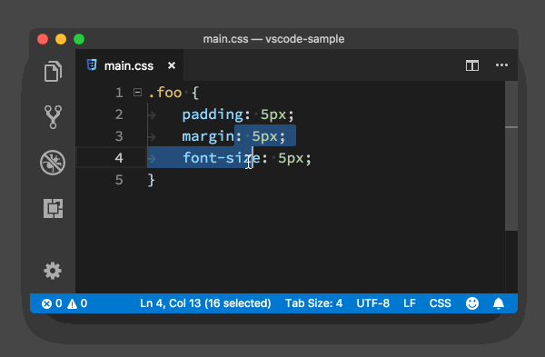
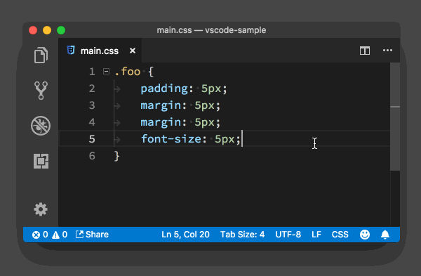
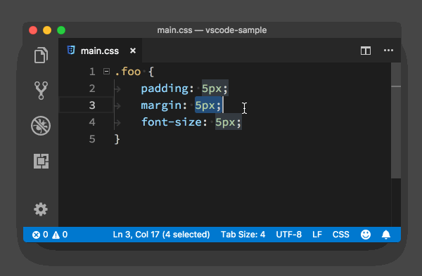

# 快捷键进阶攻略

## ★概述

软件开发有个非常流行的原则， 叫做**不要重复自己**（Don’t Repeat Yourself）。其实除了写代码，我们在使用编辑器的时候，这也是一个非常值得贯彻的准则。

在上一讲的时候，我们一起学习了如何进行光标的移动和文本选择等基本操作，除此之外，你还可以**随意将它们组合成 “一个事务” 以达成你想要的目标**。但是如果你用过 Vim，你肯定会吐槽说这 “三脚猫” 的功能还不够方便，也不够酷。

> 「一个事务」，一种操作可以同时做多件事？

虽然说写代码是一个创造的过程，但**很多时候，我们写代码并不总是行云流水从上写到下的**。比如说你新写一个功能，你会先把**整个逻辑思路**写下来，然后**重新审视整个代码**：这一行好像有点问题，删掉；这里好像少了一个判断，新增几行代码；那段代码好像提前执行比较好，然后你把它挪到了前面的位置。

> 写高考作文的时候，你总不能随便涂随便画吧？所以在写代码的时候，请抛弃你写作文时的那些思维！如不要乱涂……不然不美观的话就会被扣分的……这些东西对代码来说根本就不打紧，即别想着一次就写好啊！

面对这么多操作需求，那今天我们一起来看下，在 VS Code 编辑器里，还有哪些快捷方式能够给你的代码编辑进一步提速。

## ★代码行编辑

### ◇测试代码

下面我就以一段 CSS 代码作为例子，来和你分享下代码行编辑中的高阶技巧。

```css
.foo {
  padding: 5px;
  margin: 5px;
  font-size: 5px;
}
```

### ◇删除当前代码行

在上一讲中，你知道了要删掉一行代码，你可以选中它，然后再按 Delete 键。不过还有一个快捷键，那就是直接按下 “Cmd + Shift + K” (Windows 上是 “Ctrl + Shift + K”)，当前代码行就可以被删除了。

> 注意，你要把这种快捷键操作看作是一个事务，即摁下快捷键后，做了选中，以及delete的操作
>
> 还有就是它是可以删除多行的




### ◇剪切某一行代码

如果你只是想要剪切这行代码，那么你直接按下 “Cmd + x” (Windows 上是 “Ctrl + x”) 即可。


### ◇这行的下面或者上面开始一段新的代码

我想你肯定很清楚，**“Enter” 键的基础作用是能在编辑器里光标所在的位置添加一个换行符**。但是很多时候你可能并不是单纯地要将一行分成两段，而是希望在**这行的下面或者上面开始一段新的代码**。

这个功能对应的快捷键非常好记，它跟 “Enter” 键十分接近。当你想在当前行的下面新开始一行时，你只需按下 “Cmd + Enter” （Windows 上是 “Ctrl + Enter”）；而当你想在当前行的上面新开始一行时，你只要按下 “Cmd + Shift + Enter” （Windows 上是 “Ctrl + Shift + Enter”）就行了。


### ◇上下移动当前行

当你想移动一段代码时，一般你可能会分三步走：先选中，再剪切，最后粘贴。不过我更喜欢的是按住 “Option + 上下方向键”（Windows 中就是 “Alt + 上下方向键”） ，将当前行，或者当前选中的几行代码，在编辑器里上下移动。


### ◇向上或下复制当前行

如果你同时按住 “Shift” 键的话，也就是 “Option + Shift + 上下方向键”（Windows 中就是 “Alt + shift + 上下方向键”），那就可以复制这几行，然后粘贴到当前行的上面或者下面。


另外，你在尝试 “Option + 上下方向键” 这个快捷键 “上下移动” 时，可能也发现了，当你把一段代码移动到花括号里面或者外面时，代码前的制表符或者空格的数量会自动发生改变，这样你就不需要移动完代码后再调整了。



总之，移动代码行，代码缩进发生改变

## ★编程语言相关的命令

上面我介绍的几个命令，**都是编辑器的基础功能，它和你所使用的语言无关**。而接下来我要介绍的这几个命令，则会**根据编程语言的不同，产生不同的结果**。

### ◇添加注释

你在调试代码时，肯定经常需要临时地把一些代码注释掉。如果你要将一行代码注释掉，你只需按下 “Cmd + /” （Windows 上时 “Ctrl + /”）。如果你需要把一整段代码注释掉，按下 “ Option + Shift + A” 即可。

你可以分别在 JavaScript 和 CSS 文件里使用这两个命令，你会发现这个命令会分别使用 JavaScript 和 CSS 各自的注释语法来添加注释。

#### 注释 JavaScript 代码

当你在 JavaScript 文件里按下 “Cmd + /”，VS Code 在这行代码前添加了两个 “/”。


#### 注释 CSS 代码

当你在 CSS 文件里按下 “Cmd + /”，VS Code 则是在这行代码前添加了 “/* ” ，再最后添加了 “ */”。


### ◇代码格式化

我们平常在做自己的小项目或者随便写一些脚本的时候，可能不会太在意代码的格式。不过一旦开始团队合作，整个项目组则会选择同一个代码风格和格式以有效降低协同成本。所以**定期对自己写的代码进行格式化是个很好的习惯。**

#### 格式化整个文档

你可以按下 “Option + Shift + F” （Windows 上是 Alt + Shift + F）来对整个文档进行格式化，VS Code 也会根据你当前的语言，选择相关的插件。当然，**前提条件是你已经安装了相关插件**。


#### 格式化选中的代码行

> 有种局部格式化的调调！

你也可以选中一段代码，然后按下 “Cmd + K Cmd + F” （Windows 上是 Ctrl + K Ctrl + F），这样只有这段被选中的代码才会被格式化。


> 关于这个如果你直接选择这一行是无法格式的，你必须要有个参照点才行，如选中的时候，把上一行的空格也选中了才行
>
> 不过这选中我只能用鼠标操作了！
>
> 我测试了一下可以先全选，然后摁住shift键，通过方向键来取消选中的！


### ◇代码缩进

有的时候，**你会觉得代码格式化太重了，需要的可能只是把代码里的缩进调整一下**。这时你可以打开命令面板（快捷键 “Cmd + Shift + P”），搜索 “缩进”，然后使用 “重新缩进行” 将整个文档的缩进进行调整，但更多时候，你只需要运行 “重新缩进选中行” 来调整部分选中代码行的缩进。

> 关于关键词搜索，可以rein，反正中英文都能识别


> 如果你是全局格式化的话，那么margin里的空格也会格式化，但是我们只是想把第行的缩进搞一下而已
>
> 所以你就可以用这种姿势解决了！

## ★其它

上面的这些命令和快捷键，可以说是 VS Code 团队在开发编辑器时精心设计和规划的。不过 VS Code 里还有不少有趣的命令，它们看起来跟其他命令没有什么联系，快捷键的设置也看似没有什么章法。

但其实它们中的**大部分都是来自于社区，开发者是在多年软件开发和编辑器使用的过程中，自己摸索出的一些命令和快捷方式，然后在社区里广为流传，于是乎官方也就把这些功能做到了 VS Code 中**。

> 就像是ES6的很多新特性来自于其它语言社区一样

下面我再快速列举几个小技巧，希望你能记住，并快速练习，以成为自己的肌肉记忆。

### ◇**调换字符的位置**

**第一个是调换字符的位置**。你可以按下 “Ctrl + t” （Windows 上未绑定快捷键，可以打开命令面板，搜索 ” 转置游标处的字符 “） 来把当前光标前后的字符调换位置。


由于存在冲突，我就设置成这样了：


### ◇**调整字符的大小写**

**第二个是调整字符的大小写**，我估计这个你会经常用到。你可以选中一串字符，然后在命令面板里运行 “转换为大写” 或 “转换为小写”, 来变换字符的大小写。



不过这个有快捷键：


### ◇**合并代码行**

**第三个是合并代码行**。有的时候你可能会为了避免代码看起来过于冗余，就会把比较短小的几行代码合并到一行里面去。这时，你只需要按下 “Ctrl + j” （Windows 上未绑定快捷键，可以打开命令面板，搜索 ” 合并行 “）就可以了，而不需要不断地调整光标、删除换行符。


自己绑定一个：


> 之前写CSS的时候，就想如此，没想到居然有合并行这个功能
>
> 不过在使用它之前，得先把选中代码才行哦！

### ◇行排序

**第四个是行排序**。无论是你在写代码，还是写 Markdown，你都可以把代码行按照字母序进行重新排序。不过这个命令比较小众，VS Code 并没有给这个命令指定快捷键，你可以调出命令面板，然后搜索 “按升序排列行” 或者 “按降序排列行” 命令执行。

> 总之，还是得选择中文本，然后 “Sort Lines Ascending” 命令执行，按升序排列行

这个过于小众，我就不设置快捷键了！

### ◇**撤销光标的移动和选择**

**第五个是撤销光标的移动和选择**。有的时候你移动完光标之后，又希望把光标回退到上一个位置，这时你只需按下 “Cmd + U”（Windows 上是 “Ctrl + U”），就可以撤销这一次光标的移动。

总之，“Cmd + U”，撤销光标的移动和选择

## ★小结

今天我介绍了十几个进阶的命令和快捷键，相较于上一讲光标的移动和选择，它们更贴近于实际工作，但记忆起来就相对不容易了。这时你就需要进行一定的**刻意训练**，比如说你想把一行代码注释掉，在移动光标到行首，然后输入 “//” 之前，你想一想，有没有办法更好、更便捷地来进行这个操作。

在这样的思维训练过程中，你可能会发现，很多日常频繁使用的操作，它们并没有对应的快捷键。不过不用担心，我在后续的章节会逐步给你介绍更丰富的操作方式，你要做的就是现在赶紧练习，把已有的内容消化，我知道，**改变思维方式和习惯可能并不是一件简单和容易的事情。**

## ★总结

快捷键列表：（Ctrl即C，Shift即S，Alt即A，然后其它字母用小写）

| 快捷键            | 解释                                             |
| ----------------- | ------------------------------------------------ |
| Ctrl+ Shift + K   | 删除当前代码行                                   |
| C+x               | 剪切某一行代码                                   |
| C+enter/C+S+enter | 在当前行的下面或者上面开始一段新的代码           |
| A+上下方向键      | 上下移动当前行                                   |
| A+S+上下方向键    | 向上或下复制当前行                               |
| C+/               | 注释                                             |
| C+S+/             | 多行注释                                         |
| A+S+f             | 格式化代码                                       |
| C+k+f             | 格式化局部代码，需要有个格式化标准，即得选择多行 |
| 搜索命令rein      | 只调整代码缩进                                   |
| C+A+t             | 调换字符位置                                     |
| C+S+u/l           | 把选中的英文字符改成是大写或者是小写             |
| Z+j               | 合并代码行，尤其是CSS代码                        |
| 搜索命令sort      | 行排序                                           |
| C+u               | 撤销光标的移动和选择，就像是遥控器的返回键一样   |


## ★Q&A

### ①什么叫DRY？

一次且仅一次（英语：Once and only once，简称OAOO）又称为Don't repeat yourself（不要重复你自己，简称DRY）或一个规则，实现一次（One rule, one place）是面向对象编程中的基本原则，程序员的行事准则。旨在软件开发中，减少重复的信息。

其中违反**DRY**原则的解决方案通常被称为**WET**，其有多种全称，包括“Write everything twice”（把每个东西写两次）、“We enjoy typing”（我们就是喜欢打字）或“Waste everyone's time”（浪费大家的时间）。

**➹：**[一次且仅一次 - 维基百科，自由的百科全书](https://zh.wikipedia.org/wiki/%E4%B8%80%E6%AC%A1%E4%B8%94%E4%BB%85%E4%B8%80%E6%AC%A1)

**➹：**[代码的抽象三原则 - 阮一峰的网络日志](http://www.ruanyifeng.com/blog/2013/01/abstraction_principles.html)

### ②「一个事务」指得是数据库方面的吗？

什么是事务？

> 就是把多件事情当做一件事情来处理。也就是大家同在一条船上，要活一起活，要over一起over ！

事务应该具有4个属性：原子性、一致性、隔离性、持续性。这四个属性通常称为**ACID特性**。

原子性（atomicity）：一个事务是一个不可分割的工作单位，事务中包括的诸操作要么都做，要么都不做。

一致性（consistency）：事务必须是使数据库从一个一致性状态变到另一个一致性状态。一致性与原子性是密切相关的。

隔离性（isolation）：一个事务的执行不能被其他事务干扰。即一个事务内部的操作及使用的数据对并发的其他事务是隔离的，并发执行的各个事务之间不能互相干扰。

持久性（durability）：持续性也称永久性（permanence），指一个事务一旦提交，它对数据库中数据的改变就应该是永久性的。接下来的其他操作或故障不应该对其有任何影响  

> 讲真，之前学过Java Web与MySQL打交道，不过当时也并咩有弄清楚这个ACID特性！

**➹：**[什么是事务？__牛客网](https://www.nowcoder.com/questionTerminal/3869ecce009e4800b23955aff8a9c513?orderByHotValue=1&mutiTagIds=606&page=1&onlyReference=false)


### ③何批量生成图片目录？

> 学完一讲后，每次都要在img目录下创建一个00~39的目录

本来打算用bash的，不过还是用node写脚本比较好，因为比较熟悉JavaScript，虽然代码写得很烂，不过还是实现了

从中似乎可以体会到阮大神的这篇文章：[代码的抽象三原则 - 阮一峰的网络日志](http://www.ruanyifeng.com/blog/2013/01/abstraction_principles.html)

比如说，这个操作可以用bash写，也可以用JavaScript写，如果遵循DRY原则，那就不要管bash姿势了。还有就是ROT原则了，因为我的目录命名规则都是00~99这样的，所以我就封装它为一个函数，并传入两个参数，一个是第一个目录，接着就是按规律生成最后一个目录了……

其实，我也不知道是否有点理解这3个原则！或许你可以到知乎看看，如：[如何评价王垠最新文章，《DRY原则的危害》? - 知乎](https://www.zhihu.com/question/31278077)、[我不是很懂 Node.js 社区的 DRY 文化 - 知乎](https://zhuanlan.zhihu.com/p/35848291)


**➹：**[Node.js创建文件夹 - 简书](https://www.jianshu.com/p/8b175c109da2)

**➹：**[模板字符串 - JavaScript - MDN](https://developer.mozilla.org/zh-CN/docs/Web/JavaScript/Reference/template_strings)

**➹：**[nodejs 同步创建文件夹 - ISaiSai的专栏 - CSDN博客](https://blog.csdn.net/ISaiSai/article/details/51262258)

**➹：**[Bash Shell编程入门 - 简书](https://www.jianshu.com/p/e1c8e5bfa45e)

### ④我想让tab键有箭头？

> 我想老师老师编辑里所显示的难度是制表符吗？我不知道是否可以把 `.`变成是 `→`
>
> 不过目前看来，还是算了……因为点好已经足够好了！

```json
"editor.renderControlCharacters": true,
"editor.renderWhitespace": "all"
```

在用户设置里添加这两个key，结果：


**➹：**[vscode和webstorm中如何显示隐藏的tab和空格 - 简书](https://www.jianshu.com/p/e9ee1de056b2)

### ⑤重新绑定块注释？

默认是 S+A+a，但是与我本地的其它软件冲突了

所以我需要换个：`C+/+/`


测试：


不过，这有bug啊，因为当我输入 C+/的时候，vscode会监听下一个斜杆啊！这样一来原先注释单行的C+/没有效果了，于是再次改变：


这下就不会有bug了

### ⑥其它问题？

1. Cmd u 神器啊

2. 去除注释的快捷键是什么？——是同一个快捷键

3. ctrl + t默认是workbench.action.quickOpen的快捷键，这个如何取舍？

   > 我只是举个例子哈，我觉得 ctrl t 还是要保留的。对于这个功能，我自己觉得相对低频，不用特地给一个快捷键

4. 老师，你说的这些命令我也在别的编辑器或者IDE中见过，有个别指令还是有点不同的，就像老师最后说的，这些东西记忆起来还是有点麻烦，所以想问下老师，有没有这些快捷键的英文全称解释，比如在typora下选中一行就是ctrl ＋ l 这个l应该是英文单词line的开头字母，所以这个快捷键就是选中一行，ctrl ＋ d 是选中一个词条，我就不知道这个d代表什么单词，，但是在vs2013中，ctrl ＋ l 却是删除一行，这里的l代表什么，我也不清楚，ctrl + w是选中一个词条，这里的 w 应该就是word ，比较通用的ctrl ＋ s保存，s就是save，crrl ＋ n 新建，n是new ，举这些例子的意思，就是希望，如果可以的话，老师能在讲解的过程中，顺便解释下这些快捷键字母所代表的英文单词，这样也便于理解记忆，当然，有些可能没有什么特殊意义。

   > 像 ctrl d 的 d 的选择，我觉得主要是为了避免冲突，ctrl-w 大家会喜欢是关闭文件。

5. 查找命令的时候，建议把命令的英文名字写一下，比如“转置游标处的字符”，这样的命令对应的英文名字。

6. 老师，批量行编辑的功能后面会讲吗？比如说块选择后多行编辑

   > 后面会介绍多光标的

7. 这一个应该讲一下,快捷键在需要用的的时候，怎么在命令行中搜索的。（搜索关键词匹配的原理） 这样在用的时候，就会去找，快捷键是靠肌肉记忆的啊，现在说那么多快捷键记不住的。