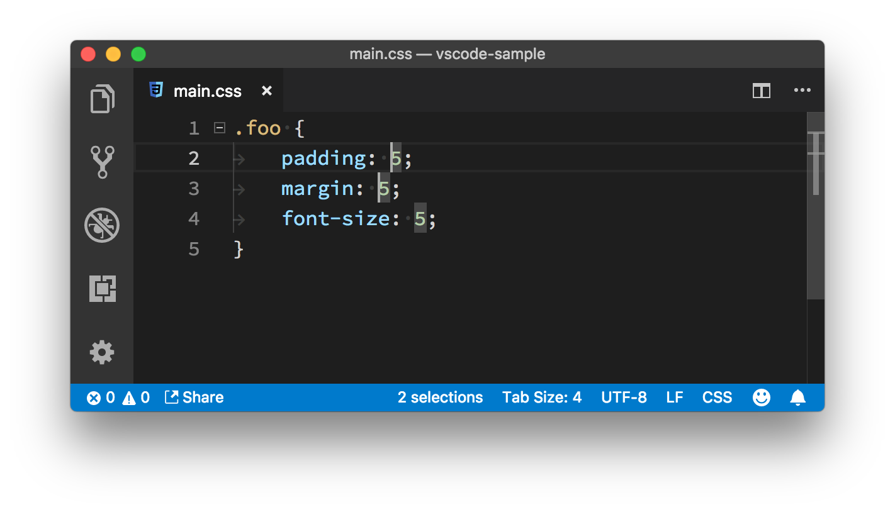
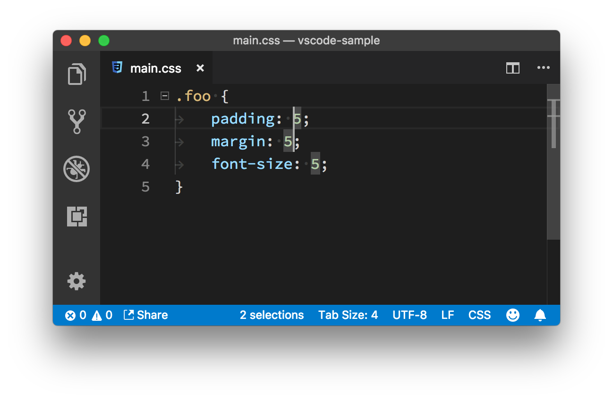
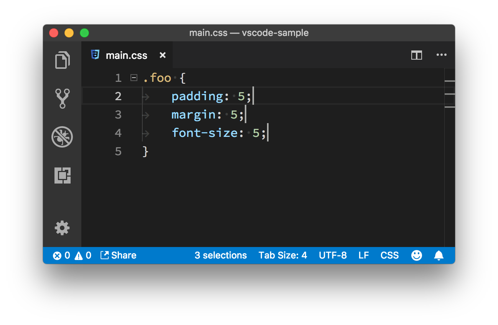
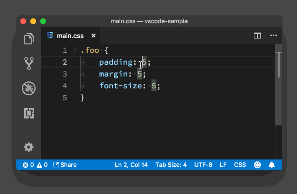
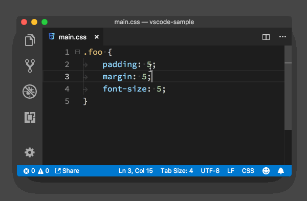

# 拒绝重复，你一定要学会的多光标特性

## ★快捷键的重要性

从这个专栏的一开始，我就**一直在强调快捷键的重要性**，也一直在说你应该**练就双手不离键盘这样的 “神功”**。学习一个编辑器的时候，我们在努力记住各种快捷键，其实目的就是希望能够**减少日常工作中的重复劳动**。前面两讲中我主要介绍了**如何将常用的一些多步骤操作，简化为单个快捷键**。

## ★为什么需要多光标特性？

但你知道，在我们的日常编码过程中，有很多工作，它本身就是具有 “重复” 属性的。比如你需要把多个单词的第一个字母从小写变成大写，这种跟业务逻辑相关的重复性操作，编辑器很难为它们一个个单独做优化。

> 为啥这些操作就跟业务逻辑相关呢？难以理解……

而 VS Code 的多光标特性其实就是用来解决这类问题的。当你在一个文本框或者某个输入框里打入字符时，会有一个竖线来显示你将要输入文字的位置，这就是 “光标”。顾名思义，**多光标其实就是多个输入位置，这里你可以脑补下多个竖线的场景。**

多光标特性允许你在输入框的多个位置创建光标，这样你就可以在多个不同的位置同时输入文字或者执行其他操作。是不是很酷？

比如我上面提到的例子，你想把多个单词的第一个字母从小写变成大写。这个时候你只需要在每个单词的开头创建一个光标，然后**按住 “shift + 右方向键” 选中这些单词的第一个字母**，最后执行 “转换为大写” ，这样这些被选中的字符，就可以全部被转换成了大写了。

那怎样才能创建多个光标呢？这其中又有什么规则？别急，且听我道来。

## ★创建多个光标

我还是以一段 CSS 代码作为例子来介绍吧，如果你要练习，直接把这段代码复制到编辑器中即可。

```css
.foo {
  padding: 5;
  margin: 5;
  font-size: 5;
}
```

你可以看到，在上面这段 CSS 代码中，所有属性的值都是 “5”，但你可能觉得这样的写法不规范，想把它们都改成 “5px”。之前你肯定是吭哧吭哧挨个在 5 后面加“px”。而现在，有了多光标特性之后，你第一步要做的事情，就是把光标移动到第一个 “5” 的前面。接下来就有两种操作方式可以选择。

### ◇使用鼠标

第一种添加多光标的方式，就是使用鼠标。在键盘上按住 “Option”（Windows 上是 Alt），然后鼠标点在第二个 “5” 之前，那么第二个光标就创建好了。现在你可以看到两个光标，第二个光标比第一个要细一点。



> 按住 “Option” 的同时，鼠标点在第二个 “5” 之前创建第二个光标

聪明的你肯定知道通过同样的方式来创建第三个光标。然后，按下右方向键，将光标们移动到 “5”的后面，输入 “px”。这样，“5” 后面就都已经加上 “px” 了，而这中间，你只做了一次输入。是不是很方便？


> 按住 “Option” 创建三个光标，然后按下右方向键，最后输入 “px”

### ◇使用键盘

第二种方式是使用键盘，但是比第一种方式要**多两个步骤**，我们来一起看看是为什么。

首先你还是先移动光标到第一个 “5” 的前面。然后按下 “Cmd + Option + 下方向键”（Windows 上是 “Ctrl + Alt + 下方向键”），在当前光标的下面创建一个光标。



> 按住 “Cmd + Option + 下方向键” 在当前光标下创建新的光标

相信你已经看出来了，第二个光标，由于就在第一个光标的正下方，所以它不在第二行的 “5” 前面。不过没关系，我们有办法搞定它。先别急，你还是如法炮制，把第三个光标创建好。


> 按住 “Cmd + Option + 下方向键” 连续创建两个光标

下面你该尝试把光标移动到正确的位置啦。虽说现在三个光标的位置都是散乱的，没有什么规则，但你可以让它们移动到类似的位置：按下 “Cmd + 右方向键”（Windows 上是 End），这样它们就都移动到每一行的末尾了。



> 按住 “Cmd + 右方向键” ，光标全部移动到每一行的末尾

到这里问题就简单了，你只需按下 “左方向键” 将光标移动到 `5`的后面，然后输入 `px`即可完成整个操作。



> 按住 “左方向键” 移动所有光标到 5 后面，然后输入 ”px“

总之，在windows下，就是 `C+A+上下方向键`，然后再搞个End

### ◇小结

对于这个样例而言，第一种方案比第二种要方便，但这两种方法解决问题的思路是一致的。前者通过鼠标操作，把光标移动到了你期望的位置，然后再执行别的操作；后者则是运用了 VS Code 内置的其他命令，把光标最终移动到你想要的位置。

在第二种方案中，你是把光标全部移动到行末，从而统一了光标的位置，进而进行 “重复性” 的操作。但这个问题的解决方案不是唯一的，你也可以想一想，还有没有其他别的解法。

在这里，我还是想重复下我之前说过的一个观点，**使用这样的功能的时候，你可以想想如果你是设计者，你会怎么样来设计多光标特性。闭着眼睛顺着这个路径思考，也许你会更容易理解和记住 VS Code 的模式。**

> 针对CSS识别分号？然后产生多个光标……

## ★创建多光标的两个特别命令

接下来，我再给你介绍两个关于多光标的创建的特别方法，如果你还没有消化上面的内容，也先别急，等把后面的全部看完之后再回去练习。

### ◇Cmd + D

首先讲第一种，还是上面的代码，你把光标移动到数字 “5” 之前，按下 “Cmd + D”，这样第一个 “5” 就被选中了；然后再按一次 “Cmd + D”（Windows 上是 Ctrl + D），你可以看到，第二个 “5” 也被选中了。

  

> 按住 “Cmd + D” 选中第二个 5

**“Cmd + D” 这个命令的作用是，第一次按下时，它会选中光标附近的单词；第二次按下时，它会找到这个单词第二次出现的位置，创建一个新的光标，并且选中它**。

这样只需要按下三次，你就选中了所有的 “5”。这个时候你再按下 “右方向键”，输入 “px”，即可完成任务。


> 按住 “Cmd + D” 选中多个 5，按下右方向键，输入 “px”

之所以说这个方法特别，是因为它的适用情况比较特别：处理多次出现的 “相同” 单词。如果你要处理的文本并不是相同的，那么这个方法就不适用了。

### ◇Option + Shift + i

接下来讲讲第二种，是跟代码行批量处理有关，也还是用的前面的代码。首先你选择多行代码，然后按下 “Option + Shift + i” （Windows 上是 Alt + Shift + i），这样操作的结果是：每一行的最后都会创建一个新的光标。


> 按住 “Option + Shift + i” 在选择内容的每一行末尾添加一个光标

同样的，这种方法是基于代码行的，如果你的需求是在同一行添加多个光标，那么就不适用了。

就上面的例子，我个人第一反应是使用 “Cmd + D” 这种方式来处理。也许你会问，是不是学习一种方式就够了呢？毕竟这些方式也不那么容易记忆。我的回答也很简单，你应该都学，然后熟能生巧，融会贯通。我前段时间读《鞋狗》这本书，里面有一段论述相当精彩：

> **在剑道中，只有在心中不再被我和你，不再被对手和他的剑，不再被自己的剑和使剑的方法所困扰时，才能达到最完美的状态…… 一切都是虚空：你自己、挥舞的剑和舞剑的胳膊，即便是空虚的想法都不再存在。**

舞剑、做企业是这样，我们写代码用编辑器何尝又不是这个道理呢？

> 这难道就是所谓的无招胜有招？肌肉记忆？就像我打字一样，脑袋中没有任何想法，直接就可以快速把字给打出来了


## ★小结

今天我们一起学习了在 VS Code 中如何使用多光标，以及如何利用多光标特性来减少重复劳动。但我这里也仅仅是抛砖引玉，**如何把你手头看似杂乱无章的操作，变化成可以被灵活运用的 “一组步骤”**，也是一门学问。

希望你能多思考、多琢磨、多练习，把多光标应用到你的日常工作中，避免重复，节约时间，从而更随心所欲地高效编程。

## ★总结

需求：我想批量处理一些字符

所以我需要多个光标

我是个初学者，我想用鼠标，所以我要鼠标左击配合Alt键产生多个光标，当然你可以按住`S+A`，然后鼠标左键就可以快速产生多行多个光标了

初学者总是会成长的，所以我不想用鼠标了，而是直接用键盘，所以 `C+A+上下方向键`+End就可以做到了

假如我的字符是一模一样的，比如我想改一下变量名的大小写，那么可以使用 `C+d`，然一直按，直到都选中了，与此同时，这样会产生多光标的！这个可以配合 `C+f`，即查找替换来使用

当你需要多行操作，创建多个光标的时候，可以通过 `S+上下方向键`稍微选中这几行代码，然后 `A+S+i`就可以为这几行代码创建多个光标了，然后就End即可！相较于`C+A+上下方向键`+End这种，它可以快速选择多行，不管你是用鼠标还是什么……

> 问题：如何只选中`{}`里的代码嘞？毕竟我每次都会把这两个 `{}`给选上啊！不过如果配合鼠标倒是方便许多！


## ★Q&A

### ①其它问题？

1.  我的mac使用鼠标选择多光标需要按住cmd键，而不是option键，咋回事呢？

   > 你可以检查一下设置 editor.multiCursorModifier

2. vim 普通模式下，option + shift + i 不起作用呢，移动到代码块末尾后，按哪个键可以是插入模式呢？

   > Vim 插件会覆盖现有的编辑器快捷键，会影响 option shift I 的使用。

3. 我在 ThinkPad 上按 “Ctrl + Alt + 下方向键” 不能选择多光标，而是把整个屏幕上下翻转了，可能是跟系统热键有冲突。

   > 我推测也是这样，你先排查下

4. 我centos7表示有些键不一样

   > 是的，有些时候还是需要在快捷键编辑器里查看一下的

5. 鞋狗的这段描述，不就是小说里，把所有招式都忘了，才能学会的太极拳吗

6. 多光标在搜索、常用正则方面有没有一些经验可以分享呢？

### ②当我选中多个单词的时候能否跳到某个单词？

