# 如何快速在文件、符号、代码之间跳转？

今天的内容，跟之前略有些不一样。在前面的几讲里，我们的**侧重点一直是 VS Code 的 “编辑器” 特性**。编辑器命令、快捷键、多光标，无一例外都是想要**提高编辑文本的效率**。

但相信你还记得，在专栏的第二讲 “VS Code 的 Why、How 和 What” 里我提到过，VS Code 是想在传统编辑器和 IDE 之间找到一个平衡点，让你在编辑器上也一样能体验到 IDE 那些出色的语言支持。

今天，我们就会一起探讨， VS Code 是如何借力于编程语言支持，让**代码的跳转更智能**的。

## ★文件跳转

### ◇为什么需要？

当你在开发一个新功能或者修复一个 Bug 的时候，你**同时在阅读和修改的文件可能就有几个或者十几个**。从资源管理器里打开文件固然方便，但是如果这个项目里的文件非常多，并且经常需要在资源管理器里寻找文件，那 “眼花缭乱” 的，肯定要浪费你不少宝贵的时间。

### ◇选择并打开文件

在 VS Code 中，解决这个问题的第一个方法，就是按下 “Ctrl+Tab”，然后继续按着 “Ctrl” 键但是松开 “Tab” 键，这样你就可以打开一个文件列表，这个列表罗列了当前打开的所有文件。接下来，你可以通过按下 “Tab” 键在这个列表里跳转，选择你想要打开的文件。最后选到你想打开的文件后，**松开 “Ctrl” 键，这个文件就被打开了**。

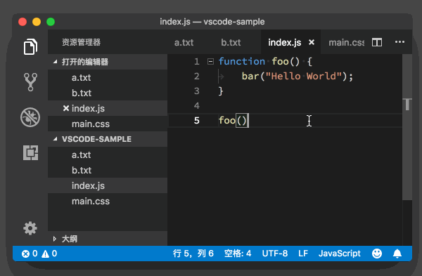

> 通过 “Ctrl+Tab” 组合键选择并打开文件

不过，使用这个方式切换文件，最大的问题在于，文件一旦多了，你就得不停地按 “Tab” 键，没完没了地上下跳转和挑选，这会是一个恼人的耗费时间和眼力的操作。

还好，VS Code 在命令面板里提供了一种支持搜索的文件跳转方式。当你按下 “Cmd + P” （Windows 上是 Ctrl + P）时，就会跳出一个最近打开文件的列表，同时在列表的顶部还有一个搜索框。

### ◇打开最近打开的文件列表

看到这里想必你应该明白了，你可以使用这个搜索框来快速地找到你想要的文件，然后按下 “Enter” 键直接打开，这整个过程简单而且顺畅。

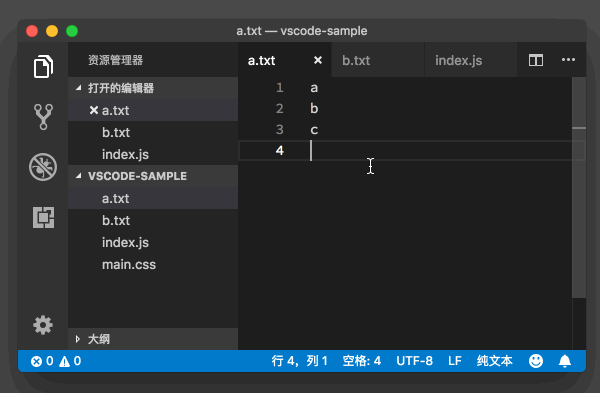

> 按下 “Cmd + P” 打开最近打开的文件列表

在这里，我再分享给你一个小技巧，当你找到目标文件后，可以按下 “Cmd + Enter” （Windows 上是 Ctrl + Enter）组合键。你会发现与上面不一样的是，这个文件在一个新的编辑器窗口中打开了（关于编辑器窗口的管理，我会在之后的章节里介绍）。

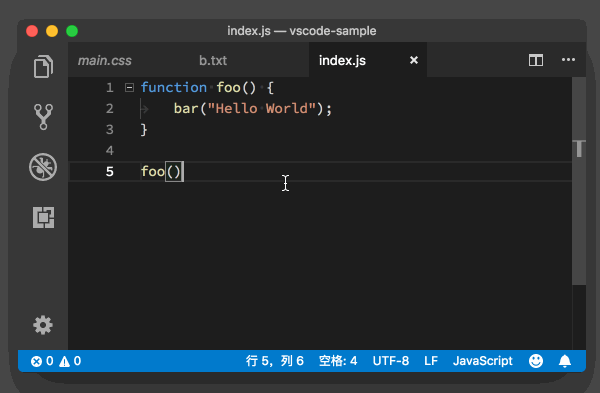

> 按下 “Cmd + Enter” 组合键在新窗口中打开文件

## ★行跳转

打开某一个文件之后，你的另外一个需求可能就是要快速跳转到这个文件的某一行。你可能会想，VS Code 是不是可以像 Vim 那样，输入 “:13” 就能跳转到第 13 行。是的，VS Code 也提供了一种极为简单的方式来支持行跳转，你只需要按下 “Ctrl + g”，紧接着编辑器就会出现一个输入框。如下图所示：

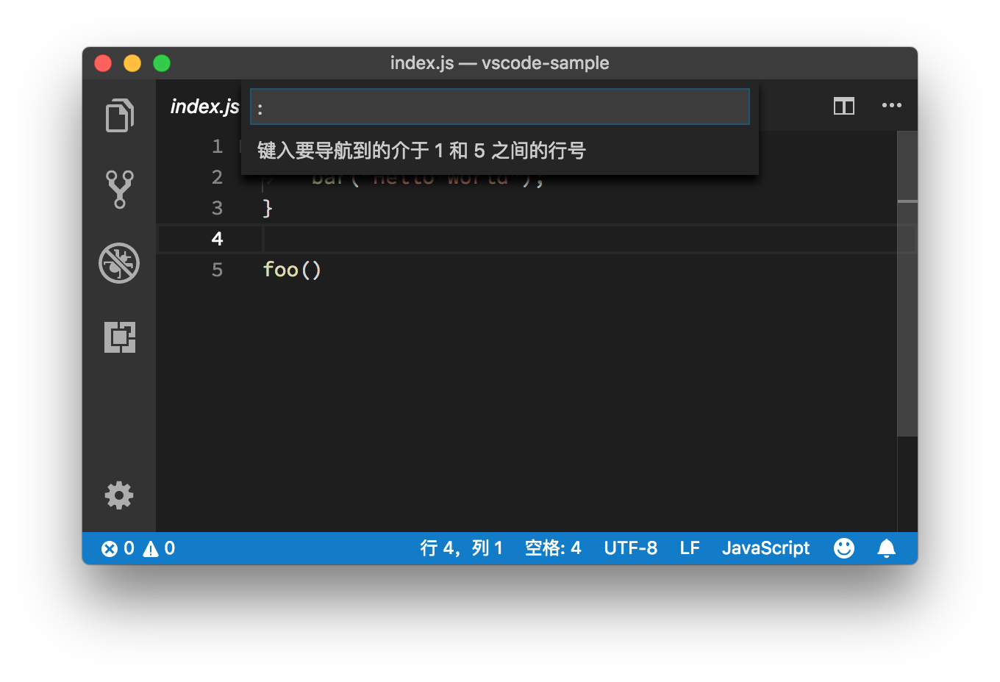

> 按下 “Ctrl + g”，调出行输入框

你会惊喜地发现，这个输入框的第一个字符就是 “:”，在这之后输入数字，你就能够将光标快速地移动到那一行。是不是很便捷？

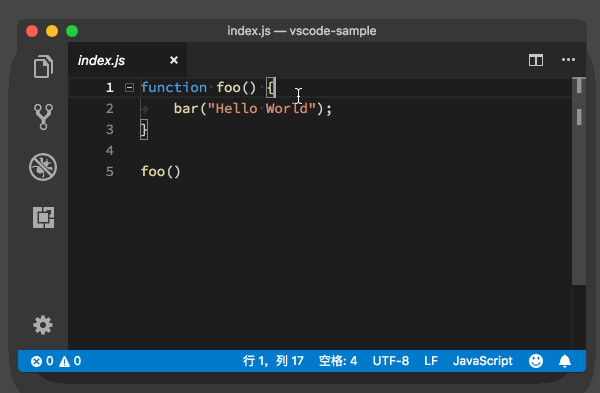

> 输入行数 3，跳转到第 3 行

接下来我再给你介绍一个高阶组合技巧。如果你想跳转到某个文件的某一行，你只需要先按下 “Cmd + P”，输入文件名，然后在这之后加上 “:” 和指定行号即可。

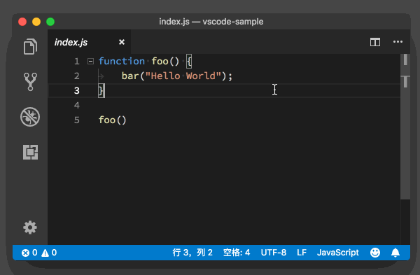

> 跳转到指定文件的指定行数


## ★符号 (Symbols) 跳转

文件跳转和行跳转，是代码跳转的基本操作，也是日常编码中的高频操作。不过有的时候，你可能会希望能够立刻跳转到文件里的类定义，或者函数定义的位置。为了支持这种跳转，VS Code 提供了一套 API 给语言服务插件，它们可以分析代码，**告诉 VS Code 项目或者文件里有哪些类、哪些函数或者标识符（我们把这些统称为符号）**。

如果要在一个文件里的符号之间跳转，你只需按下 “Cmd + Shift + O” （Windows 上是 Ctrl + Shift + O），就能够看到当前文件里的所有符号。

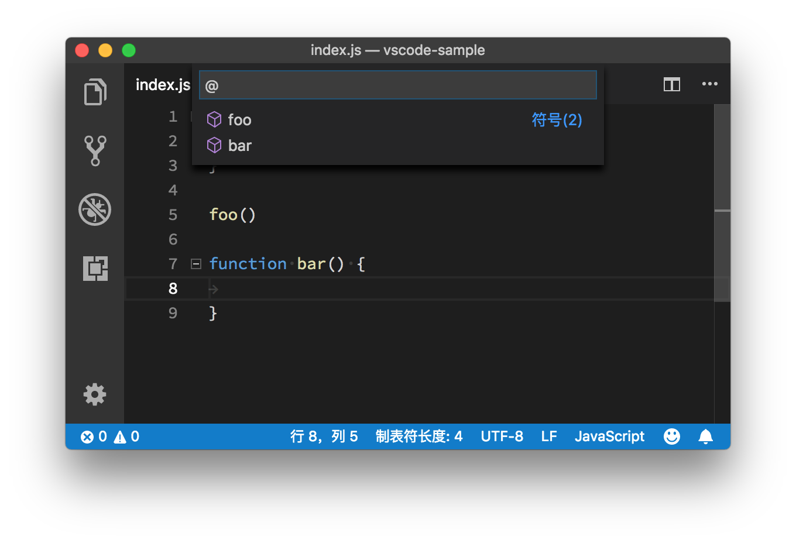

> 使用 “Cmd + Shift + O” 组合键，调出当前文件的符号

使用方向键，或者搜索，找到你想要的符号后，按下回车，就能够立刻跳转到那个符号的位置。如下图所示：

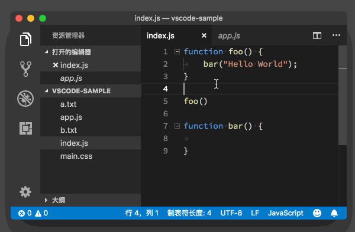

> 通过符号功能跳转到指定的代码位置

请注意，在按下 “Cmd + Shift +O” 后，输入框里有一个 “@” 符号，这个符号在这里的意义，我会在后面的章节里去介绍，你可以先留个心眼。这时，如果你输入 “:”，就可以将当前文件的所有符号，进行分类，这样搜索符号也就更加方便。

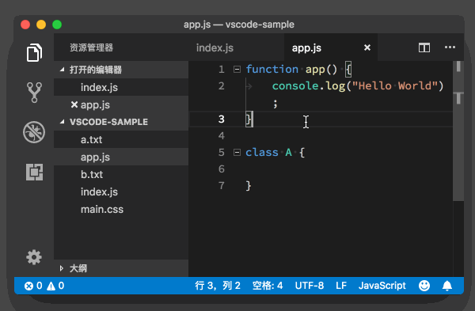

> 对当前文件的所有符号进行分类

有些语言除了提供单个文件里的符号，还支持在多个文件里进行符号跳转。比如在 VS Code 里，如果你打开了多个 JavaScript 文件，就可以按下 “Cmd + T” （Windows 上是 Ctrl + T），搜索这些文件里的符号。


> 通过 “Cmd + T”，搜索多个文件的符号

## ★定义 (Definition) 和实现 (implementation) 跳转

符号跳转依托于语言插件对代码的分析，已经算得上具备一定的智能特性，但是它还是不够精确。比如说我们看到某个函数的调用，想要知道这个函数的接口定义是什么样的，它的实现细节是什么样的，光靠符号跳转，还是会不方便。我们需要的是直接跳转到定义和实现的位置，Java 程序员看到这里一定会深有感触。

当然，这个功能也需要语言本身的支持。比如说当你在使用 TypeScript 时，按下 F12，就可以跳转到函数的定义处。

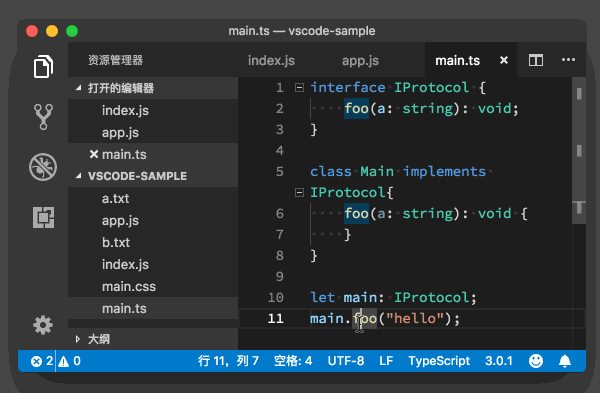

> F12 跳转到函数定义的位置

也可以按下 “Cmd + F12” （Windows 上是 Ctrl + F12），跳转到函数的实现的位置。

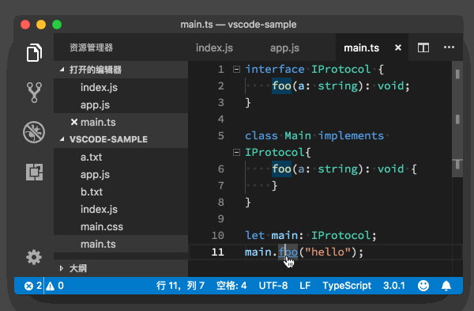

> Cmd + F12 跳转到函数实现的位置

而在书写 JavaScript 时，因为并没有接口（interface）的概念，定义和实现恰好是相同的。

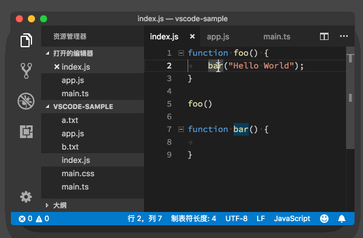

> JavaScript 里 F12 和 Cmd + F12 效果一样


## ★引用 (Reference) 跳转

很多时候，除了要知道一个函数或者类的定义和实现以外，你可能还希望知道它们被谁引用了，以及在哪里被引用了。这时你只需要将光标移动到函数或者类上面，然后按下 “Shift + F12”，VS Code 就会打开一个引用列表和一个内嵌的编辑器。在这个引用列表里，你选中某个引用，VS Code 就会把这个引用附近的代码展示在这个内嵌的编辑器里。

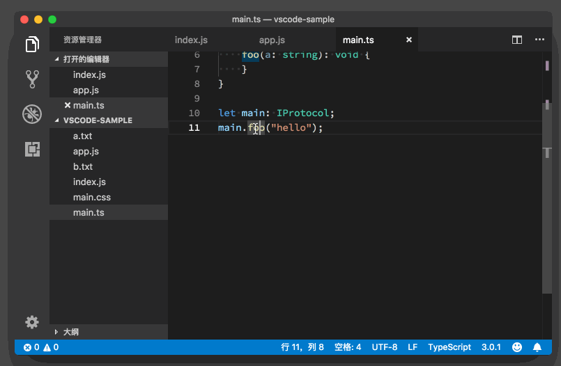

## ★小结

今天我介绍了如何在文件之间跳转，如何跳转到某个文件的某行代码，以及如何在编程语言插件的帮助下，跳转到符号、定义、实现和引用的位置。对这些命令和快捷键熟练掌握后，你就不用像 “无头苍蝇” 一样在编辑器里找代码了。

不过这并不是 VS Code 里代码跳转功能的全部，在之后的学习过程中，我还会给你展示更多的快捷方式，所以尽情感受你灵活的双手随心所欲地在代码之间跳转吧。

## ★总结

- 似乎同名的文件，会被替换掉打开，用方向键，如右方向键`→`可以打开独立的tab。

| 快捷键  | 解释                                                         | 场景                                                         |
| ------- | ------------------------------------------------------------ | ------------------------------------------------------------ |
| C+tab   | 按住tab不松手，然后通过继续tab来选择文件                     | 需要同时操作（如阅读和修写）多个文件，适用于文件少的情况     |
| C+p     | 打开最近打开的文件列表，当你找到目标文件后可以直接按Enter，或者Ctrl + Enter（它会在新的编辑窗口打开，可以在同一个维度里看JS、CSS、HTML） | 基本同上，不过适用于文件多的情况                             |
| C+g     | 简单使用的话就是行跳转了。如果利用C+p，我们可以在输入文件名的同时，在这之后加上 “:” 和指定行号，即可快速实现想跳转到某个文件的某一行，不过这需要你输入全部的文件名 | 打开某一个文件之后，我们很有可能就是要快速跳转到这个文件的某一行 |
| C+S+o   | 可以找当前文件里的所有符号，如果你想找到同在一个项目里的其它文件里的符号，那么你可以通过 `C+p`打开搜索，然后通过 `#+符号名`即可找到该符号了。其中可以直接用 `C+S+p`。总之如果是命令，那么它就是以 `>`开头的，同理如果是 `@`的，也是如此！这样一来在写js文件时就可以通过它们快速跳到到某个函数和某个变量了。如果是 `@:`的话，你会发现符号分类了……显然这样搜索符号也就更加方便 | 希望能够立刻跳转到文件里的类定义，或者函数定义的位置         |
| C+t     | 除了提供单个文件里的符号，还支持在多个文件里进行符号跳转。快速有@的快捷方式 | 同上                                                         |
| F12     | 跳转到函数的定义处，JavaScript 里 F12 和 C+ F12 效果一样     | 我们想看到某个函数的调用，想要知道这个函数的接口定义是什么样的，它的实现细节是什么样的，光靠符号跳转，还是会不方便 |
| C+ F12  | 跳转到函数的实现的位置，JavaScript 里 F12 和 C + F12 效果一样 | 同上                                                         |
| S + F12 | 引用 (Reference) 跳转                                        | 除了要知道一个函数或者类的定义和实现以外，你可能还希望知道它们被谁引用了，以及在哪里被引用了。这时你只需要将光标移动到函数或者类上面 |


## ★Q&A

### ①其它问题？

1. 只有vscode自身的功能，并不能好好工作，比如我们在webpack里面配置了路径别名，vscode就找不到定义了，这时候需要配合jsconfig来处理路径，让vscode可以正确识别别名。既然收了钱，应该讲深一点啊

   > 在介绍跳转功能的文章里，我觉得不必特地介绍某个编程语言或者框架的使用。你提的这个是个好问题，我会在后面的语言相关的文章里涉及。

2. 刚刚试了一下那个shift+F12的查找索引。发现只能查找到当前文件的引用。如果这个函数被export出去了就查不到了，这个是vscode的原因还是因为JS？如果换成TS就可以查到了吗？

   >  如果你说的问题是，在一个 js 文件里 export 了一个函数，在另外一个文件里引用了它但是 shift + F12 找不到，那么可以在这个项目下添加一个 jsconfig.json 文件，这个文件会让 VSCode 知道，当前这个文件夹下的文件都是属于同一个项目的，从而进行索引。jsconfig.json 这个文件的一个例子 
   >
   > ```json
   > {
   >     "compilerOptions": {
   >         "target": "ES6"
   >     },
   >     "exclude": [
   >         "node_modules",
   >         "**/node_modules/*"
   >     ]
   > }
   > ```
   >
   > 你也可以参考 <https://code.visualstudio.com/Docs/languages/javascript#_javascript-projects-jsconfigjson> 来修改 jsconfig  

3. 项目大了之后，查找全局符号或者查找函数引用速度非常非常慢，是没有缓存？每次重新index函数或符号吗？

   >  是的，现在 VSCode 的实现并没有做缓存

4. 老师，我用的是python3 ，我自己定义了一个函数后，在另外一个文件引用该函数，按F12，无法跳转到该定义函数，这是为什么呢

   > 默认的 Python 支持没有添加 Intellisense ，你可以安装 Python 插件<https://marketplace.visualstudio.com/items?itemName=ms-python.python>

5. 那个文件符号跳转列表，是不是就是大纲里面的列表？——没错

6. 很好奇我们在webpack里面配置了路径别名，vscode就找不到定义了，这时候如何解决，jsconfig该怎么配置

   > 一个简单的例子 ：
   >
   > ```json
   > {
   >   "compilerOptions": {
   >     "baseUrl": ".",
   >     "paths": {
   >       "ClientApp/*": ["./ClientApp/*"]
   >     }
   >   }
   > }
   > ```

7. cmd + p，列出文件后，enter 键似乎是临时打开一个tab，如果再次选择另一个文件，刚才那个打开的文件tab就会被替换。文件打开的模式不同吗（读模式和写模式）？用方向→键可以打开一个独立的tab。

8. 老师，我的VSCODE 出事啦！笔掉在键盘上，代码里面突然空格被加重显示了，特别扭 ， 找了半天没找到快捷键，老师知道吗？

   > 你这只笔比较厉害 可以修改 editor.renderWhitespace

9. 怎么在键盘上撤销多光标操作呢？有的时候使用了cmd+d来选中了很多的词进行一次操作以后，又要切换回鼠标点一下把所有光标变成一个

   > 这个忘了介绍了，按 Escape 键即可

10. 有个问题typescript。假如我在channel类中new一个user类，因为没有import所以会标红，黄色的解决提示我总是不知道如何才能让它确定出现，有什么快捷键可以手动找到import？就是手动出黄色的解决问题提示的快捷键？谢谢

    > 当光标在这个错误上时，你可以命令面包找到快速修复 Quick Fix，或者按下 cmd + .

11.   在vscode中输入 (的时候会自动补全(), 这个时候光标在`(|)`中间； 除了使用right按键，是否有什么快捷方式光标跳动` ()|`， 右括号右边；

    因为使用right按键， 则需要手移动到键盘边角， 再回来找“J”字母； 有点不爽的感觉；  

    >  输入 ) 跟移动光标的作用是一样的
    >
    > 也就是说按住shift键，然后嗯一下`（`，会出现 `（）`，如果此时内有松开Shift键，那么再按一下` ）`就会类似于按了right键一样

12. 有没有跳转到上次编辑的位置，上次光标的位置，这两项功能呢？比如跟踪代码之后，我想回到调用的最初位置该怎么操作。

