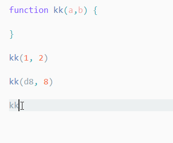

# 代码自动补全、快速修复和重构的二三事

## ★是什么？为什么？

它是 VS Code 语言支持功能 的核心地带

很多人离不开IDE就是因为它有代码自动补全和重构。

如，你经常用webstorm的话，你就能明白写 `if……else`时，很多时候都会提示你有更简洁的写法、API的智能提示等等……

不过，你需要注意的是，这次辅助就像是一把双刃剑一样，它可以提高你的开发效率，但是如果过于依赖的话，那么换工作遇到白板面试时就GG了。

总之，用IDE或用一些功能不是很强的编辑器，就如自动挡和手动挡一样，两个都会，总不会吃亏，即可谓技不压身呀！

总之，这不是非黑即白的关系，即我用了IDE了，就一辈子都不用编辑器了。最好的姿势，还是都得会比较好！

## ★自动补全

- 语言服务：VS Code 提供了 Language Server Protocol （API），然后各个语言能根据这个 API 实现的服务，就被称为语言服务了。而实现了语言服务，那也就意味着，使用xx语言写代码，就能得到类似 IDE 的开发体验

- 建议列表：就是提示信息呀！找到合适的提示内容，就可以按下Tab键或者回车键将其补全。（会根据当前的项目、当前的文件，以及光标所在的位置给出一个建议列表）

- 如何让自动补全窗口出来？

  - 打字（自动），可以模糊提示哦，如`console.db`就会提示为 `console.debug`
  - `Ctrl+空格键`（主动）

  不想看到自动出来的提示？——直接 `Esc`键，将其隐藏

## ★自动补全设置

- 在用户设置了搜索「editor.suggest」

  - 我修改了建议列表显示为3条

  - 完成JS和TS函数的参数签名（写一个有参数的函数，那么当你调用函数时会有提示）：

    

    如果不勾选的话，得自己写括号和写参数
    
  - 单词拼写建议3个。

## ★快速修复？

- 是什么？——语言服务除了在书写代码的时候提供提示以外，还能够帮我们分析当前的代码，检测出他们潜在的问题，然后提供快速修复的方案。
- 测试：`pading:16px;`，这个 `pading`会出现波浪线，点黄色灯泡，或者定位该单词然后 `C+j .`，默认是 `C+.`，但是我的不起效果，所以我自定义了。

## ★重构？

- 修改一个函数或变量名（重命名）：让光标定位到函数或变量名，按下 `F2`即可，注意着可不同于查找替换哦！

- 把一段长代码抽取出来转成一个单独的函数：

  - 选中代码
  - 点击黄色灯泡
  - 选择对应的重构操作

  注意，不是所有语言都支持重构操作。识别标志是，选中代码后有没有黄色小灯泡。

## ★基于单词的自动补全

- 一种「笨」的提示：基于单词的提示。原理是「编辑器通过分析当前的文件里的内容，进行简单的正则表达式匹配，给我们建议已经出现过的单词。」
- 可以通过设置 “`editor.wordBasedSuggestions`” 将其关闭。（不需要关闭）

## ★小结

- VS Code 相关的代码自动补全、快速修复和重构相关的操作，这些操作在 VS Code 里，都是需要特定的语言服务来支持的。目前来看，Java、JavaScript、Python、PHP、Golang 等主流语言在 VS Code 中都已经得到了很不错的支持，你可以尽情尝试。
- 代码补全相关的「智能」操作，可以帮助我们剩下不少力气。
- VS Code 的重构并咩有代码相关的重构，而Webstorm则是有的。

## ★总结

- 自动补全：在JavaScript文件中，我们直接输入 `console.`之后，就会有关console下的API提示，然后通过按下 Tab 键或者回车键就可以将其补全了

  如果你暂时看不顺眼自动补全的话，那么可以按下 Escape 键将其隐藏或者可以按下 “Ctrl + 空格键” 来手动地调出建议列表

## ★Q&A

### ①什么是接口啊？

我们发一个请求url叫接口，Java里也有实现某个接口这样的字眼、又有什么提供了统一的接口或者API之类的说法……

如：

> VS Code 为编程语言工作者提供了统一的 API ，即 Language Server Protocol，每种语言都能够通过实现这个 API 在 VS Code 上得到类似 IDE 的开发体验，而各个语言根据这个 API 实现的服务，就被称为**语言服务**。

话说这个API为啥要实现呢？这不已经是API了吗，即可以供人家使用了，为啥还要实现呢？

看了其中一个答案说到：

> 接口与API不一定等价
>
> 1. 接口。js原生是没有接口这一个概念的，不过可以轻易的模拟出来（《javascript设计模式》里面就介绍了这种方法）。而模拟出来的接口，自然就与别的OOP语言的接口类似。以Java为例，**接口其实就是一种约定，凡是继承了这种接口的类均具有该接口所规定的方法，所以程序员必须实现这些方法**。同时，对于编译器而言，因为Java是单继承的，所以用接口继承就可以让多态更加灵活。
>
> 2. API。js里面的API就是指宿主提供的API，如浏览器或NodeJs提供的API。而API可以类比为“请神上身”，当你使用了某一个API，你就是请了某个神跟你附体，你就可以使用它的技能。如用了`document.getElementById`那么你就有了相应的能力。否则你自己是没这个能力的。

还有一个答案比较详细说明接口的概念的：

> 接口：故名思议就是提供转接的口子。
>
> 你可以理解为遵循同一个规则的多个程序之间交换数据的一种方式。
>
> 往大了说，有网络接口。例如以 HTTP GET 方式请求 [http://sf.gg](http://sf.gg/) 并获取返回值， [http://sf.gg](http://sf.gg/) 就可以视为一个接口。MySQL client 使用 ip port user password 访问某个ip 端口上的 MySQL Server ，这个 Server 也可以视为接口。当然，javascript 通过 XMLHttpRequest 请求 http server 也可以视为一个接口通信。
>
> 往小了说，有程序内部接口。在某个类里面调用其他类提供的方法，也可以算是接口。

最后一个答案：

> 接口是一个抽象概念，一般有好几种层面的接口。Interface可翻译为界面也可翻译为接口，翻译为接口的由来应该是从电器的插口而来（未做考证）。通俗说法：接口就是用来连接而开放的入口。
>
> 大致有这些类型的接口：硬件接口、用户界面（UI）、软件接口、面向对象接口。
>
> 编程接口（API）应该是软件接口中的一个分支。当然接口在不同的领域有N多的分类。
>
> 至于API一般仅仅限于应用程序的编程接口。通俗的解释应该是：一个组件（或程序库）提供给开发者进行编程使用的，通过代码可以与之沟通的入口。比如说你下载了一个控件包，通过阅读说明你知道应该如何创建上下文、初始化、设置属性、调用、回调、事件处理，这些就是这个控件包的API。
>
> API一般对应函数，在面向对象领域可能对应类提供的特性，而对于传输协议一般指协议的一种实现所提供的使用该协议的方式。

所以，VS Code是提供了一种约定还是一些API（语言服务协议）呢？既然这里说到是协议的话，这应该就是一种约定吧！

然后如果我们想要在 VS Code 上得到类似 IDE 的开发体验，那么每种语言都得通过实现这个 API 来搞事情！然后各个语言根据这个 API 实现的服务，就被称为**语言服务**。

换言之JavaScript这门语言是否提供了语言服务？如果提供了，那么它就应该有「代码自动补全」等这样的功能

**➹：**[javascript - 什么是接口（API）？ - SegmentFault 思否](https://segmentfault.com/q/1010000000171568)

### ②如何看API的建议列表？

> 如console.log这个API

那么它的作用呢？

> 关键在于`message?:`中的这个问号是啥意思？——难道是typescript的语法提示？
>
> **➹：**[Redefine window.console with typescript - Stack Overflow](https://stackoverflow.com/questions/23819983/redefine-window-console-with-typescript)

再来看一个例子吧：

> 感觉这个`Array<string | number>`有点想Java里的泛型语法！
>
> 根据这篇文章的讲解：
>
> **➹：**[Java泛型详解 - 简书](https://www.jianshu.com/p/c8ee2cfa5b33)
>
> 类型通配符是一个问号（？），它可以匹配任意类型的类型实参
>
> 所以上个例子中：
>
> `message?:`中的这个问号是啥意思？即可以匹配任意类型的实参

突然，上觉得面那幅图中的注释有点错误

forEach是接收两个参数，一个是回调（value，index，arr），另外一个是什么？当执行回调函数时用作 `this` (引用对象)的值。

即：

如果你对第二个参数传的是其它非引用类型的，那么它就会隐式包装成对象哈！

如这样：

> 不过这建议列表似乎咩有给出哪些参数是否可选的啊！

那个冒号的结果：

---

似乎只有语言的基础功能才有提示哈！

