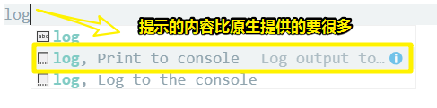

# 拒绝重复，你的代码百宝箱：如何书写code snippet？

## ★需求？

- [ ] 我想搞个普通的HTML模板，emmet提供了太多我不需要的字符了。
- [ ] 我想搞个写Vue的HTML模板
- [ ] 我想搞个写.vue文件的模板
- [ ] 我想搞个写log的模板
- [ ] 我想……

## ★为什么？

**痛点：我们经常会写很多类似的代码，只是参数有点不一样罢了。**

语言服务的局限性：我们经常输入的代码是业务强相关的，所以语言服务没法做出大段代码的提示优化，因此我们需要自己自定义去搞。

所以我们可以把这些类似代码抽象成模板，保存起来，下次用时直接调用即可，而这就像是封装成一个函数一样。

## ★是什么？

> 代码片段（code snippet）是对常用代码的一个抽象，它保留了大部分不变的代码，然后**把需要经常变动的部分，换成变量**，这样等下次调用它的时候，只需要把这些变量换成我们需要的就可以了。

## ★怎么做？

1. 打开命令面板：`C+S+p`

2. 搜索 配置用户代码片段”（Configure User Snippets）并且执行

3. 于弹出的列表选择JavaScript语言作为测试，毕竟它的代码简单和易于理解

4. 一个JSON文件被打开了，里边的内容都是被注释掉，所以我们得把7~14行的注释给去掉。`C+/`

5. 拿到这样的东东：

   ```json
   {
   	// Place your snippets for javascript here. Each snippet is defined under a snippet name and has a prefix, body and 
   	// description. The prefix is what is used to trigger the snippet and the body will be expanded and inserted. Possible variables are:
   	// $1, $2 for tab stops, $0 for the final cursor position, and ${1:label}, ${2:another} for placeholders. Placeholders with the 
   	// same ids are connected.
   	// Example:
   	"Print to console": {
   		"prefix": "log",
   		"body": [
   			"console.log('$1');",
   			"$2"
   		],
   		"description": "Log output to console"
   	}
   }
   ```

6. 分析这个JSON文件

   这个JSON文件也叫代码片段文件

   它的根对象下边的所有子节点都是一个单独的代码片段

   这些子节点可以被我们 调用 并 插入到编辑器里边

   子节点的Value是个对象，子节点的key是这个代码片段的名字，所以我们得保证子节点的key值与当前文件其它的key值不冲突。

7. 所以代码片段的名字叫 `"Print to console"`，它的值是个对象，有两个必须要写的key（ `prefix`和 `body` ），还有一个 `description` 则是 随你喜欢，爱写不写，即不是必须的。

8. 分析子节点的value的每个key的作用：

   1. `prefix`：于编辑器打出它的值，如 `log`，就会有代码提示
   2. `body`：它的值，就是代码提示显示你可以插入到编辑器里的值
   3. `description`：显然，它的值是告诉你这个代码提示是用来干啥的，这样你就不需要记忆这个`log`的作用是啥了。

9. 在JavaScript文件里边测试：

   

> 无须理会，这API的设计为啥是这样的：
>
> 
>
> 鼠标画的图很丑，如果有强迫症，请画一张让你感到舒服的图，然后发给我，然后我会替换之……

## ★Tab Stop

深入了解一下body：

> “body” 里的内容，**并不只是一个纯文本，它其实是一个模板**。要让它像模板一样工作，我们就需要先理解一个概念，叫做 **Tab Stop**。

Tob Stop是啥？

简单来说就是 `$1`和 `$2`

那么这有啥作用呢？——不知道你之前，有咩有发现，当你输入log前缀的时候，然后根据提示，插入那段内容，会发现 `$1` 和`$2`不见了，取而代之的是两个竖线。默认光标会定位到 `$1`这个位置，你再按下Tab就会跳到 `$2`这个位置，按下 `Shift+Tab`又会回到 `$1`这个位置，而这样一来，我们就不用 **手动地把光标移动到括号里面，然后填入我们想要打印的参数。**这之后，当我们需要新起一行写代码时，还得按下 “`Crrl + Enter`”创建新的一行并将光标移动到下一行。但**有了 Tab Stop 后，上面的这些繁琐的操作就可以简化为一次 “Tab” 键了。**

所以这就是为啥 `Tab Stop`会存在的原因了。

需要注意的是：

Tab Stop 的作用，并**不只是简单地减少重复操作**，它还能够**真正发挥模板的功效**。

所谓发挥模板的功效指的是**所有需要修改的地方都插入 Tab Stop**

一个模板其实有许多地方需要修改的，因为模板杵在不同的上下文，那么相应的参数就得发生相应的修改，而 `Tob Stop`方便了我们修改参数，即**当代码片段被插入编辑器后，我们只需要通过按下 “Tab”键，就可以快速地跳到这些位置，将它们修改成我们需要的值。**


## ★占位符

这是使用Tab Stop的另一种姿势 `${1:label}` ：

```json
"Print to console": {
    "prefix": "log",
    "body": [
        "console.log(${1:i});",
        "$2"
    ],
    "description": "Log output to console"
}
```
label是个占位符，即`i`是个占位符，而 **占位符，顾名思义，这个值是我们在代码片段中预先设置好的**

如果我们**觉得这个值可以用，那就不需要修改了**，直接按 Tab 键跳到下一个 Tab Stop 继续编辑。**如果觉得要换成一个新的值，那么也只需直接打字就可以将其替换**，因为这个占位符已经被光标选中了

使用场景：

```js
for (var i = 0; i < 5; i++) {
    
}
```

我们想log一个`i`那就是分分钟的事儿了；如果循环变量是`j`的话，我们大可直接改过来。

总之，需要即按Tab到下一个Tab Stop，需要改，那就直接修改咯！

注意：**按下 Escape 键，可以跳出代码片段的编辑模式，之后继续我们的其他编辑操作**


## ★多光标

> 写for语句时，弹出的提示是来自于内置的JavaScript的语言服务的，而这个提示的代码片段是有多光标特性的。

为啥需要多光标？

我们知道**多光标能够大幅度减少重复劳动**，而**在代码片段里，我们也可以使用多光标的特性。**

如何做到多光标？——很简单，我们知道`${1:label}`可以用来指定 Tab Stop 和占位符，但是如果我们在代码片段的多个位置使用同样的 Tab Stop 呢？你说会发生什么？显然，会发生多光标，即修改一个 Tab Stop，相应的Tab Stop也会被修改：

```json
"Print to console": {
    "prefix": "log",
    "body": [
        "console.log(${1:i});",
        "console.log(${1:i} + 1); // ${1:i} + 1",
        "$2"
    ],
    "description": "Log output to console"
}
```
> 突然发现一个数组元素就是一行语句。即一个换行咯！


## ★预设变量

在每个 Tab Stop 的位置，**我们可以提供占位符，也就是提前预设好一些值**。但**这些占位符是我们提前写在代码片段里的，跟当前代码的上下文往往没什么关系**。

> 为啥需要预设变量？

不过，VS Code 的代码片段支持里，还提供了一种模板，叫做**预设变量**。

比如说，我们想在代码片段里的某个位置使用剪切板的内容，那么我们在那个位置写上 `$CLIPBOARD` 就好了，如果我们希望插入代码片段后自己可以修改这个值，也可以将它放在一个 Tab Stop 里面，语法则是 `${1:$CLIPBOARD}`。

```json
	"Print to log copy": {
		"prefix": "logc",
		"body": [
			"console.log('${1:$CLIPBOARD}');",
			"$2"
		],
		"description": "Log output to console copy"
	}
```

除了剪切板，VS Code 还支持其他数十个预设值，大家可以按需自行[查看文档](https://code.visualstudio.com/docs/editor/userdefinedsnippets#_variables)，自己尝试。

> 我想不到有什么使用场景呀！
>
> 反正有这样的预设值，肯定会有特定的需要场景，不过，目前对于我而言，他们的需求并不是我的需求呀！

## ★总结

- 代码片段这个功能：只是介绍了代码片段的基本概念和使用

- 要想真正掌握它，你就需要**练习上面的内容，并且自己多尝试**，根据文档里介绍的各个知识点**组合使用**

- VS Code 的代码片段语法是**基于 TextMate** 的，不仅 VS Code，Atom 和 Sublime 也都支持这个语法，你可以**在网上找些其他人分享的代码片段**，通过**阅读这些他人书写的代码片段来学习和精进，相信这也会是你一个不错的学习途径。**

  > 就像是阅读他人优秀的JavaScript代码，来让自己的JavaScript写得更好。

- 我发现搞代码片段是个苦力活儿，也是一个需要思考权衡的活儿！你的代码片段一定要做到简洁，不要把一些特殊场景下需要的内容都放进去了，总之，你用了这个代码片段，还需要自己主动去删除一些内容的话，那么你最好重构一下你的代码片段。


## ★Q&A

### ①settings sync？

1. 安装 「Settings Sync 」这个插件

2. 安装这个插件后，会有提示告诉你登录你的github

3. 配置token：

   

   然后点击 `Generator token`即可！

4. 创建一个gist id，直接新建一个gist就好了，每个gist都会有一个id，就是地址栏这串随机数 `ba410b89772aca2c51bf5d56d3f97345`

5. 配置gist id：

   

6.  `Shift+Alt+u`：上传本地配置到 Gist里边

7. 效果：[vscode_sync](https://gist.github.com/ppambler/ba410b89772aca2c51bf5d56d3f97345)

我发觉其实并不需要配置token，为啥有这样的结论呢？因为我看到本地上传时的信息（在控制台的「输出」这个面板）里边，是不一样的token：


我们之所以需要配置token，那是因为需要进行身份验证呀！

可我们之前在安装好这个插件之后，就提示我们要登录github账户了呀！所以这就不需要身份验证了。

因此我们只需要配置一个gist id就可以了。

继续了解一下：

- 同步下载：`Shift+Alt+d`
- 如果需要变更上传的gist：那就重新设置一个Gist ID呗！
- 上传or下载同步设置时：可以在VS Code的底下看到操作信息


**➹：**[三分钟教你同步 Visual Studio Code 设置 - 掘金](https://juejin.im/post/5b9b5a6f6fb9a05d22728e36)

**➹：**[vscode sync插件 在不同设备 同步的坑 - 志林哥哥 - 博客园](https://www.cnblogs.com/zhilingege/p/8921211.html)

### ②搞个普通的HTML模板？

内置的输入一个 `!`：

```html
<!DOCTYPE html>
<html lang="en">
<head>
  <meta charset="UTF-8">
  <meta name="viewport" content="width=device-width, initial-scale=1.0">
  <meta http-equiv="X-UA-Compatible" content="ie=edge">
  <title>Document</title>
</head>
<body>
  
</body>
</html>
```

我想要这样的：

```HTML
<!DOCTYPE html>
<html lang="zh-Hans">
	<head>
		<meta charset="utf-8">
		<title>可以读取该文件的标题吗？</title>
    <style></style>
	</head>
	<body>
    <script></script>
	</body>
</html>
```

遇到的问题：

- json只能是双引号的，所以需要转义
- 关于缩进，我直接用的是内置的格式化功能：`C+A+f`
- `TM_FILENAME_BASE` 没有扩展名的当前文档的文件名
- `TM_FILENAME` 当前文档的文件名

最终的代码片段（这是html.json）：

```json
{
	"add html": {
		"prefix": "!html",
		"body": [
			"<!DOCTYPE html>",
			"<html lang=\"zh-Hans\">",
			"<head>",
			"<meta charset=\"utf-8\">",
			"<title>$TM_FILENAME_BASE</title>",
			"<style></style>",
			"</head>",
			"<body>",
			"<script></script>",
			"</body>",
			"</html>"
		],
		"description": "输出简单的 HTML "
	},
}
```

不用tab stop了，我觉得在这里用鼠标方便点。

### ③搞个写Vue的HTML模板？

```json
{
  	"add Vue": {
		"prefix": "!vue",
		"body": [
			"<!DOCTYPE html>",
			"<html lang=\"zh-Hans\">",
			"<head>",
			"<meta charset=\"utf-8\">",
			"<title>$TM_FILENAME_BASE</title>",
			"<style></style>",
			"</head>",
			"<body>\n<div id=\"app\"></div>\n",
			"<script src=\"https://cdn.jsdelivr.net/npm/vue/dist/vue.js\"></script>",
			"<script>",
			"new Vue({",
			" el: '#app',",
			"})",
			"</script>",
			"</body>",
			"</html>"
		],
		"description": "输出含有 Vue 的 HTML "
	}
}
```

### ④搞个写 `.vue`文件的模板？

回顾我是如何写的：

1. 新建 .vue 文件

2. 写上你日常每天都要重复的代码（这是需要权衡的，最好就是很抽象）：

   ```vue
   <template>
   
   </template>
   
   <script>
   export default {
     name: "xx"
   };
   </script>
   
   <style lang="scss" scoped>
   </style>
   ```

3. 来到 `vue.json`这个文件：

   ```json
   {
   	"test": {
   		"prefix": "xxx",
   		"body": [
   			"",
   			"",
   			"",
   			"",
   			"",
   			"",
   		],
   		"description": "balabala"
   	}
   }
   ```

4. 开始拷贝操作：

   ```json
   {
   	"add vue": {
   		"prefix": "!vue",
   		"body": [
   			"<template>",
   			"",
   			"</template>",
   			"",
   			"<script>",
   			"export default {",
   			"name: \"${1:$TM_FILENAME_BASE}\"",
   			"};",
   			"</script>",
   			"",
   			"<style lang=\"scss\" scoped>",
   			"",
   			"</style>",
   
   		],
   		"description": " .vue 文件初始化"
   	},
   }
   ```

### ⑤搞个写log的模板？

```json
{
	"Print to console": {
		"prefix": "log",
		"body": [
			"console.log('$1');",
			"$2"
		],
		"description": "Log output to console"
	},
	"Print to log copy": {
		"prefix": "logc",
		"body": [
			"console.log(${1:$CLIPBOARD});",
			"$2"
		],
		"description": "先拷贝变量名，再 logc "
	}
}
```

一个是针对字符串的log，一个是针对变量名很长，然后复制的log

搞完以上操作之后，别忘了 `S+A+u`同步一下哦！

