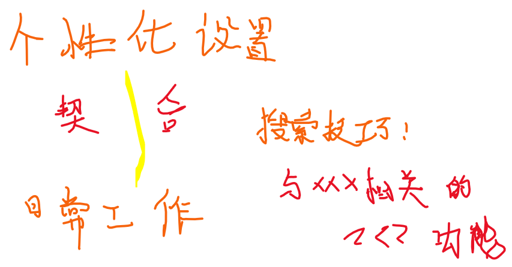

# 13 | 优化你的编辑器设置

## ★为什么需要？

之前主要介绍了编辑器的功能，并且是尽量介绍**编辑器默认推荐的设置**。但在实际工作中，我们是需要**根据自己的个人喜好以及项目的不同特性来对编辑器进行一定修改**的。

> 话说，项目的不同特性指的是什么呢？——用不同语言写的项目吗？比如我用markdown写笔记等

## ★怎么引入这话题？

通过对比来引入，比如一个是默认编辑器设置的呈现，一个是优化过后的呈现……

## ★六个变化（决定了编辑器看起来怎么样）

> 修改7处设置，形成6个变化。
>
> 注意：这几个设置都是被大家频繁使用的，而且是用于个性化定制编辑器的设置

- 编辑器最左侧的行号

  - 默认情况：行号代表的是每一行代码所处的位置，也就是在当前文件中处于第几行，是**绝对行数**。
  - 优化情况：行号显示的是每一行代码相对于当前光标所在位置的行的距离，是**相对行数**
  - 如何优化？—— `editor.lineNumbers`，搞一下这个就好了，而且它可以设置成不显示行号哦！习惯 使用 Vim 的用户，会把它设置成 `relative`值

- 空白符可视化（空格为点，tab为箭头）

  - 设置 `editor.renderWhitespace: all` 让编辑器将所有的空格符、制表符等全部都渲染出来。
  - 意义：能够一眼看出这个文件中使用的究竟是制表符还是空格符，以及有没有在哪里不小心多打了一个空格等。（我把一个tab键设置成两个空格）

  顺手而为： 把`Editor: Render Line Highlight`搞成是`all`值，这样光标定位到当前行就会很明显！配合 `editor.lineNumbers`为 `relative`值，效果显著！

- 垂直标尺

  - 为啥需要？——如果你的项目中有规定说**每一行代码不得超过多少个字符**，比如说 120 个字符，那么你就可以将标尺设置为 120，即 “`editor.rulers: [120]`”
  - 效果？——编辑器会在第 120 个字符所在的位置处**画出这样一条垂直的竖线**，所以你一眼就可以看出自己的代码是否达标。

- 小地图

  - 关闭小地图 Minimap，为啥要关闭？——我找代码一般**更习惯使用搜索功能**，所以通常我在笔记本上使用编辑器时，都会将小地图功能关闭，这样的话就能够**留出更多的空间给其他 UI 组件**。
  - 如何设置？——通过 “`editor.minimap.enabled`” 来控制它的显示与否

- 光标的样式

  - 编辑器中的光标样式有非常多种，你可以控制粗细，也可以控制它怎么闪烁
  - 设置：“`editor.cursorBlinking`” “`editor.cursorStyle`” 和 “`editor.cursorWidth`”

  我用默认的就好了！

- 当前行的背景色

  - 设置 `editor.renderLineHighlight: "all"` 把当前代码行的行号下的背景色
  - 意义：能够清楚地看到哪一行代码是当前光标所在的位置，总之就是视觉整体上看起来更统一。

## ★其它设置（决定我们在编辑器里的书写体验）

- **空格还是制表符**？

  - 默认情况下的空白符？——通常是制表符，不过编辑器会根据你所打开的文件夹或者项目来决定该使用空格还是制表符，也就是说，如果你的项目中使用的都是空格符的话，那么当你在书写代码的时候，每次按下 Tab 键，编辑器输入的就会是空格。（VS Code很智能呀！）

  - 不希望 VS Code 的自动检测来控制制表符或者空格键的使用？

    - `editor.detectIndentation`（检查说缩进）：禁用，即不勾选这个
    - 注意：在书写代码时，空格或者制表符的使用，则是由设置 “`editor.insertSpaces`” 来决定的；而每一个制表符所对应的空格符的长度是由设置 “editor.tabSize” 来控制。这两个设置往往是需要搭配在一起使用的。

    勾选 `editor.insertSpaces`，不然按tab键插入的就是制表符了，即可视化为一个个箭头，而不是一个个点！

- **代码风格**

  - 这是一个因人而异，或者受项目、团队影响比较大的设置
  - 为什么需要？——如果一个团队想要保证所有人的代码风格都是一致的，那么可以在编辑器中使用格式化工具。而如果你喜欢的方式是先不管三七二十一，把代码写完，然后保存代码，再统一进行格式化的修改，那么你可以设置 “`editor.formatOnSave: true`”。而如果你希望编辑器在你打字的时候就自动帮你校正代码格式的话，则可以将设置 “`editor.formatOnType: true`” 打开。

- 文件保存

  - 默认情况下，你需要按下“`Ctrl + S`”来保存文件，但是其实你也可以修改设置 “`files.autoSave`” 来对文件进行自动保存。但由于**很多自动化的脚本工具是根据文件状态的改变来触发运行**的，所以为了避免频繁触发这些脚本，你也可以将 “`files.autoSave`” 设置为 “`delay`”，然后使用 “`files.autoSaveDelay`” 控制在你打完字多久后保存文件。

  我没有设置自动保存……

## ★小Tip

评价一下以上的设置：

- 中规中矩（比喻符合规矩、标准，平淡无奇）

那么有哪些设置可让人惊喜和意外呢？

- `files.defaultLanguage`

该设置解决的痛点：

> 当你按下 Cmd + N （Windows 上是 Ctrl + N）在编辑器里创建一个新文件的时候，这个新的文件会被识别为普通文本文件，你在里面书写内容时并**没有合适的语法高亮和自动补全**，所以你可能会经常看到有些用户，创建了新的空文件后，然后再去调整文件的语言类型

做法：

> 通过把 “`files.defaultLanguage`” 设置为你想要的语言，比如说，把它设置成 “markdown”，那么创建空文件的时候，VS Code 就会把它当作一个 Markdown 文件，然后你在里面能够得到 Markdown 的所有语言支持。

应用场景：

吕大佬说：

> 我在工作的时候，也会拿 VS Code 来写会议记录，当突然有了一个新的想法，我就会立刻创建新文件，无需任何改动，就能够书写各种 Markdown 的语法，并且得到正确的代码高亮。这就是我心目中的**最佳编辑器设置。**

总之，这个在做笔记的时候，比较方便吧！

让我惊喜和意味的还有「保存后就格式化」

## ★总结

- 以上是吕大佬在日常工作中常用的编辑器设置，所以说这不一定适合所有人，因此或多或少都会有个性化的设置。更多的设置可以通过搜素 「editor」这个词找到，你不妨一个个都过一遍，**看看它们都是干什么的，以及它们能不能帮助到你的工作**。（会使用这个工具吗？那么你就把能点都点一遍呗！）

- 除了一个个研究这些设置，你还可以**通过功能的名字，进一步搜索**。比如说，如果你想看看有哪些小地图的设置可以修改，那你在设置里搜索 “editor minimap” 就可以了。至于其他的功能，也是非常类似的，拿我们在前面的章节里介绍的功能来说，它们分别是：

  - editor cursor， 是跟光标渲染和多光标相关的设置；
  - editor find， 是与编辑器内搜索相关的设置；
  - editor font， 是与字体有关的设置；
  - editor format， 是代码格式化；
  - editor suggest， 是和自动补全、建议窗口等相关的配置。

  > 这是与针对性的搜索技巧！

- 了解编辑器的同时，吕大佬也建议你顺带**熟悉一下这些功能的英文名字**，可以有助你更快地定位这些功能的设置



## ★Q&A

### ①为CSS排序？

需要安装csscomb插件。

```
 "csscomb.preset": {
    "remove-empty-rulesets": true,
    "always-semicolon": true,
    "color-case": "lower",
    "block-indent": "  ",
    "color-shorthand": true,
    "element-case": "lower",
    "eof-newline": true,
    "leading-zero": false,
    "quotes": "double",
    "sort-order-fallback": "abc",
    "space-before-colon": "",
    "space-after-colon": " ",
    "space-before-combinator": " ",
    "space-after-combinator": " ",
    "space-between-declarations": "\n",
    "space-before-opening-brace": " ",
    "space-after-opening-brace": "\n",
    "space-after-selector-delimiter": "\n",
    "space-before-selector-delimiter": "",
    "space-before-closing-brace": "\n",
    "strip-spaces": true,
    "tab-size": true,
    "unitless-zero": true,
    "vendor-prefix-align": true,
    "sort-order": [
      "$variable",
      "$include",
      "$extend",
      "$import",
      "content",
      // 位置
      "position",
      "top",
      "right",
      "bottom",
      "left",
      "z-index",
      "float",
      "clear",
      "display",
      "flex-align",
      "flex-flow",
      "flex-direction",
      "flex-order",
      "flex-pack",
      "flex-wrap",
      "justify-content",
      "align-content",
      "align-items",
      "align-self",
      "order",
      "flex",
      "flex-basis",
      "flex-grow",
      "flex-shrink",
      // 大小
      "box-sizing",
      "overflow",
      "overflow-x",
      "overflow-y",
      "width",
      "min-width",
      "max-width",
      "height",
      "min-height",
      "max-height",
      "padding",
      "padding-top",
      "padding-right",
      "padding-bottom",
      "padding-left",
      "margin",
      "margin-top",
      "margin-right",
      "margin-bottom",
      "margin-left",
      "margin-collapse",
      "margin-top-collapse",
      "margin-right-collapse",
      "margin-bottom-collapse",
      "margin-left-collapse",
      "clip",
      "clip-path",
      "color",
      "counter-reset",
      "counter-increment",
      "direction",
      // 文字
      "font",
      "font-family",
      "font-feature-settings",
      "font-size",
      "font-kerning",
      "font-smoothing",
      "font-stretch",
      "font-style",
      "font-variant",
      "font-weight",
      "hanging-punctuation",
      "hyphens",
      "quotes",
      "line-height",
      "letter-spacing",
      "text-align",
      "text-decoration",
      "text-emphasis",
      "text-emphasis-color",
      "text-emphasis-position",
      "text-emphasis-style",
      "text-indent",
      "text-justify",
      "text-overflow",
      "text-overflow-ellipsis",
      "text-overflow-mode",
      "text-rendering",
      "text-size-adjust",
      "text-shadow",
      "text-transform",
      "word-break",
      "word-spacing",
      "word-wrap",
      "word-break",
      "tab-size",
      "vertical-align",
      "white-space",
      "list-style",
      "list-style-image",
      "list-style-position",
      "list-style-type",
      "appearance",
      // 背景
      "background",
      "background-color",
      "background-attachment",
      "background-clip",
      "background-image",
      "background-repeat",
      "background-repeat-x",
      "background-repeat-y",
      "background-position",
      "background-position-x",
      "background-position-y",
      "background-origin",
      "background-size",
      "box-decoration-break",
      "box-shadow",
      "border",
      "border-collapse",
      "border-top",
      "border-right",
      "border-bottom",
      "border-left",
      "border-color",
      "border-image",
      "border-top-color",
      "border-right-color",
      "border-bottom-color",
      "border-left-color",
      "border-spacing",
      "border-style",
      "border-top-style",
      "border-right-style",
      "border-bottom-style",
      "border-left-style",
      "border-width",
      "border-top-width",
      "border-right-width",
      "border-bottom-width",
      "border-left-width",
      "border-radius",
      "border-top-right-radius",
      "border-bottom-right-radius",
      "border-bottom-left-radius",
      "border-top-left-radius",
      "border-radius-topright",
      "border-radius-bottomright",
      "border-radius-bottomleft",
      "border-radius-topleft",
      "outline",
      "outline-width",
      "outline-style",
      "outline-color",
      "outline-offset",
      "perspective",
      "perspective-origin",
      "table-layout",
      // 其他
      "transform",
      "transform-origin",
      "transform-style",
      "animation",
      "animation-delay",
      "animation-duration",
      "animation-iteration-count",
      "animation-name",
      "animation-play-state",
      "animation-timing-function",
      "animation-fill-mode",
      "backface-visibility",
      "transition",
      "transition-delay",
      "transition-duration",
      "transition-property",
      "transition-timing-function",
      "will-change",
      "cursor",
      "opacity",
      "filter",
      "visibility",
      "zoom",
      "marks",
      "page-break",
      "page-break-before",
      "page-break-inside",
      "page-break-after",
      "pointer-events",
      "resize",
      "unicode-bidi",
      "user-select",
      "scrollbar",
      "widows"
    ]
  },
```

**➹：**[CSS 属性排序千千万，我只爱那一种 · Issue #13 · wayou/wayou.github.io](https://github.com/wayou/wayou.github.io/issues/13)

**➹：**[vscode 中使用 csscomb - xianshenglu - 博客园](https://www.cnblogs.com/xianshenglu/p/8849121.html)

### ②Vue编码风格？

1. vue-style-beautify——可结合csscomb设置！

**➹：**[在 vscode 中统一 vue 编码风格 - Web技术试炼地](https://www.52cik.com/2018/02/20/vscode-vue.html)


### ③json文件注释折叠？

没有这个语法啊！

**➹：**[Basic Editing in Visual Studio Code](https://code.visualstudio.com/docs/editor/codebasics#_folding)

### ④ `"files.defaultLanguage": ""`无效？

其实是有效的啊！

```json
"files.defaultLanguage": "markdown"
```

是小写的m，而不是大写的`M`

**➹：**["files.defaultLanguage" does not work · Issue #40994 · microsoft/vscode](https://github.com/Microsoft/vscode/issues/40994)

### ⑤换一款颜色主题？eva theme？

- 字体： [CamingoCode](https://www.fontsquirrel.com/fonts/camingocode)
- 图标：[file-icons](https://marketplace.visualstudio.com/items?itemName=file-icons.file-icons)

 Bracket Pair Colorizer 设置：

- 配合 Eva Dark theme

```
"bracketPairColorizer.showHorizontalScopeLine": false,
"bracketPairColorizer.showVerticalScopeLine": false,
"bracketPairColorizer.consecutivePairColors": [
        "()",
        "[]",
        "{}",
        [
        "#838FA7",
        "#A78CFA",
        "#56B7C3",
        "#FF9070"
        ],
        "#e51400"
    ]
```

- 配合 Eva Light theme

```
"bracketPairColorizer.showHorizontalScopeLine": false,
"bracketPairColorizer.showVerticalScopeLine": false,
"bracketPairColorizer.consecutivePairColors": [
        "()",
        "[]",
        "{}",
        [
        "#5D5D5FD8",
        "#7C4DFF",
        "#00BEC4",
        "#ff6500"
        ],
        "#e51400"
    ]
```

 **➹：**[Eva-Theme/README_CN.md at master · fisheva/Eva-Theme](https://github.com/fisheva/Eva-Theme/blob/master/README_CN.md)

### ⑥下载好看的字体？

**➹：**[Montserrat Font Free by Julieta Ulanovsky » Font Squirrel](https://www.fontsquirrel.com/fonts/montserrat)

### ⑦保存后格式化，自动加分号和加双引号？

**➹：**[Emmet - Vetur](https://vuejs.github.io/vetur/emmet.html)

**➹：**[深入浅出eslint——关于我学习eslint的心得 - 掘金](https://juejin.im/post/5bab946cf265da0ae92a75ca#heading-11)

